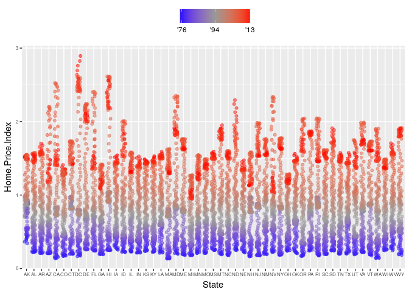
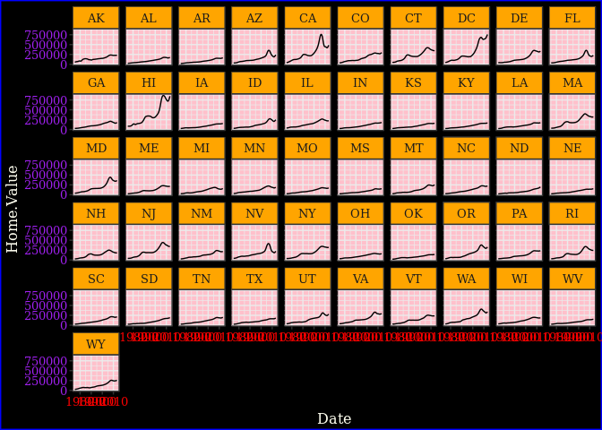
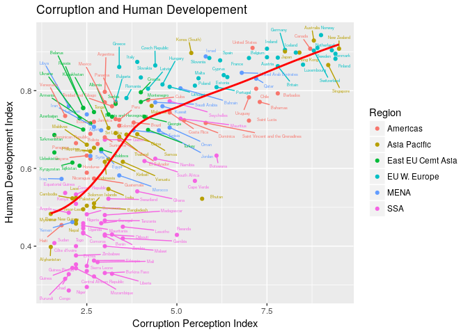

Exploring the Cocoli Database
-----------------------------

    cocoli_dat <- read.table("~/Desktop/eeb-177/class-assignments/classwork-21-Feb/cocoli.txt", header = TRUE)
    head(cocoli_dat)

    ##      tag spcode   x   y dbh1 dbh2 dbh3 recr1 recr2 recr3 pom1 pom2 pom3
    ## 1 000001 PROTTE 3.0 0.9  171  267  277     A     A     A    1    2    2
    ## 2 000002 COCCPA 0.1 0.6   13   14   17     A     A     A    1    1    1
    ## 3 000003 EUGEPR 1.3 2.3   26   33   39     A     A     A    1    2    2
    ## 4 000004 PROTTE 2.2 3.4   10   17   19     A     A     A    1    1    1
    ## 5 000005 CLAVME 3.5 3.7   14   15   15     A     A     A    1    1    1
    ## 6 000006 PROTTE 4.3 4.7   12   26   25     A     A     A    1    2    2
    ##   code1 code2 code3 mult1 mult2 mult3      date1      date2      date3
    ## 1     *     *     *     1     1     1 11/02/1994 11/11/1997 11/23/1998
    ## 2     *     *     *     1     1     1 11/02/1994 11/11/1997 11/23/1998
    ## 3     M     M     M     2     2     2 11/02/1994 11/11/1997 11/23/1998
    ## 4     *     *     *     1     1     1 11/02/1994 11/11/1997 11/23/1998
    ## 5    ML    ML     M     2     2     2 11/02/1994 11/11/1997 11/23/1998
    ## 6     *     *     M     1     1     2 11/02/1994 11/11/1997 11/23/1998

    str(cocoli_dat)

    ## 'data.frame':    9466 obs. of  22 variables:
    ##  $ tag   : Factor w/ 9466 levels "-47493","000001",..: 2 3 4 5 6 7 8 9 10 11 ...
    ##  $ spcode: Factor w/ 177 levels "*","ACACME","ACALDI",..: 131 49 67 131 48 131 129 154 139 49 ...
    ##  $ x     : num  3 0.1 1.3 2.2 3.5 4.3 3.7 4.1 1.5 0.9 ...
    ##  $ y     : num  0.9 0.6 2.3 3.4 3.7 4.7 7 6.3 11 14 ...
    ##  $ dbh1  : int  171 13 26 10 14 12 15 78 29 28 ...
    ##  $ dbh2  : int  267 14 33 17 15 26 19 78 30 29 ...
    ##  $ dbh3  : int  277 17 39 19 15 25 19 78 29 33 ...
    ##  $ recr1 : Factor w/ 3 levels "*","A","P": 2 2 2 2 2 2 2 2 2 2 ...
    ##  $ recr2 : Factor w/ 5 levels "*","A","B","D",..: 2 2 2 2 2 2 2 2 2 2 ...
    ##  $ recr3 : Factor w/ 4 levels "*","A","B","D": 2 2 2 2 2 2 2 2 2 2 ...
    ##  $ pom1  : int  1 1 1 1 1 1 1 1 1 1 ...
    ##  $ pom2  : int  2 1 2 1 1 2 1 1 1 1 ...
    ##  $ pom3  : int  2 1 2 1 1 2 1 1 1 1 ...
    ##  $ code1 : Factor w/ 8 levels "*","B","L","M",..: 1 1 4 1 5 1 4 5 4 1 ...
    ##  $ code2 : Factor w/ 25 levels "*","B","BL","BQ",..: 1 1 14 1 15 1 14 15 14 1 ...
    ##  $ code3 : Factor w/ 19 levels "*","B","BM","D",..: 1 1 13 1 13 13 13 13 13 1 ...
    ##  $ mult1 : int  1 1 2 1 2 1 2 2 2 1 ...
    ##  $ mult2 : int  1 1 2 1 2 1 2 2 2 1 ...
    ##  $ mult3 : int  1 1 2 1 2 2 2 2 2 1 ...
    ##  $ date1 : Factor w/ 23 levels "11/02/1994","11/04/1994",..: 1 1 1 1 1 1 1 1 1 1 ...
    ##  $ date2 : Factor w/ 18 levels "11/10/1997","11/11/1997",..: 2 2 2 2 2 2 2 2 2 2 ...
    ##  $ date3 : Factor w/ 30 levels "11/04/1998","11/23/1998",..: 2 2 2 2 2 2 2 2 2 2 ...

    #View(cocoli_dat)

    sizes_in_1994 <- cocoli_dat$dbh1
    names(sizes_in_1994) <- cocoli_dat$tag
    sizes_in_1994[1]

    ## 000001 
    ##    171

    sizes_in_1997 <- cocoli_dat$dbh2
    names(sizes_in_1997) <- cocoli_dat$tag

    sizes_in_1998 <- cocoli_dat$dbh3
    names(sizes_in_1998) <- cocoli_dat$tag

    #find all instances of dbh = 171
    sizes_in_1994 == 171

    ## 000001 000002 000003 000004 000005 000006 000007 000008 000009 000010 
    ##   TRUE  FALSE  FALSE  FALSE  FALSE  FALSE  FALSE  FALSE  FALSE  FALSE 
    ## 000011 000012 000013 000014 000015 000016 000017 000018 000019 000020 
    ##  FALSE  FALSE  FALSE  FALSE  FALSE  FALSE  FALSE  FALSE  FALSE  FALSE 
    ## 000021 000022 000023 000024 000025 000026 000027 000028 000029 000030 
    ##  FALSE  FALSE  FALSE  FALSE  FALSE  FALSE  FALSE  FALSE  FALSE  FALSE 
    ## 000031 000032 000033 000034 000035 000036 000037 000038 000039 000040 
    ##  FALSE  FALSE  FALSE  FALSE  FALSE  FALSE  FALSE  FALSE  FALSE  FALSE 
    ## 000041 000042 000043 000044 000045 000046 000047 000048 000049 000050 
    ##  FALSE  FALSE  FALSE  FALSE  FALSE  FALSE  FALSE  FALSE  FALSE  FALSE 
    ## 000051 000052 000053 000054 000055 000056 000057 000058 000059 000060 
    ##  FALSE  FALSE  FALSE  FALSE  FALSE  FALSE  FALSE  FALSE  FALSE  FALSE 
    ## 000061 000062 000063 000064 000065 000066 000067 000068 000069 000070 
    ##  FALSE  FALSE  FALSE  FALSE  FALSE  FALSE  FALSE  FALSE  FALSE  FALSE 
    ## 000071 000072 000073 000074 000075 000076 000077 000078 000079 000080 
    ##  FALSE  FALSE  FALSE  FALSE  FALSE  FALSE  FALSE  FALSE  FALSE  FALSE 
    ## 000081 000082 000083 000084 000085 000086 000087 000088 000089 000090 
    ##  FALSE  FALSE  FALSE  FALSE  FALSE  FALSE  FALSE  FALSE  FALSE  FALSE 
    ## 000091 000092 000093 000094 000095 000096 000097 000098 000099 000100 
    ##  FALSE  FALSE  FALSE  FALSE  FALSE  FALSE  FALSE  FALSE  FALSE  FALSE 
    ## 000101 000102 000103 000104 000105 000106 000107 000108 000109 000110 
    ##  FALSE  FALSE  FALSE  FALSE  FALSE  FALSE  FALSE  FALSE  FALSE  FALSE 
    ## 000111 000112 000113 000114 000115 000116 000117 000118 000119 000120 
    ##  FALSE  FALSE  FALSE  FALSE  FALSE  FALSE  FALSE  FALSE  FALSE  FALSE 
    ## 000121 000122 000123 000124 000125 000126 000127 000128 000129 000130 
    ##  FALSE  FALSE  FALSE  FALSE  FALSE  FALSE  FALSE  FALSE  FALSE  FALSE 
    ## 000131 000132 000133 000134 000135 000136 000137 000138 000139 000140 
    ##  FALSE  FALSE  FALSE  FALSE  FALSE  FALSE  FALSE  FALSE  FALSE  FALSE 
    ## 000141 000142 000143 000144 000145 000146 000147 000148 000149 000150 
    ##  FALSE  FALSE  FALSE  FALSE  FALSE  FALSE  FALSE  FALSE  FALSE  FALSE 
    ## 000151 000152 000153 000154 000155 000156 000157 000158 000159 000161 
    ##  FALSE  FALSE  FALSE  FALSE  FALSE  FALSE  FALSE  FALSE  FALSE  FALSE 
    ## 000162 000163 000164 000166 000167 000168 000169 000170 000171 000172 
    ##  FALSE  FALSE  FALSE  FALSE  FALSE  FALSE  FALSE  FALSE  FALSE  FALSE 
    ## 000173 000174 000175 000176 000177 000178 000179 000180 000181 000182 
    ##  FALSE  FALSE  FALSE  FALSE  FALSE  FALSE  FALSE  FALSE  FALSE  FALSE 
    ## 000183 000184 000185 000186 000187 000188 000189 000190 000191 000192 
    ##  FALSE  FALSE  FALSE  FALSE  FALSE  FALSE  FALSE  FALSE  FALSE  FALSE 
    ## 000193 000194 000195 000196 000197 000198 000199 000200 000201 000202 
    ##  FALSE  FALSE  FALSE  FALSE  FALSE  FALSE  FALSE  FALSE  FALSE  FALSE 
    ## 000203 000204 000205 000206 000207 000208 000209 000210 000211 000212 
    ##  FALSE  FALSE  FALSE  FALSE  FALSE  FALSE  FALSE  FALSE  FALSE  FALSE 
    ## 000213 000214 000215 000216 000217 000218 000219 000220 000221 000222 
    ##  FALSE  FALSE  FALSE  FALSE  FALSE  FALSE  FALSE  FALSE  FALSE  FALSE 
    ## 000223 000224 000225 000226 000227 000228 000229 000230 000231 000232 
    ##  FALSE  FALSE  FALSE  FALSE  FALSE  FALSE  FALSE  FALSE  FALSE  FALSE 
    ## 000233 000234 000235 000236 000237 000238 000239 000240 000241 000242 
    ##  FALSE  FALSE  FALSE  FALSE  FALSE  FALSE  FALSE  FALSE  FALSE  FALSE 
    ## 000243 000244 000245 000246 000247 000248 000249 000250 000251 000252 
    ##  FALSE  FALSE  FALSE  FALSE  FALSE  FALSE  FALSE  FALSE  FALSE  FALSE 
    ## 000253 000254 000255 000256 000257 000258 000259 000260 000261 000262 
    ##  FALSE  FALSE  FALSE  FALSE  FALSE  FALSE  FALSE  FALSE  FALSE  FALSE 
    ## 000263 000264 000265 000266 000267 000268 000269 000270 000271 000272 
    ##  FALSE  FALSE  FALSE  FALSE  FALSE  FALSE  FALSE  FALSE  FALSE  FALSE 
    ## 000273 000274 000275 000276 000277 000278 000279 000280 000281 000282 
    ##  FALSE  FALSE  FALSE  FALSE  FALSE  FALSE  FALSE  FALSE  FALSE  FALSE 
    ## 000283 000284 000285 000286 000287 000288 000289 000290 000291 000292 
    ##  FALSE  FALSE  FALSE  FALSE  FALSE  FALSE  FALSE  FALSE  FALSE  FALSE 
    ## 000293 000294 000295 000296 000297 000298 000299 000300 000301 000302 
    ##  FALSE  FALSE  FALSE  FALSE  FALSE  FALSE  FALSE  FALSE  FALSE  FALSE 
    ## 000303 000304 000305 000306 000307 000308 000309 000310 000311 000312 
    ##  FALSE  FALSE  FALSE  FALSE  FALSE  FALSE  FALSE  FALSE  FALSE  FALSE 
    ## 000313 000314 000315 000316 000317 000318 000319 000320 000321 000322 
    ##  FALSE  FALSE  FALSE  FALSE  FALSE  FALSE  FALSE  FALSE  FALSE  FALSE 
    ## 000323 000324 000325 000326 000327 000328 000329 000330 000331 000332 
    ##  FALSE  FALSE  FALSE  FALSE  FALSE  FALSE  FALSE  FALSE  FALSE  FALSE 
    ## 000333 000334 000335 000336 000337 000338 000339 000340 000341 000342 
    ##  FALSE  FALSE  FALSE  FALSE  FALSE  FALSE  FALSE  FALSE  FALSE  FALSE 
    ## 000343 000344 000345 000346 000347 000348 000349 000350 000351 000352 
    ##  FALSE  FALSE  FALSE  FALSE  FALSE  FALSE  FALSE  FALSE  FALSE  FALSE 
    ## 000353 000354 000355 000356 000357 000358 000359 000360 000361 000362 
    ##  FALSE  FALSE  FALSE  FALSE  FALSE  FALSE  FALSE  FALSE  FALSE  FALSE 
    ## 000363 000364 000365 000366 000367 000368 000369 000370 000371 000372 
    ##  FALSE  FALSE  FALSE  FALSE  FALSE  FALSE  FALSE  FALSE  FALSE  FALSE 
    ## 000373 000374 000375 000376 000377 000378 000379 000380 000381 000382 
    ##  FALSE  FALSE  FALSE  FALSE  FALSE  FALSE  FALSE  FALSE  FALSE  FALSE 
    ## 000383 000384 000385 000386 000387 000388 000389 000390 000391 000392 
    ##  FALSE  FALSE  FALSE  FALSE  FALSE  FALSE  FALSE  FALSE  FALSE  FALSE 
    ## 000393 000394 000395 000396 000397 000398 000399 000400 000401 000402 
    ##  FALSE  FALSE  FALSE  FALSE  FALSE  FALSE  FALSE  FALSE  FALSE  FALSE 
    ## 000403 000404 000405 000406 000407 000408 000409 000410 000411 000412 
    ##  FALSE  FALSE  FALSE  FALSE  FALSE  FALSE  FALSE  FALSE  FALSE  FALSE 
    ## 000413 000414 000415 000416 000417 000418 000419 000420 000421 000422 
    ##  FALSE  FALSE  FALSE  FALSE  FALSE  FALSE  FALSE  FALSE  FALSE  FALSE 
    ## 000423 000424 000425 000426 000427 000428 000429 000430 000431 000432 
    ##  FALSE  FALSE  FALSE  FALSE  FALSE  FALSE  FALSE  FALSE  FALSE  FALSE 
    ## 000433 000434 000435 000436 000437 000438 000439 000440 000441 000442 
    ##  FALSE  FALSE  FALSE  FALSE  FALSE  FALSE  FALSE  FALSE  FALSE  FALSE 
    ## 000443 000444 000445 000446 000447 000448 000449 000450 000451 000452 
    ##  FALSE  FALSE  FALSE  FALSE  FALSE  FALSE  FALSE  FALSE  FALSE  FALSE 
    ## 000453 000454 000455 000456 000457 000458 000459 000460 000461 000462 
    ##  FALSE  FALSE  FALSE  FALSE  FALSE  FALSE  FALSE  FALSE  FALSE  FALSE 
    ## 000463 000464 000465 000466 000467 000468 000469 000470 000471 000472 
    ##  FALSE  FALSE  FALSE  FALSE  FALSE  FALSE  FALSE  FALSE  FALSE  FALSE 
    ## 000473 000474 000475 000476 000477 000478 000479 000480 000481 000482 
    ##  FALSE  FALSE  FALSE  FALSE  FALSE  FALSE  FALSE  FALSE  FALSE  FALSE 
    ## 000483 000484 000485 000486 000487 000488 000489 000490 000491 000492 
    ##  FALSE  FALSE  FALSE  FALSE  FALSE  FALSE  FALSE  FALSE  FALSE  FALSE 
    ## 000493 000494 000495 000496 000497 000498 000499 000500 000501 000502 
    ##  FALSE  FALSE  FALSE  FALSE  FALSE  FALSE  FALSE  FALSE  FALSE  FALSE 
    ## 000503 000504 000505 000506 000507 000508 000509 000510 000511 000512 
    ##  FALSE  FALSE  FALSE  FALSE  FALSE  FALSE  FALSE  FALSE  FALSE  FALSE 
    ## 000513 000514 000515 000516 000517 000518 000519 000520 000521 000522 
    ##  FALSE  FALSE  FALSE  FALSE  FALSE  FALSE  FALSE  FALSE  FALSE  FALSE 
    ## 000523 000524 000525 000526 000527 000528 000529 000530 000531 000532 
    ##  FALSE  FALSE  FALSE  FALSE  FALSE  FALSE  FALSE  FALSE  FALSE  FALSE 
    ## 000533 000534 000535 000536 000537 000538 000539 000540 000541 000542 
    ##  FALSE  FALSE  FALSE  FALSE  FALSE  FALSE  FALSE  FALSE  FALSE  FALSE 
    ## 000543 000544 000545 000546 000547 000548 000549 000550 000551 000552 
    ##  FALSE  FALSE  FALSE  FALSE  FALSE  FALSE  FALSE  FALSE  FALSE  FALSE 
    ## 000553 000554 000555 000556 000557 000558 000559 000560 000561 000562 
    ##  FALSE  FALSE  FALSE  FALSE  FALSE  FALSE  FALSE  FALSE  FALSE  FALSE 
    ## 000563 000564 000565 000566 000567 000568 000569 000570 000571 000572 
    ##  FALSE  FALSE  FALSE  FALSE  FALSE  FALSE  FALSE  FALSE  FALSE  FALSE 
    ## 000573 000574 000575 000576 000577 000578 000579 000580 000581 000582 
    ##  FALSE  FALSE  FALSE  FALSE  FALSE  FALSE  FALSE  FALSE  FALSE  FALSE 
    ## 000583 000584 000585 000586 000587 000588 000589 000590 000591 000592 
    ##  FALSE  FALSE  FALSE  FALSE  FALSE  FALSE  FALSE  FALSE  FALSE  FALSE 
    ## 000593 000594 000595 000596 000597 000598 000599 000600 000601 000602 
    ##  FALSE  FALSE  FALSE  FALSE  FALSE  FALSE  FALSE  FALSE  FALSE  FALSE 
    ## 000603 000604 000605 000606 000607 000608 000609 000610 000611 000612 
    ##  FALSE  FALSE  FALSE  FALSE  FALSE  FALSE  FALSE  FALSE  FALSE  FALSE 
    ## 000613 000614 000615 000616 000617 000618 000619 000620 000621 000622 
    ##  FALSE  FALSE  FALSE  FALSE  FALSE  FALSE  FALSE  FALSE  FALSE  FALSE 
    ## 000623 000624 000625 000626 000627 000628 000629 000630 000631 000632 
    ##  FALSE  FALSE  FALSE  FALSE  FALSE  FALSE  FALSE  FALSE  FALSE  FALSE 
    ## 000633 000634 000635 000636 000637 000638 000639 000640 000641 000642 
    ##  FALSE  FALSE  FALSE  FALSE  FALSE  FALSE  FALSE  FALSE  FALSE  FALSE 
    ## 000643 000644 000645 000646 000647 000648 000649 000650 000651 000652 
    ##  FALSE  FALSE  FALSE  FALSE  FALSE  FALSE  FALSE  FALSE  FALSE  FALSE 
    ## 000653 000654 000655 000656 000657 000658 000659 000660 000661 000662 
    ##  FALSE  FALSE  FALSE  FALSE  FALSE  FALSE  FALSE  FALSE  FALSE  FALSE 
    ## 000663 000664 000665 000666 000667 000668 000669 000670 000671 000672 
    ##  FALSE  FALSE  FALSE  FALSE  FALSE  FALSE  FALSE  FALSE  FALSE  FALSE 
    ## 000673 000674 000675 000676 000677 000678 000679 000680 000681 000682 
    ##  FALSE  FALSE  FALSE  FALSE  FALSE  FALSE  FALSE  FALSE  FALSE  FALSE 
    ## 000683 000684 000685 000686 000687 000688 000689 000690 000691 000692 
    ##  FALSE  FALSE  FALSE  FALSE  FALSE  FALSE  FALSE  FALSE  FALSE  FALSE 
    ## 000693 000694 000695 000696 000697 000698 000699 000700 000701 000702 
    ##  FALSE  FALSE  FALSE  FALSE  FALSE  FALSE  FALSE  FALSE  FALSE  FALSE 
    ## 000703 000704 000705 000706 000707 000708 000709 000710 000711 000712 
    ##  FALSE  FALSE  FALSE  FALSE  FALSE  FALSE  FALSE  FALSE  FALSE  FALSE 
    ## 000713 000714 000715 000716 000717 000718 000719 000720 000721 000722 
    ##  FALSE  FALSE  FALSE  FALSE  FALSE  FALSE  FALSE  FALSE  FALSE  FALSE 
    ## 000723 000724 000725 000726 000727 000728 000729 000730 000731 000732 
    ##  FALSE  FALSE  FALSE  FALSE  FALSE  FALSE  FALSE  FALSE  FALSE  FALSE 
    ## 000733 000734 000735 000736 000737 000738 000739 000740 000741 000742 
    ##  FALSE  FALSE  FALSE  FALSE  FALSE  FALSE  FALSE  FALSE  FALSE  FALSE 
    ## 000743 000744 000745 000746 000747 000748 000749 000750 000751 000752 
    ##  FALSE  FALSE  FALSE  FALSE  FALSE  FALSE  FALSE  FALSE  FALSE  FALSE 
    ## 000753 000754 000755 000756 000757 000758 000759 000760 000761 000762 
    ##  FALSE  FALSE  FALSE  FALSE  FALSE  FALSE  FALSE  FALSE  FALSE  FALSE 
    ## 000763 000764 000765 000766 000767 000768 000769 000770 000771 000772 
    ##  FALSE  FALSE  FALSE  FALSE  FALSE  FALSE  FALSE  FALSE  FALSE  FALSE 
    ## 000773 000774 000775 000776 000777 000778 000779 000780 000781 000782 
    ##  FALSE  FALSE  FALSE  FALSE  FALSE  FALSE  FALSE  FALSE  FALSE  FALSE 
    ## 000783 000784 000785 000786 000787 000788 000789 000790 000791 000792 
    ##  FALSE  FALSE  FALSE  FALSE  FALSE  FALSE  FALSE  FALSE  FALSE  FALSE 
    ## 000793 000794 000795 000796 000797 000798 000799 000800 000801 000802 
    ##  FALSE  FALSE  FALSE  FALSE  FALSE  FALSE  FALSE  FALSE  FALSE  FALSE 
    ## 000803 000804 000805 000806 000807 000808 000809 000810 000811 000812 
    ##  FALSE  FALSE  FALSE  FALSE  FALSE  FALSE  FALSE  FALSE  FALSE  FALSE 
    ## 000813 000814 000815 000816 000817 000818 000819 000820 000821 000822 
    ##  FALSE  FALSE  FALSE  FALSE  FALSE  FALSE  FALSE  FALSE  FALSE  FALSE 
    ## 000823 000824 000825 000826 000827 000828 000829 000830 000831 000832 
    ##  FALSE  FALSE  FALSE  FALSE  FALSE  FALSE  FALSE  FALSE  FALSE  FALSE 
    ## 000833 000834 000835 000836 000837 000838 000839 000840 000841 000842 
    ##  FALSE  FALSE  FALSE  FALSE  FALSE  FALSE  FALSE  FALSE  FALSE  FALSE 
    ## 000843 000844 000845 000846 000847 000848 000849 000850 000851 000852 
    ##  FALSE  FALSE  FALSE  FALSE  FALSE  FALSE  FALSE  FALSE  FALSE  FALSE 
    ## 000853 000854 000855 000856 000857 000858 000859 000860 000861 000862 
    ##  FALSE  FALSE  FALSE  FALSE  FALSE  FALSE  FALSE  FALSE  FALSE  FALSE 
    ## 000863 000864 000865 000866 000867 000868 000869 000870 000871 000872 
    ##  FALSE  FALSE  FALSE  FALSE  FALSE  FALSE  FALSE  FALSE  FALSE  FALSE 
    ## 000873 000874 000875 000876 000877 000878 000879 000880 000881 000882 
    ##  FALSE  FALSE  FALSE  FALSE  FALSE  FALSE  FALSE  FALSE  FALSE  FALSE 
    ## 000883 000884 000885 000886 000887 000888 000889 000890 000891 000892 
    ##  FALSE  FALSE  FALSE  FALSE  FALSE  FALSE  FALSE  FALSE  FALSE  FALSE 
    ## 000893 000894 000895 000896 000897 000898 000899 000900 000901 000902 
    ##  FALSE  FALSE  FALSE  FALSE  FALSE  FALSE  FALSE  FALSE  FALSE  FALSE 
    ## 000903 000904 000905 000906 000907 000908 000909 000910 000911 000912 
    ##  FALSE  FALSE  FALSE  FALSE  FALSE  FALSE  FALSE  FALSE  FALSE  FALSE 
    ## 000913 000914 000915 000916 000917 000918 000919 000920 000921 000922 
    ##  FALSE  FALSE  FALSE  FALSE  FALSE  FALSE  FALSE  FALSE  FALSE  FALSE 
    ## 000923 000924 000925 000926 000927 000928 000929 000930 000931 000932 
    ##  FALSE  FALSE  FALSE  FALSE  FALSE  FALSE  FALSE  FALSE  FALSE  FALSE 
    ## 000933 000934 000935 000936 000937 000938 000939 000940 000941 000942 
    ##  FALSE  FALSE  FALSE  FALSE  FALSE  FALSE  FALSE  FALSE  FALSE  FALSE 
    ## 000943 000944 000945 000946 000947 000948 000949 000950 000951 000952 
    ##  FALSE  FALSE  FALSE  FALSE  FALSE  FALSE  FALSE  FALSE  FALSE  FALSE 
    ## 000953 000954 000955 000956 000957 000958 000959 000960 000961 000962 
    ##  FALSE  FALSE  FALSE  FALSE  FALSE  FALSE  FALSE  FALSE  FALSE  FALSE 
    ## 000963 000964 000965 000966 000967 000968 000969 000970 000971 000972 
    ##  FALSE  FALSE  FALSE  FALSE  FALSE  FALSE  FALSE  FALSE  FALSE  FALSE 
    ## 000973 000974 000975 000976 000977 000978 000979 000980 000981 000982 
    ##  FALSE  FALSE  FALSE  FALSE  FALSE  FALSE  FALSE  FALSE  FALSE  FALSE 
    ## 000983 000984 000985 000986 000987 000988 000989 000990 000991 000992 
    ##  FALSE  FALSE  FALSE  FALSE  FALSE  FALSE  FALSE  FALSE  FALSE  FALSE 
    ## 000993 000994 000995 000996 000997 000998 000999 001000 001001 001002 
    ##  FALSE  FALSE  FALSE  FALSE  FALSE  FALSE  FALSE  FALSE  FALSE  FALSE 
    ## 001003 001004 001005 001006 001007 001008 001009 001010 001011 001012 
    ##  FALSE  FALSE  FALSE  FALSE  FALSE  FALSE  FALSE  FALSE  FALSE  FALSE 
    ## 001013 001014 001015 001016 001017 001018 001019 001020 001021 001022 
    ##  FALSE  FALSE  FALSE  FALSE  FALSE  FALSE  FALSE  FALSE  FALSE  FALSE 
    ## 001023 001024 001025 001026 001027 001028 001029 001030 001031 001032 
    ##  FALSE  FALSE  FALSE  FALSE  FALSE  FALSE  FALSE  FALSE  FALSE  FALSE 
    ## 001033 001034 001035 001036 001037 001038 001039 001040 001041 001042 
    ##  FALSE  FALSE  FALSE  FALSE  FALSE  FALSE  FALSE  FALSE  FALSE  FALSE 
    ## 001043 001044 001045 001046 001047 001048 001049 001050 001051 001052 
    ##  FALSE  FALSE  FALSE  FALSE  FALSE  FALSE  FALSE  FALSE  FALSE  FALSE 
    ## 001053 001054 001055 001056 001057 001058 001059 001060 001061 001062 
    ##  FALSE  FALSE  FALSE  FALSE  FALSE  FALSE  FALSE  FALSE  FALSE  FALSE 
    ## 001063 001064 001065 001066 001067 001068 001069 001070 001071 001072 
    ##  FALSE  FALSE  FALSE  FALSE  FALSE  FALSE  FALSE  FALSE  FALSE  FALSE 
    ## 001073 001074 001075 001076 001077 001078 001079 001080 001081 001082 
    ##  FALSE  FALSE  FALSE  FALSE  FALSE  FALSE  FALSE  FALSE  FALSE  FALSE 
    ## 001083 001084 001085 001086 001087 001088 001089 001090 001091 001092 
    ##  FALSE  FALSE  FALSE  FALSE  FALSE  FALSE  FALSE  FALSE  FALSE  FALSE 
    ## 001093 001094 001095 001096 001097 001098 001099 001100 001101 001102 
    ##  FALSE  FALSE  FALSE  FALSE  FALSE  FALSE  FALSE  FALSE  FALSE  FALSE 
    ## 001103 001104 001105 001106 001107 001108 001109 001110 001111 001112 
    ##  FALSE  FALSE  FALSE  FALSE  FALSE  FALSE  FALSE  FALSE  FALSE  FALSE 
    ## 001113 001114 001115 001116 001117 001118 001119 001120 001121 001122 
    ##  FALSE  FALSE  FALSE  FALSE  FALSE  FALSE  FALSE  FALSE  FALSE  FALSE 
    ## 001123 001124 001125 001126 001127 001128 001129 001130 001131 001132 
    ##  FALSE  FALSE  FALSE  FALSE  FALSE  FALSE  FALSE  FALSE  FALSE  FALSE 
    ## 001133 001134 001135 001136 001137 001138 001139 001140 001141 001142 
    ##  FALSE  FALSE  FALSE  FALSE  FALSE  FALSE  FALSE  FALSE  FALSE  FALSE 
    ## 001143 001144 001145 001146 001147 001148 001149 001150 001151 001152 
    ##  FALSE  FALSE  FALSE  FALSE  FALSE  FALSE  FALSE  FALSE  FALSE  FALSE 
    ## 001153 001154 001155 001156 001157 001158 001159 001160 001161 001162 
    ##  FALSE  FALSE  FALSE  FALSE  FALSE  FALSE  FALSE  FALSE  FALSE  FALSE 
    ## 001163 001164 001165 001166 001167 001168 001169 001170 001171 001172 
    ##  FALSE  FALSE  FALSE  FALSE  FALSE  FALSE  FALSE  FALSE  FALSE  FALSE 
    ## 001173 001174 001175 001176 001177 001178 001179 001180 001181 001182 
    ##  FALSE  FALSE  FALSE  FALSE  FALSE  FALSE  FALSE  FALSE  FALSE  FALSE 
    ## 001183 001184 001185 001186 001187 001188 001189 001190 001191 001192 
    ##  FALSE  FALSE  FALSE  FALSE  FALSE  FALSE  FALSE  FALSE  FALSE  FALSE 
    ## 001193 001194 001195 001196 001197 001198 001199 001200 001201 001202 
    ##  FALSE  FALSE  FALSE  FALSE  FALSE  FALSE  FALSE  FALSE  FALSE  FALSE 
    ## 001203 001204 001205 001206 001207 001208 001209 001210 001211 001212 
    ##  FALSE  FALSE  FALSE  FALSE  FALSE  FALSE  FALSE  FALSE  FALSE  FALSE 
    ## 001213 001214 001215 001216 001217 001218 001219 001220 001221 001222 
    ##  FALSE  FALSE  FALSE  FALSE  FALSE  FALSE  FALSE  FALSE  FALSE  FALSE 
    ## 001223 001224 001225 001226 001227 001228 001229 001230 001231 001232 
    ##  FALSE  FALSE  FALSE  FALSE  FALSE  FALSE  FALSE  FALSE  FALSE  FALSE 
    ## 001233 001234 001235 001236 001237 001238 001239 001240 001241 001242 
    ##  FALSE  FALSE  FALSE  FALSE  FALSE  FALSE  FALSE  FALSE  FALSE  FALSE 
    ## 001243 001244 001245 001246 001247 001248 001249 001250 001251 001252 
    ##  FALSE  FALSE  FALSE  FALSE  FALSE  FALSE  FALSE  FALSE  FALSE  FALSE 
    ## 001253 001254 001255 001256 001257 001258 001259 001260 001261 001262 
    ##  FALSE  FALSE  FALSE  FALSE  FALSE  FALSE  FALSE  FALSE  FALSE  FALSE 
    ## 001263 001264 001265 001266 001267 001268 001269 001270 001271 001272 
    ##  FALSE  FALSE  FALSE  FALSE  FALSE  FALSE  FALSE  FALSE  FALSE  FALSE 
    ## 001273 001274 001275 001276 001277 001278 001279 001280 001281 001282 
    ##  FALSE  FALSE  FALSE  FALSE  FALSE  FALSE  FALSE  FALSE  FALSE  FALSE 
    ## 001283 001284 001285 001286 001287 001288 001289 001290 001291 001292 
    ##  FALSE  FALSE  FALSE  FALSE  FALSE  FALSE  FALSE  FALSE  FALSE  FALSE 
    ## 001293 001294 001295 001296 001297 001298 001299 001300 001301 001302 
    ##  FALSE  FALSE  FALSE  FALSE  FALSE  FALSE  FALSE  FALSE  FALSE  FALSE 
    ## 001303 001304 001305 001306 001307 001308 001309 001310 001311 001312 
    ##  FALSE  FALSE  FALSE  FALSE  FALSE  FALSE  FALSE  FALSE  FALSE  FALSE 
    ## 001313 001314 001315 001316 001317 001318 001319 001320 001321 001322 
    ##  FALSE  FALSE  FALSE  FALSE  FALSE  FALSE  FALSE  FALSE  FALSE  FALSE 
    ## 001323 001324 001325 001326 001327 001328 001329 001330 001331 001332 
    ##  FALSE  FALSE  FALSE  FALSE  FALSE  FALSE  FALSE  FALSE  FALSE  FALSE 
    ## 001333 001334 001336 001337 001338 001339 001340 001341 001342 001343 
    ##  FALSE  FALSE  FALSE  FALSE  FALSE  FALSE  FALSE  FALSE  FALSE  FALSE 
    ## 001344 001345 001346 001347 001348 001349 001350 001351 001352 001353 
    ##  FALSE  FALSE  FALSE  FALSE  FALSE  FALSE  FALSE  FALSE  FALSE  FALSE 
    ## 001354 001355 001356 001357 001358 001359 001360 001361 001362 001363 
    ##  FALSE  FALSE  FALSE  FALSE  FALSE  FALSE  FALSE  FALSE  FALSE  FALSE 
    ## 001364 001365 001366 001367 001368 001369 001370 001371 001372 001373 
    ##  FALSE  FALSE  FALSE  FALSE  FALSE  FALSE  FALSE  FALSE  FALSE  FALSE 
    ## 001374 001375 001376 001377 001378 001379 001380 001381 001382 001383 
    ##  FALSE  FALSE  FALSE  FALSE  FALSE  FALSE  FALSE  FALSE  FALSE  FALSE 
    ## 001384 001385 001386 001387 001388 001389 001390 001391 001392 001393 
    ##  FALSE  FALSE  FALSE  FALSE  FALSE  FALSE  FALSE  FALSE  FALSE  FALSE 
    ## 001394 001395 001396 001397 001398 001399 001400 001401 001402 001403 
    ##  FALSE  FALSE  FALSE  FALSE  FALSE  FALSE  FALSE  FALSE  FALSE  FALSE 
    ## 001404 001405 001406 001407 001408 001409 001410 001411 001412 001413 
    ##  FALSE  FALSE  FALSE  FALSE  FALSE  FALSE  FALSE  FALSE  FALSE  FALSE 
    ## 001414 001415 001416 001417 001418 001419 001420 001421 001422 001423 
    ##  FALSE  FALSE  FALSE  FALSE  FALSE  FALSE  FALSE  FALSE  FALSE  FALSE 
    ## 001424 001425 001426 001427 001428 001429 001430 001431 001432 001433 
    ##  FALSE  FALSE  FALSE  FALSE  FALSE  FALSE  FALSE  FALSE  FALSE  FALSE 
    ## 001434 001435 001436 001437 001438 001439 001440 001441 001442 001443 
    ##  FALSE  FALSE  FALSE  FALSE  FALSE  FALSE  FALSE  FALSE  FALSE  FALSE 
    ## 001444 001445 001446 001447 001448 001449 001450 001451 001452 001453 
    ##  FALSE  FALSE  FALSE  FALSE  FALSE  FALSE  FALSE  FALSE  FALSE  FALSE 
    ## 001454 001455 001456 001457 001458 001459 001460 001461 001462 001463 
    ##  FALSE  FALSE  FALSE  FALSE  FALSE  FALSE  FALSE  FALSE  FALSE  FALSE 
    ## 001464 001465 001466 001467 001468 001469 001470 001471 001472 001473 
    ##  FALSE  FALSE  FALSE  FALSE  FALSE  FALSE  FALSE  FALSE  FALSE  FALSE 
    ## 001474 001475 001476 001477 001478 001479 001480 001481 001482 001483 
    ##  FALSE  FALSE  FALSE  FALSE  FALSE  FALSE  FALSE  FALSE  FALSE  FALSE 
    ## 001484 001485 001486 001487 001488 001489 001490 001491 001492 001493 
    ##  FALSE  FALSE  FALSE  FALSE  FALSE  FALSE  FALSE  FALSE  FALSE  FALSE 
    ## 001494 001495 001496 001497 001498 001499 001500 001501 001502 001503 
    ##  FALSE  FALSE  FALSE  FALSE  FALSE  FALSE  FALSE  FALSE  FALSE  FALSE 
    ## 001504 001505 001506 001507 001508 001509 001510 001511 001512 001513 
    ##  FALSE  FALSE  FALSE  FALSE  FALSE  FALSE  FALSE  FALSE  FALSE  FALSE 
    ## 001514 001515 001516 001517 001518 001519 001520 001521 001522 001523 
    ##  FALSE  FALSE  FALSE  FALSE  FALSE  FALSE  FALSE  FALSE  FALSE  FALSE 
    ## 001524 001525 001526 001527 001528 001529 001530 001531 001532 001533 
    ##  FALSE  FALSE  FALSE  FALSE  FALSE  FALSE  FALSE  FALSE  FALSE  FALSE 
    ## 001534 001535 001536 001537 001538 001539 001540 001541 001542 001543 
    ##  FALSE  FALSE  FALSE  FALSE  FALSE  FALSE  FALSE  FALSE  FALSE  FALSE 
    ## 001544 001545 001546 001547 001548 001549 001550 001551 001552 001553 
    ##  FALSE  FALSE  FALSE  FALSE  FALSE  FALSE  FALSE  FALSE  FALSE  FALSE 
    ## 001554 001555 001556 001557 001558 001559 001560 001561 001562 001563 
    ##  FALSE  FALSE  FALSE  FALSE  FALSE  FALSE  FALSE  FALSE  FALSE  FALSE 
    ## 001564 001565 001566 001567 001568 001569 001570 001571 001572 001573 
    ##  FALSE  FALSE  FALSE  FALSE  FALSE  FALSE  FALSE  FALSE  FALSE  FALSE 
    ## 001574 001575 001576 001577 001578 001579 001580 001581 001582 001583 
    ##  FALSE  FALSE  FALSE  FALSE  FALSE  FALSE  FALSE  FALSE  FALSE  FALSE 
    ## 001584 001585 001586 001587 001588 001589 001590 001591 001592 001593 
    ##  FALSE  FALSE  FALSE  FALSE  FALSE  FALSE  FALSE  FALSE  FALSE  FALSE 
    ## 001594 001595 001596 001597 001598 001599 001600 001601 001602 001603 
    ##  FALSE  FALSE  FALSE  FALSE  FALSE  FALSE  FALSE  FALSE  FALSE  FALSE 
    ## 001604 001605 001606 001607 001608 001609 001610 001611 001612 001613 
    ##  FALSE  FALSE  FALSE  FALSE  FALSE  FALSE  FALSE  FALSE  FALSE  FALSE 
    ## 001614 001615 001616 001617 001618 001619 001620 001621 001622 001623 
    ##  FALSE  FALSE  FALSE  FALSE  FALSE  FALSE  FALSE  FALSE  FALSE  FALSE 
    ## 001624 001625 001626 001627 001628 001629 001630 001631 001632 001633 
    ##  FALSE  FALSE  FALSE  FALSE  FALSE  FALSE  FALSE  FALSE  FALSE  FALSE 
    ## 001634 001635 001636 001637 001638 001639 001640 001641 001642 001643 
    ##  FALSE  FALSE  FALSE  FALSE  FALSE  FALSE  FALSE  FALSE  FALSE  FALSE 
    ## 001644 001645 001646 001647 001648 001649 001650 001651 001652 001653 
    ##  FALSE  FALSE  FALSE  FALSE  FALSE  FALSE  FALSE  FALSE  FALSE  FALSE 
    ## 001654 001655 001656 001657 001658 001659 001660 001661 001662 001663 
    ##  FALSE  FALSE  FALSE  FALSE  FALSE  FALSE  FALSE  FALSE  FALSE  FALSE 
    ## 001664 001665 001666 001667 001668 001669 001670 001671 001672 001673 
    ##  FALSE  FALSE  FALSE  FALSE  FALSE  FALSE  FALSE  FALSE  FALSE  FALSE 
    ## 001674 001675 001676 001677 001678 001679 001680 001681 001682 001683 
    ##  FALSE  FALSE  FALSE  FALSE  FALSE  FALSE  FALSE  FALSE  FALSE  FALSE 
    ## 001684 001685 001686 001687 001688 001689 001690 001691 001692 001693 
    ##  FALSE  FALSE  FALSE  FALSE  FALSE  FALSE  FALSE  FALSE  FALSE  FALSE 
    ## 001694 001695 001696 001697 001698 001699 001700 001701 001702 001703 
    ##  FALSE  FALSE  FALSE  FALSE  FALSE  FALSE  FALSE  FALSE  FALSE  FALSE 
    ## 001704 001705 001706 001707 001708 001709 001710 001711 001712 001713 
    ##  FALSE  FALSE  FALSE  FALSE  FALSE  FALSE  FALSE  FALSE  FALSE  FALSE 
    ## 001714 001715 001716 001717 001718 001719 001720 001721 001722 001723 
    ##  FALSE  FALSE  FALSE  FALSE  FALSE  FALSE  FALSE  FALSE  FALSE  FALSE 
    ## 001724 001725 001726 001727 001728 001729 001730 001731 001732 001733 
    ##  FALSE  FALSE  FALSE  FALSE  FALSE  FALSE  FALSE  FALSE  FALSE  FALSE 
    ## 001734 001735 001736 001737 001738 001739 001740 001741 001742 001743 
    ##  FALSE  FALSE  FALSE  FALSE  FALSE  FALSE  FALSE  FALSE  FALSE  FALSE 
    ## 001744 001745 001746 001747 001748 001749 001750 001751 001752 001753 
    ##  FALSE  FALSE  FALSE  FALSE  FALSE  FALSE  FALSE  FALSE  FALSE  FALSE 
    ## 001754 001755 001756 001757 001758 001759 001760 001761 001762 001763 
    ##  FALSE  FALSE  FALSE  FALSE  FALSE  FALSE  FALSE  FALSE  FALSE  FALSE 
    ## 001764 001765 001766 001767 001768 001769 001770 001771 001772 001773 
    ##  FALSE  FALSE  FALSE  FALSE  FALSE  FALSE  FALSE  FALSE  FALSE  FALSE 
    ## 001774 001775 001776 001777 001778 001779 001780 001781 001814 001831 
    ##  FALSE  FALSE  FALSE  FALSE  FALSE  FALSE  FALSE  FALSE  FALSE  FALSE 
    ## 001890 001992 001993 001994 001995 001997 002000 002001 002002 002003 
    ##  FALSE  FALSE  FALSE  FALSE  FALSE  FALSE  FALSE  FALSE  FALSE  FALSE 
    ## 002004 002005 002006 002007 002008 002009 002010 002011 002012 002013 
    ##  FALSE  FALSE  FALSE  FALSE  FALSE  FALSE  FALSE  FALSE  FALSE  FALSE 
    ## 002014 002015 002016 002017 002018 002019 002020 002021 002022 002023 
    ##  FALSE  FALSE  FALSE  FALSE  FALSE  FALSE  FALSE  FALSE  FALSE  FALSE 
    ## 002024 002025 002026 002027 002028 002029 002030 002031 002032 002033 
    ##  FALSE  FALSE  FALSE  FALSE  FALSE  FALSE  FALSE  FALSE  FALSE  FALSE 
    ## 002034 002035 002036 002037 002038 002039 002040 002041 002042 002043 
    ##  FALSE  FALSE  FALSE  FALSE  FALSE  FALSE  FALSE  FALSE  FALSE  FALSE 
    ## 002044 002045 002046 002047 002048 002049 002050 002051 002052 002053 
    ##  FALSE  FALSE  FALSE  FALSE  FALSE  FALSE  FALSE  FALSE  FALSE  FALSE 
    ## 002054 002055 002056 002057 002058 002059 002060 002061 002062 002063 
    ##  FALSE  FALSE  FALSE  FALSE  FALSE  FALSE  FALSE  FALSE  FALSE  FALSE 
    ## 002064 002065 002066 002067 002068 002069 002070 002071 002072 002073 
    ##  FALSE  FALSE  FALSE  FALSE  FALSE  FALSE  FALSE  FALSE  FALSE  FALSE 
    ## 002074 002075 002076 002077 002078 002079 002080 002081 002082 002083 
    ##  FALSE  FALSE  FALSE  FALSE  FALSE  FALSE  FALSE  FALSE  FALSE  FALSE 
    ## 002084 002085 002086 002087 002088 002089 002090 002091 002092 002093 
    ##  FALSE  FALSE  FALSE  FALSE  FALSE  FALSE  FALSE  FALSE  FALSE  FALSE 
    ## 002094 002095 002096 002097 002098 002099 002100 002101 002102 002103 
    ##  FALSE  FALSE  FALSE  FALSE  FALSE  FALSE  FALSE  FALSE  FALSE  FALSE 
    ## 002104 002105 002106 002107 002108 002109 002110 002111 002112 002113 
    ##  FALSE  FALSE  FALSE  FALSE  FALSE  FALSE  FALSE  FALSE  FALSE  FALSE 
    ## 002114 002115 002116 002117 002118 002119 002120 002121 002122 002123 
    ##  FALSE  FALSE  FALSE  FALSE  FALSE  FALSE  FALSE  FALSE  FALSE  FALSE 
    ## 002124 002125 002126 002127 002128 002129 002130 002131 002132 002133 
    ##  FALSE  FALSE  FALSE  FALSE  FALSE  FALSE  FALSE  FALSE  FALSE  FALSE 
    ## 002134 002135 002136 002137 002138 002139 002140 002141 002142 002143 
    ##  FALSE  FALSE  FALSE  FALSE  FALSE  FALSE  FALSE  FALSE  FALSE  FALSE 
    ## 002144 002145 002146 002147 002148 002149 002150 002151 002152 002153 
    ##  FALSE  FALSE  FALSE  FALSE  FALSE  FALSE  FALSE  FALSE  FALSE  FALSE 
    ## 002154 002155 002156 002157 002158 002159 002160 002161 002162 002163 
    ##  FALSE  FALSE  FALSE  FALSE  FALSE  FALSE  FALSE  FALSE  FALSE  FALSE 
    ## 002164 002165 002166 002167 002168 002169 002170 002171 002172 002173 
    ##  FALSE  FALSE  FALSE  FALSE  FALSE  FALSE  FALSE  FALSE  FALSE  FALSE 
    ## 002174 002175 002176 002177 002178 002179 002180 002181 002182 002183 
    ##  FALSE  FALSE  FALSE  FALSE  FALSE  FALSE  FALSE  FALSE  FALSE  FALSE 
    ## 002184 002185 002186 002187 002188 002189 002190 002191 002192 002193 
    ##  FALSE  FALSE  FALSE  FALSE  FALSE  FALSE  FALSE  FALSE  FALSE  FALSE 
    ## 002194 002195 002196 002197 002198 002199 002200 002201 002202 002203 
    ##  FALSE  FALSE  FALSE  FALSE  FALSE  FALSE  FALSE  FALSE  FALSE  FALSE 
    ## 002204 002205 002206 002207 002208 002209 002210 002211 002212 002213 
    ##  FALSE  FALSE  FALSE  FALSE  FALSE  FALSE  FALSE  FALSE  FALSE  FALSE 
    ## 002214 002215 002216 002217 002218 002219 002220 002221 002222 002223 
    ##  FALSE  FALSE  FALSE  FALSE  FALSE  FALSE  FALSE  FALSE  FALSE  FALSE 
    ## 002224 002225 002226 002227 002228 002229 002230 002231 002232 002233 
    ##  FALSE  FALSE  FALSE  FALSE  FALSE  FALSE  FALSE  FALSE  FALSE  FALSE 
    ## 002234 002235 002236 002237 002238 002239 002240 002241 002242 002243 
    ##  FALSE  FALSE  FALSE  FALSE  FALSE  FALSE  FALSE  FALSE  FALSE  FALSE 
    ## 002244 002245 002246 002247 002248 002249 002250 002251 002252 002253 
    ##  FALSE  FALSE  FALSE  FALSE  FALSE  FALSE  FALSE  FALSE  FALSE  FALSE 
    ## 002254 002255 002256 002257 002258 002259 002260 002261 002262 002263 
    ##  FALSE  FALSE  FALSE  FALSE  FALSE  FALSE  FALSE  FALSE  FALSE  FALSE 
    ## 002264 002265 002266 002267 002268 002269 002270 002271 002272 002273 
    ##  FALSE  FALSE  FALSE  FALSE  FALSE  FALSE  FALSE  FALSE  FALSE  FALSE 
    ## 002274 002275 002276 002277 002278 002279 002280 002281 002282 002283 
    ##  FALSE  FALSE  FALSE  FALSE  FALSE  FALSE  FALSE  FALSE  FALSE  FALSE 
    ## 002284 002285 002286 002287 002288 002289 002290 002291 002292 002293 
    ##  FALSE  FALSE  FALSE  FALSE  FALSE  FALSE  FALSE  FALSE  FALSE  FALSE 
    ## 002294 002295 002296 002297 002298 002299 002300 002301 002302 002303 
    ##  FALSE  FALSE  FALSE  FALSE  FALSE  FALSE  FALSE  FALSE  FALSE  FALSE 
    ## 002304 002305 002306 002307 002308 002309 002310 002311 002312 002313 
    ##  FALSE  FALSE  FALSE  FALSE  FALSE  FALSE  FALSE  FALSE  FALSE  FALSE 
    ## 002314 002315 002316 002317 002318 002319 002320 002321 002323 002324 
    ##  FALSE  FALSE  FALSE  FALSE  FALSE  FALSE  FALSE  FALSE  FALSE  FALSE 
    ## 002325 002326 002327 002328 002329 002330 002331 002332 002333 002334 
    ##  FALSE  FALSE  FALSE  FALSE  FALSE  FALSE  FALSE  FALSE  FALSE  FALSE 
    ## 002335 002336 002337 002338 002339 002340 002341 002342 002343 002344 
    ##  FALSE  FALSE  FALSE  FALSE  FALSE  FALSE  FALSE  FALSE  FALSE  FALSE 
    ## 002345 002346 002347 002348 002349 002350 002351 002352 002353 002354 
    ##  FALSE  FALSE  FALSE  FALSE  FALSE  FALSE  FALSE  FALSE  FALSE  FALSE 
    ## 002355 002356 002357 002358 002359 002360 002361 002362 002363 002364 
    ##  FALSE  FALSE  FALSE  FALSE  FALSE  FALSE  FALSE  FALSE  FALSE  FALSE 
    ## 002365 002366 002367 002368 002369 002371 002372 002373 002374 002375 
    ##  FALSE  FALSE  FALSE  FALSE  FALSE  FALSE  FALSE  FALSE  FALSE  FALSE 
    ## 002376 002377 002378 002379 003001 003002 003003 003004 003005 003006 
    ##  FALSE  FALSE  FALSE  FALSE  FALSE  FALSE  FALSE  FALSE  FALSE  FALSE 
    ## 003007 003008 003009 003010 003011 003012 003013 003014 003015 003016 
    ##  FALSE  FALSE  FALSE  FALSE  FALSE  FALSE  FALSE  FALSE  FALSE  FALSE 
    ## 003017 003018 003019 003020 003021 003022 003023 003024 003025 003026 
    ##  FALSE  FALSE  FALSE  FALSE  FALSE  FALSE  FALSE  FALSE  FALSE  FALSE 
    ## 003027 003028 003029 003030 003031 003032 003033 003034 003035 003036 
    ##  FALSE  FALSE  FALSE  FALSE  FALSE  FALSE  FALSE  FALSE  FALSE  FALSE 
    ## 003037 003038 003040 003041 003042 003043 003044 003045 003046 003047 
    ##  FALSE  FALSE  FALSE  FALSE  FALSE  FALSE  FALSE  FALSE  FALSE  FALSE 
    ## 003048 003049 003050 003051 003052 003053 003054 003055 003056 003057 
    ##  FALSE  FALSE  FALSE  FALSE  FALSE  FALSE  FALSE  FALSE  FALSE  FALSE 
    ## 003058 003059 003060 003061 003062 003063 003064 003065 003066 003067 
    ##  FALSE  FALSE  FALSE  FALSE  FALSE  FALSE  FALSE  FALSE  FALSE  FALSE 
    ## 003068 003069 003070 003071 003072 003073 003074 003075 003076 003077 
    ##  FALSE  FALSE  FALSE  FALSE  FALSE  FALSE  FALSE  FALSE  FALSE  FALSE 
    ## 003078 003079 003080 003081 003082 003083 003084 003085 003086 003087 
    ##  FALSE  FALSE  FALSE  FALSE  FALSE  FALSE  FALSE  FALSE  FALSE  FALSE 
    ## 003088 003089 003090 003091 003092 003093 003094 003095 003096 003097 
    ##  FALSE  FALSE  FALSE  FALSE  FALSE  FALSE  FALSE  FALSE  FALSE  FALSE 
    ## 003098 003099 003100 003101 003102 003103 003104 003105 003106 003107 
    ##  FALSE  FALSE  FALSE  FALSE  FALSE  FALSE  FALSE  FALSE  FALSE  FALSE 
    ## 003108 003109 003110 003111 003112 003113 003114 003115 003116 003117 
    ##  FALSE  FALSE  FALSE  FALSE  FALSE  FALSE  FALSE  FALSE  FALSE  FALSE 
    ## 003118 003119 003120 003121 003122 003123 003124 003125 003126 003127 
    ##  FALSE  FALSE  FALSE  FALSE  FALSE  FALSE  FALSE  FALSE  FALSE  FALSE 
    ## 003128 003129 003130 003131 003132 003133 003134 003135 003136 003137 
    ##  FALSE  FALSE  FALSE  FALSE  FALSE  FALSE  FALSE  FALSE  FALSE  FALSE 
    ## 003138 003139 003140 003141 003142 003143 003144 003145 003146 003147 
    ##  FALSE  FALSE  FALSE  FALSE  FALSE  FALSE  FALSE  FALSE  FALSE  FALSE 
    ## 003148 003149 003150 003151 003152 003153 003154 003155 003156 003157 
    ##  FALSE  FALSE  FALSE  FALSE  FALSE  FALSE  FALSE  FALSE  FALSE  FALSE 
    ## 003158 003159 003160 003161 003162 003163 003164 003165 003166 003167 
    ##  FALSE  FALSE  FALSE  FALSE  FALSE  FALSE  FALSE  FALSE  FALSE  FALSE 
    ## 003168 003169 003170 003171 003172 003173 003174 003175 003176 003177 
    ##  FALSE  FALSE  FALSE  FALSE  FALSE  FALSE  FALSE  FALSE  FALSE  FALSE 
    ## 003178 003179 003180 003181 003182 003183 003184 003185 003186 003187 
    ##  FALSE  FALSE  FALSE  FALSE  FALSE  FALSE  FALSE  FALSE  FALSE  FALSE 
    ## 003188 003189 003190 003191 003192 003193 003194 003195 003196 003197 
    ##  FALSE  FALSE  FALSE  FALSE  FALSE  FALSE  FALSE  FALSE  FALSE  FALSE 
    ## 003198 003199 003200 003201 003202 003203 003204 003205 003206 003207 
    ##  FALSE  FALSE  FALSE  FALSE  FALSE  FALSE  FALSE  FALSE  FALSE  FALSE 
    ## 003208 003209 003210 003211 003212 003213 003214 003215 003216 003217 
    ##  FALSE  FALSE  FALSE  FALSE  FALSE  FALSE  FALSE  FALSE  FALSE  FALSE 
    ## 003218 003219 003220 003221 003222 003223 003224 003225 003226 003227 
    ##  FALSE  FALSE  FALSE  FALSE  FALSE  FALSE  FALSE  FALSE  FALSE  FALSE 
    ## 003228 003229 003230 003231 003232 003233 003234 003235 003236 003237 
    ##  FALSE  FALSE  FALSE  FALSE  FALSE  FALSE  FALSE  FALSE  FALSE  FALSE 
    ## 003238 003239 003240 003241 003242 003243 003244 003245 003246 003247 
    ##  FALSE  FALSE  FALSE  FALSE  FALSE  FALSE  FALSE  FALSE  FALSE  FALSE 
    ## 003248 003249 003250 003251 003252 003253 003254 003255 003256 003257 
    ##  FALSE  FALSE  FALSE  FALSE  FALSE  FALSE  FALSE  FALSE  FALSE  FALSE 
    ## 003258 003259 003260 003261 003262 003263 003264 003265 003266 003267 
    ##  FALSE  FALSE  FALSE  FALSE  FALSE  FALSE  FALSE  FALSE  FALSE  FALSE 
    ## 003268 003269 003270 003271 003272 003273 003274 003275 003276 003277 
    ##  FALSE  FALSE  FALSE  FALSE  FALSE  FALSE  FALSE  FALSE  FALSE  FALSE 
    ## 003278 003279 003280 003281 003282 003283 003284 003285 003286 003287 
    ##  FALSE  FALSE  FALSE  FALSE  FALSE  FALSE  FALSE  FALSE  FALSE  FALSE 
    ## 003288 003289 003290 003291 003292 003293 003294 003295 003296 003297 
    ##  FALSE  FALSE  FALSE  FALSE  FALSE  FALSE  FALSE  FALSE  FALSE  FALSE 
    ## 003298 003299 003300 003301 003302 003303 003304 003305 003306 003307 
    ##  FALSE  FALSE  FALSE  FALSE  FALSE  FALSE  FALSE  FALSE  FALSE  FALSE 
    ## 003308 003309 003310 003311 003312 003313 003314 003315 003316 003317 
    ##  FALSE  FALSE  FALSE  FALSE  FALSE  FALSE  FALSE  FALSE  FALSE  FALSE 
    ## 003318 003319 003320 003321 003322 003323 003324 003325 003326 003327 
    ##  FALSE  FALSE  FALSE  FALSE  FALSE  FALSE  FALSE  FALSE  FALSE  FALSE 
    ## 003328 003329 003330 003331 003332 003333 003334 003335 003336 003337 
    ##  FALSE  FALSE  FALSE  FALSE  FALSE  FALSE  FALSE  FALSE  FALSE  FALSE 
    ## 003338 003339 003340 003341 003342 003343 003344 003345 003346 003347 
    ##  FALSE  FALSE  FALSE  FALSE  FALSE  FALSE  FALSE  FALSE  FALSE  FALSE 
    ## 003348 003349 003350 003351 003352 003353 003354 003355 003356 003357 
    ##  FALSE  FALSE  FALSE  FALSE  FALSE  FALSE  FALSE  FALSE  FALSE  FALSE 
    ## 003358 003359 003360 003361 003362 003363 003364 003365 003366 003367 
    ##  FALSE  FALSE  FALSE  FALSE  FALSE  FALSE  FALSE  FALSE  FALSE  FALSE 
    ## 003368 003369 003370 003371 003372 003373 003374 003375 003376 003377 
    ##  FALSE  FALSE  FALSE  FALSE  FALSE  FALSE  FALSE  FALSE  FALSE  FALSE 
    ## 003378 003379 003380 003381 003382 003383 003384 003385 003386 003387 
    ##  FALSE  FALSE  FALSE  FALSE  FALSE  FALSE  FALSE  FALSE  FALSE  FALSE 
    ## 003388 003389 003390 003391 003392 003393 003394 003395 003396 003397 
    ##  FALSE  FALSE  FALSE  FALSE  FALSE  FALSE  FALSE  FALSE  FALSE  FALSE 
    ## 003398 003399 003400 003401 003402 003403 003404 003405 003406 003407 
    ##  FALSE  FALSE  FALSE  FALSE  FALSE  FALSE  FALSE  FALSE  FALSE  FALSE 
    ## 003408 003409 003410 003411 003412 003413 003414 003416 003417 003418 
    ##  FALSE  FALSE  FALSE  FALSE  FALSE  FALSE  FALSE  FALSE  FALSE  FALSE 
    ## 003419 003420 003421 003422 003423 003424 003425 003426 003427 003428 
    ##  FALSE  FALSE  FALSE  FALSE  FALSE  FALSE  FALSE  FALSE  FALSE  FALSE 
    ## 003429 003430 003431 003432 003433 003434 003435 003436 003437 003438 
    ##  FALSE  FALSE  FALSE  FALSE  FALSE  FALSE  FALSE  FALSE  FALSE  FALSE 
    ## 003439 003440 003441 003442 003443 003444 003445 003446 003447 003448 
    ##  FALSE  FALSE  FALSE  FALSE  FALSE  FALSE  FALSE  FALSE  FALSE  FALSE 
    ## 003449 003450 003451 003452 003453 003454 003455 003456 003457 003458 
    ##  FALSE  FALSE  FALSE  FALSE  FALSE  FALSE  FALSE  FALSE  FALSE  FALSE 
    ## 003459 003460 003461 003462 003463 003464 003465 003466 003467 003468 
    ##  FALSE  FALSE  FALSE  FALSE  FALSE  FALSE  FALSE  FALSE  FALSE  FALSE 
    ## 003469 003470 003471 003472 003473 003474 003475 003476 003477 003478 
    ##  FALSE  FALSE  FALSE  FALSE  FALSE  FALSE  FALSE  FALSE  FALSE  FALSE 
    ## 003479 003480 003482 003483 003484 003485 003486 003487 003488 003489 
    ##  FALSE  FALSE  FALSE  FALSE  FALSE  FALSE  FALSE  FALSE  FALSE  FALSE 
    ## 003490 003491 003492 003493 003494 003495 003496 003497 003498 003499 
    ##  FALSE  FALSE  FALSE  FALSE  FALSE  FALSE  FALSE  FALSE  FALSE  FALSE 
    ## 003500 003501 003502 003503 003504 003505 003506 003507 003508 003509 
    ##  FALSE  FALSE  FALSE  FALSE  FALSE  FALSE  FALSE  FALSE  FALSE  FALSE 
    ## 003510 003511 003512 003513 003514 003515 003516 003517 003518 003519 
    ##  FALSE  FALSE  FALSE  FALSE  FALSE  FALSE  FALSE  FALSE  FALSE  FALSE 
    ## 003520 003521 003522 003523 003524 003525 003526 003527 003528 003529 
    ##  FALSE  FALSE  FALSE  FALSE  FALSE  FALSE  FALSE  FALSE  FALSE  FALSE 
    ## 003530 003531 003532 003533 003534 003535 003536 003537 003538 003539 
    ##  FALSE  FALSE  FALSE  FALSE  FALSE  FALSE  FALSE  FALSE  FALSE  FALSE 
    ## 003540 003541 003542 003543 003544 003545 003546 003547 003548 003549 
    ##  FALSE  FALSE  FALSE  FALSE  FALSE  FALSE  FALSE  FALSE  FALSE  FALSE 
    ## 003550 003551 003552 003553 003554 003555 003556 003558 003559 003560 
    ##  FALSE  FALSE  FALSE  FALSE  FALSE  FALSE  FALSE  FALSE  FALSE  FALSE 
    ## 003561 003562 003563 003564 003565 003566 003567 003568 003569 003570 
    ##  FALSE  FALSE  FALSE  FALSE  FALSE  FALSE  FALSE  FALSE  FALSE  FALSE 
    ## 003571 003572 003573 003574 003575 003576 003577 003578 003579 003580 
    ##  FALSE  FALSE  FALSE  FALSE  FALSE  FALSE  FALSE  FALSE  FALSE  FALSE 
    ## 003581 003582 003583 003584 003585 003586 003587 003588 003589 003590 
    ##  FALSE  FALSE  FALSE  FALSE  FALSE  FALSE  FALSE  FALSE  FALSE  FALSE 
    ## 003591 003592 003593 003594 003595 003596 003597 003598 003599 003600 
    ##  FALSE  FALSE  FALSE  FALSE  FALSE  FALSE  FALSE  FALSE  FALSE  FALSE 
    ## 003601 003602 003603 003605 003606 003607 003608 003609 003610 003611 
    ##  FALSE  FALSE  FALSE  FALSE  FALSE  FALSE  FALSE  FALSE  FALSE  FALSE 
    ## 003612 003613 003614 003615 003616 003617 003618 003619 003620 003621 
    ##  FALSE  FALSE  FALSE  FALSE  FALSE  FALSE  FALSE  FALSE  FALSE  FALSE 
    ## 003622 003623 003624 003625 003626 003627 003628 003629 003630 003631 
    ##  FALSE  FALSE  FALSE  FALSE  FALSE  FALSE  FALSE  FALSE  FALSE  FALSE 
    ## 003632 003633 003634 003635 003636 003637 003638 003639 003640 003641 
    ##  FALSE  FALSE  FALSE  FALSE  FALSE  FALSE  FALSE  FALSE  FALSE  FALSE 
    ## 003642 003643 003644 003645 003646 003647 003648 003649 003650 003651 
    ##  FALSE  FALSE  FALSE  FALSE  FALSE  FALSE  FALSE  FALSE  FALSE  FALSE 
    ## 003652 003653 003654 003655 003656 003657 003658 003659 003660 003661 
    ##  FALSE  FALSE  FALSE  FALSE  FALSE  FALSE  FALSE  FALSE  FALSE  FALSE 
    ## 003662 003663 003664 003665 003666 003667 003668 003669 003670 003671 
    ##  FALSE  FALSE  FALSE  FALSE  FALSE  FALSE  FALSE  FALSE  FALSE  FALSE 
    ## 003672 003673 003674 003675 003676 003677 003678 003679 003680 003681 
    ##  FALSE  FALSE  FALSE  FALSE  FALSE  FALSE  FALSE  FALSE  FALSE  FALSE 
    ## 003682 003683 003684 003685 003686 003687 003688 003689 003690 003691 
    ##  FALSE  FALSE  FALSE  FALSE  FALSE  FALSE  FALSE  FALSE  FALSE  FALSE 
    ## 003692 003693 003694 003695 003696 003697 003698 003699 003700 003701 
    ##  FALSE  FALSE  FALSE  FALSE  FALSE  FALSE  FALSE  FALSE  FALSE  FALSE 
    ## 003702 003703 003704 003705 003706 003707 003708 003709 003710 003711 
    ##  FALSE  FALSE  FALSE  FALSE  FALSE  FALSE  FALSE  FALSE  FALSE  FALSE 
    ## 003712 003713 003714 003715 003716 003717 003718 003719 003720 003721 
    ##  FALSE  FALSE  FALSE  FALSE  FALSE  FALSE  FALSE  FALSE  FALSE  FALSE 
    ## 003722 003723 003724 003725 003726 003727 003728 003729 003730 003731 
    ##  FALSE  FALSE  FALSE  FALSE  FALSE  FALSE  FALSE  FALSE  FALSE  FALSE 
    ## 003732 003733 003734 003735 003736 003737 003738 003739 003740 003741 
    ##  FALSE  FALSE  FALSE  FALSE  FALSE  FALSE  FALSE  FALSE  FALSE  FALSE 
    ## 003742 003743 003744 003745 003746 003747 003748 003749 003750 003751 
    ##  FALSE  FALSE  FALSE  FALSE  FALSE  FALSE  FALSE  FALSE  FALSE  FALSE 
    ## 003752 003753 003754 003755 003756 003757 003758 003759 003760 003761 
    ##  FALSE  FALSE  FALSE  FALSE  FALSE  FALSE  FALSE  FALSE  FALSE  FALSE 
    ## 003762 003763 003764 003765 003766 003767 003768 003769 003770 003771 
    ##  FALSE  FALSE  FALSE  FALSE  FALSE  FALSE  FALSE  FALSE  FALSE  FALSE 
    ## 003772 003773 003774 003775 003776 003777 003778 003779 003780 003781 
    ##  FALSE  FALSE  FALSE  FALSE  FALSE  FALSE  FALSE  FALSE  FALSE  FALSE 
    ## 003782 003783 003784 003785 003786 003787 003788 003789 003790 003791 
    ##  FALSE  FALSE  FALSE  FALSE  FALSE  FALSE  FALSE  FALSE  FALSE  FALSE 
    ## 003792 003793 003794 003795 003796 003797 003798 003799 003800 003801 
    ##  FALSE  FALSE  FALSE  FALSE  FALSE  FALSE  FALSE  FALSE  FALSE  FALSE 
    ## 003802 003803 003804 003805 003806 003807 003808 003809 003810 003811 
    ##  FALSE  FALSE  FALSE  FALSE  FALSE  FALSE  FALSE  FALSE  FALSE  FALSE 
    ## 003812 003813 003814 003815 003816 003817 003818 003819 003820 003821 
    ##  FALSE  FALSE  FALSE  FALSE  FALSE  FALSE  FALSE  FALSE  FALSE  FALSE 
    ## 003822 003823 003824 003825 003826 003827 003828 003830 003831 003832 
    ##  FALSE  FALSE  FALSE  FALSE  FALSE  FALSE  FALSE  FALSE  FALSE  FALSE 
    ## 003833 003834 003835 003836 003837 003838 003839 003840 003841 003842 
    ##  FALSE  FALSE  FALSE  FALSE  FALSE  FALSE  FALSE  FALSE  FALSE  FALSE 
    ## 003843 003844 003845 003846 003847 003848 003849 003850 003851 003852 
    ##  FALSE  FALSE  FALSE  FALSE  FALSE  FALSE  FALSE  FALSE  FALSE  FALSE 
    ## 003853 003854 003855 003856 003857 003858 003859 003860 003861 003862 
    ##  FALSE  FALSE  FALSE  FALSE  FALSE  FALSE  FALSE  FALSE  FALSE  FALSE 
    ## 003863 003864 003865 003866 003867 003868 003869 003870 003871 003872 
    ##  FALSE  FALSE  FALSE  FALSE  FALSE  FALSE  FALSE  FALSE  FALSE  FALSE 
    ## 003873 003874 003875 003876 003877 003878 003879 003880 003881 003882 
    ##  FALSE  FALSE  FALSE  FALSE  FALSE  FALSE  FALSE  FALSE  FALSE  FALSE 
    ## 003883 003884 003885 003886 003887 003888 003889 003890 003891 003892 
    ##  FALSE  FALSE  FALSE  FALSE  FALSE  FALSE  FALSE  FALSE  FALSE  FALSE 
    ## 003893 003894 003895 003896 003897 003898 003899 003900 003901 003902 
    ##  FALSE  FALSE  FALSE  FALSE  FALSE  FALSE  FALSE  FALSE  FALSE  FALSE 
    ## 003903 003904 003905 003906 003907 003908 003909 003910 003911 003912 
    ##  FALSE  FALSE  FALSE  FALSE  FALSE  FALSE  FALSE  FALSE  FALSE  FALSE 
    ## 003913 003914 003915 003916 003917 003918 003919 003920 003921 003922 
    ##  FALSE  FALSE  FALSE  FALSE  FALSE  FALSE  FALSE  FALSE  FALSE  FALSE 
    ## 003923 003924 003925 003926 003927 003928 003929 003930 003931 003932 
    ##  FALSE  FALSE  FALSE  FALSE  FALSE  FALSE  FALSE  FALSE  FALSE  FALSE 
    ## 003933 003934 003935 003936 003937 003938 003939 003940 003941 003942 
    ##  FALSE  FALSE  FALSE  FALSE  FALSE  FALSE  FALSE  FALSE  FALSE  FALSE 
    ## 003943 003944 003945 003946 003947 003948 003949 003950 003951 003952 
    ##  FALSE  FALSE  FALSE  FALSE  FALSE  FALSE  FALSE  FALSE  FALSE  FALSE 
    ## 003953 003954 003955 003956 003957 003958 003959 003960 003961 003962 
    ##  FALSE  FALSE  FALSE  FALSE  FALSE  FALSE  FALSE  FALSE  FALSE  FALSE 
    ## 003963 003964 003965 003966 003967 003968 003969 003970 003971 003972 
    ##  FALSE  FALSE  FALSE  FALSE  FALSE  FALSE  FALSE  FALSE  FALSE  FALSE 
    ## 003973 003974 003975 003976 003977 003978 003979 003980 003981 003982 
    ##  FALSE  FALSE  FALSE  FALSE  FALSE  FALSE  FALSE  FALSE  FALSE  FALSE 
    ## 003983 003984 003985 003986 003987 003988 003989 003990 003991 003992 
    ##  FALSE  FALSE  FALSE  FALSE  FALSE  FALSE  FALSE  FALSE  FALSE  FALSE 
    ## 003993 003994 003995 003996 003997 003998 003999 004000 004001 004002 
    ##  FALSE  FALSE  FALSE  FALSE  FALSE  FALSE  FALSE  FALSE  FALSE  FALSE 
    ## 004003 004004 004005 004006 004007 004008 004009 004010 004011 004012 
    ##  FALSE  FALSE  FALSE  FALSE  FALSE  FALSE  FALSE  FALSE  FALSE  FALSE 
    ## 004013 004014 004015 004016 004017 004018 004019 004020 004021 004022 
    ##  FALSE  FALSE  FALSE  FALSE  FALSE  FALSE  FALSE  FALSE  FALSE  FALSE 
    ## 004023 004024 004025 004026 004027 004028 004029 004030 004031 004032 
    ##  FALSE  FALSE  FALSE  FALSE  FALSE  FALSE  FALSE  FALSE  FALSE  FALSE 
    ## 004033 004034 004035 004036 004037 004038 004039 004040 004041 004042 
    ##  FALSE  FALSE  FALSE  FALSE  FALSE  FALSE  FALSE  FALSE  FALSE  FALSE 
    ## 004043 004044 004045 004046 004047 004048 004049 004050 004051 004052 
    ##  FALSE  FALSE  FALSE  FALSE  FALSE  FALSE  FALSE  FALSE  FALSE  FALSE 
    ## 004053 004054 004055 004056 004057 004058 004059 004060 004061 004062 
    ##  FALSE  FALSE  FALSE  FALSE  FALSE  FALSE  FALSE  FALSE  FALSE  FALSE 
    ## 004063 004064 004066 004067 004068 004069 004071 004072 004073 004074 
    ##  FALSE  FALSE  FALSE  FALSE  FALSE  FALSE  FALSE  FALSE  FALSE  FALSE 
    ## 004075 004076 004078 004079 004080 004081 004082 004083 004084 004085 
    ##  FALSE  FALSE  FALSE  FALSE  FALSE  FALSE  FALSE  FALSE  FALSE  FALSE 
    ## 004086 004087 004088 004089 004090 004091 004092 004093 004094 004095 
    ##  FALSE  FALSE  FALSE  FALSE  FALSE  FALSE  FALSE  FALSE  FALSE  FALSE 
    ## 004096 004097 004098 004099 004100 004101 004102 004103 004104 004105 
    ##  FALSE  FALSE  FALSE  FALSE  FALSE  FALSE  FALSE  FALSE  FALSE  FALSE 
    ## 004106 004107 004109 004110 004111 004112 004113 004114 004115 004116 
    ##  FALSE  FALSE  FALSE  FALSE  FALSE  FALSE  FALSE  FALSE  FALSE  FALSE 
    ## 004117 004118 004119 004120 004121 004122 004123 004124 004125 004126 
    ##  FALSE  FALSE  FALSE  FALSE  FALSE  FALSE  FALSE  FALSE  FALSE  FALSE 
    ## 004127 004128 004129 004130 004131 004132 004133 004134 004135 004136 
    ##  FALSE  FALSE  FALSE  FALSE  FALSE  FALSE  FALSE  FALSE  FALSE  FALSE 
    ## 004137 004138 004139 004140 004141 004142 004143 004144 004145 004146 
    ##  FALSE  FALSE  FALSE  FALSE  FALSE  FALSE  FALSE  FALSE  FALSE  FALSE 
    ## 004147 004148 004149 004150 004151 004152 004153 004154 004155 004156 
    ##  FALSE  FALSE  FALSE  FALSE  FALSE  FALSE  FALSE  FALSE  FALSE  FALSE 
    ## 004157 004158 004159 004160 004161 004162 004163 004164 004165 004166 
    ##  FALSE  FALSE  FALSE  FALSE  FALSE  FALSE  FALSE  FALSE  FALSE  FALSE 
    ## 004167 004168 004169 004170 004171 004172 004173 004174 004175 004176 
    ##  FALSE  FALSE  FALSE  FALSE  FALSE  FALSE  FALSE  FALSE  FALSE  FALSE 
    ## 004177 004178 004179 004180 004181 004182 004183 004184 004185 004186 
    ##  FALSE  FALSE  FALSE  FALSE  FALSE  FALSE  FALSE  FALSE  FALSE  FALSE 
    ## 004188 004189 004190 004191 004192 004193 004196 004197 004198 004199 
    ##  FALSE  FALSE  FALSE  FALSE  FALSE  FALSE  FALSE  FALSE  FALSE  FALSE 
    ## 004200 004201 004202 004203 004204 004205 004206 004207 004208 004209 
    ##  FALSE  FALSE  FALSE  FALSE  FALSE  FALSE  FALSE  FALSE  FALSE  FALSE 
    ## 004210 004211 004212 004213 004214 004215 004216 004217 004218 004219 
    ##  FALSE  FALSE  FALSE  FALSE  FALSE  FALSE  FALSE  FALSE  FALSE  FALSE 
    ## 004220 004221 004222 004223 004224 004225 004226 004227 004228 004229 
    ##  FALSE  FALSE  FALSE  FALSE  FALSE  FALSE  FALSE  FALSE  FALSE  FALSE 
    ## 004230 004231 004232 004233 004234 004235 004236 004237 004238 004239 
    ##  FALSE  FALSE  FALSE  FALSE  FALSE  FALSE  FALSE  FALSE  FALSE  FALSE 
    ## 004240 004241 004242 004243 004244 004245 004246 004247 004248 004249 
    ##  FALSE  FALSE  FALSE  FALSE  FALSE  FALSE  FALSE  FALSE  FALSE  FALSE 
    ## 004250 004251 004252 004253 004254 004255 004256 004257 004258 004259 
    ##  FALSE  FALSE  FALSE  FALSE  FALSE  FALSE  FALSE  FALSE  FALSE  FALSE 
    ## 004260 004261 004262 004263 004264 004265 004266 004267 004268 004269 
    ##  FALSE  FALSE  FALSE  FALSE  FALSE  FALSE  FALSE  FALSE  FALSE  FALSE 
    ## 004270 004271 004272 004273 004274 004275 004276 004277 004278 004279 
    ##  FALSE  FALSE  FALSE  FALSE  FALSE  FALSE  FALSE  FALSE  FALSE  FALSE 
    ## 004280 004281 004282 004283 004284 004285 004286 004287 004288 004289 
    ##  FALSE  FALSE  FALSE  FALSE  FALSE  FALSE  FALSE  FALSE  FALSE  FALSE 
    ## 004290 004291 004292 004293 004294 004295 004296 004297 004298 004299 
    ##  FALSE  FALSE  FALSE  FALSE  FALSE  FALSE  FALSE  FALSE  FALSE  FALSE 
    ## 004300 004301 004302 004303 004304 004305 004306 004307 004308 004309 
    ##  FALSE  FALSE  FALSE  FALSE  FALSE  FALSE  FALSE  FALSE  FALSE  FALSE 
    ## 004310 004311 004312 004313 004314 004315 004316 004317 004318 004319 
    ##  FALSE  FALSE  FALSE  FALSE  FALSE  FALSE  FALSE  FALSE  FALSE  FALSE 
    ## 004320 004321 004322 004323 004324 004325 004326 004327 004328 004329 
    ##  FALSE  FALSE  FALSE  FALSE  FALSE  FALSE  FALSE  FALSE  FALSE  FALSE 
    ## 004330 004331 004332 004333 004334 004335 004336 004337 004338 004339 
    ##  FALSE  FALSE  FALSE  FALSE  FALSE  FALSE  FALSE  FALSE  FALSE  FALSE 
    ## 004340 004341 004342 004343 004344 004345 004346 004347 004348 004349 
    ##  FALSE  FALSE  FALSE  FALSE  FALSE  FALSE  FALSE  FALSE  FALSE  FALSE 
    ## 004350 004351 004352 004353 004354 004355 004356 004357 004358 004359 
    ##  FALSE  FALSE  FALSE  FALSE  FALSE  FALSE  FALSE  FALSE  FALSE  FALSE 
    ## 004360 004361 004362 004363 004364 004365 004366 004367 004535 004537 
    ##  FALSE  FALSE  FALSE  FALSE  FALSE  FALSE  FALSE  FALSE  FALSE  FALSE 
    ## 004538 004539 004540 004541 004542 004543 004544 004545 004546 004547 
    ##  FALSE  FALSE  FALSE  FALSE  FALSE  FALSE  FALSE  FALSE  FALSE  FALSE 
    ## 004548 004549 004550 004601 004602 006001 006002 006003 006004 006005 
    ##  FALSE  FALSE  FALSE  FALSE  FALSE  FALSE  FALSE  FALSE  FALSE  FALSE 
    ## 006006 006007 006008 006009 006010 006011 006012 006013 006014 006015 
    ##  FALSE  FALSE  FALSE  FALSE  FALSE  FALSE  FALSE  FALSE  FALSE  FALSE 
    ## 006016 006017 006018 006019 006020 006021 006022 006023 006024 006025 
    ##  FALSE  FALSE  FALSE  FALSE  FALSE  FALSE  FALSE  FALSE  FALSE  FALSE 
    ## 006026 006027 006028 006029 006030 006031 006032 006033 006034 006035 
    ##  FALSE  FALSE  FALSE  FALSE  FALSE  FALSE  FALSE  FALSE  FALSE  FALSE 
    ## 006036 006037 006038 006039 006040 006041 006043 006044 006045 006046 
    ##  FALSE  FALSE  FALSE  FALSE  FALSE  FALSE  FALSE  FALSE  FALSE  FALSE 
    ## 006047 006048 006049 006050 006051 006052 006053 006054 006055 006056 
    ##  FALSE  FALSE  FALSE  FALSE  FALSE  FALSE  FALSE  FALSE  FALSE  FALSE 
    ## 006057 006058 006059 006060 006061 006062 006063 006064 006065 006066 
    ##  FALSE  FALSE  FALSE  FALSE  FALSE  FALSE  FALSE  FALSE  FALSE  FALSE 
    ## 006067 006068 006069 006070 006071 006072 006073 006074 006075 006076 
    ##  FALSE  FALSE  FALSE  FALSE  FALSE  FALSE  FALSE  FALSE  FALSE  FALSE 
    ## 006077 006078 006079 006080 006081 006082 006083 006084 006085 006086 
    ##  FALSE  FALSE  FALSE  FALSE  FALSE  FALSE  FALSE  FALSE  FALSE  FALSE 
    ## 006087 006088 006089 006090 006091 006092 006093 006094 006095 006096 
    ##  FALSE  FALSE  FALSE  FALSE  FALSE  FALSE  FALSE  FALSE  FALSE  FALSE 
    ## 006097 006098 006099 006100 006101 006102 006103 006104 006105 006106 
    ##  FALSE  FALSE  FALSE  FALSE  FALSE  FALSE  FALSE  FALSE  FALSE  FALSE 
    ## 006107 006108 006109 006110 006111 006112 006113 006114 006115 006116 
    ##  FALSE  FALSE  FALSE  FALSE  FALSE  FALSE  FALSE  FALSE  FALSE  FALSE 
    ## 006117 006118 006119 006120 006121 006122 006123 006124 006125 006126 
    ##  FALSE  FALSE  FALSE  FALSE  FALSE  FALSE  FALSE  FALSE  FALSE  FALSE 
    ## 006127 006128 006129 006130 006131 006132 006133 006134 006135 006136 
    ##  FALSE  FALSE  FALSE  FALSE  FALSE  FALSE  FALSE  FALSE  FALSE  FALSE 
    ## 006137 006138 006139 006140 006141 006142 006143 006144 006145 006146 
    ##  FALSE  FALSE  FALSE  FALSE  FALSE  FALSE  FALSE  FALSE  FALSE  FALSE 
    ## 006147 006148 006149 006150 006151 006152 006153 006154 006155 006156 
    ##  FALSE  FALSE  FALSE  FALSE  FALSE  FALSE  FALSE  FALSE  FALSE  FALSE 
    ## 006157 006158 006159 006160 006161 006162 006163 006164 006165 006166 
    ##  FALSE  FALSE  FALSE  FALSE  FALSE  FALSE  FALSE  FALSE  FALSE  FALSE 
    ## 006167 006168 006169 006171 006172 006173 006174 006175 006176 006177 
    ##  FALSE  FALSE  FALSE  FALSE  FALSE  FALSE  FALSE  FALSE  FALSE  FALSE 
    ## 006178 006179 006180 006181 006182 006183 006184 006185 006186 006187 
    ##  FALSE  FALSE  FALSE  FALSE  FALSE  FALSE  FALSE  FALSE  FALSE  FALSE 
    ## 006188 006189 006190 006191 006192 006193 006194 006195 006196 006197 
    ##  FALSE  FALSE  FALSE  FALSE  FALSE  FALSE  FALSE  FALSE  FALSE  FALSE 
    ## 006198 006199 006200 006201 006202 006203 006204 006205 006206 006207 
    ##  FALSE  FALSE  FALSE  FALSE  FALSE  FALSE  FALSE  FALSE  FALSE  FALSE 
    ## 006208 006209 006210 006211 006212 006213 006214 006215 006216 006217 
    ##  FALSE  FALSE  FALSE  FALSE  FALSE  FALSE  FALSE  FALSE  FALSE  FALSE 
    ## 006218 006219 006220 006221 006222 006223 006224 006225 006226 006227 
    ##  FALSE  FALSE  FALSE  FALSE  FALSE  FALSE  FALSE  FALSE  FALSE  FALSE 
    ## 006228 006229 006230 006231 006232 006233 006234 006235 006236 006237 
    ##  FALSE  FALSE  FALSE  FALSE  FALSE  FALSE  FALSE  FALSE  FALSE  FALSE 
    ## 006238 006239 006240 006241 006242 006243 006244 006245 006246 006247 
    ##  FALSE  FALSE  FALSE  FALSE  FALSE  FALSE  FALSE  FALSE  FALSE  FALSE 
    ## 006248 006249 006250 006251 006252 006253 006254 006255 006256 006257 
    ##  FALSE  FALSE  FALSE  FALSE  FALSE  FALSE  FALSE  FALSE  FALSE  FALSE 
    ## 006258 006259 006260 006261 006262 006263 006264 006265 006266 006267 
    ##  FALSE  FALSE  FALSE  FALSE  FALSE  FALSE  FALSE  FALSE  FALSE  FALSE 
    ## 006268 006269 006270 006271 006272 006273 006274 006275 006276 006277 
    ##  FALSE  FALSE  FALSE  FALSE  FALSE  FALSE  FALSE  FALSE  FALSE  FALSE 
    ## 006278 006279 006280 006281 006282 006283 006284 006285 006286 006287 
    ##  FALSE  FALSE  FALSE  FALSE  FALSE  FALSE  FALSE  FALSE  FALSE  FALSE 
    ## 006288 006289 006290 006291 006292 006293 006294 006295 006296 006297 
    ##  FALSE  FALSE  FALSE  FALSE  FALSE  FALSE  FALSE  FALSE  FALSE  FALSE 
    ## 006298 006299 006300 006301 006302 006303 006304 006305 006306 006307 
    ##  FALSE  FALSE  FALSE  FALSE  FALSE  FALSE  FALSE  FALSE  FALSE  FALSE 
    ## 006308 006309 006310 006311 006312 006313 006314 006315 006316 006317 
    ##  FALSE  FALSE  FALSE  FALSE  FALSE  FALSE  FALSE  FALSE  FALSE  FALSE 
    ## 006318 006319 006320 006321 006322 006323 006324 006325 006326 006327 
    ##  FALSE  FALSE  FALSE  FALSE  FALSE  FALSE  FALSE  FALSE  FALSE  FALSE 
    ## 006328 006329 006330 006331 006332 006333 006334 006335 006336 006337 
    ##  FALSE  FALSE  FALSE  FALSE  FALSE  FALSE  FALSE  FALSE  FALSE  FALSE 
    ## 006338 006339 006340 006341 006342 006343 006344 006345 006346 006347 
    ##  FALSE  FALSE  FALSE  FALSE  FALSE  FALSE  FALSE  FALSE  FALSE  FALSE 
    ## 006348 006349 006350 006351 006352 006353 006354 006355 006356 006357 
    ##  FALSE  FALSE  FALSE  FALSE  FALSE  FALSE  FALSE  FALSE  FALSE  FALSE 
    ## 006358 006359 006360 006361 006362 006363 006364 006365 006366 006367 
    ##  FALSE  FALSE  FALSE  FALSE  FALSE  FALSE  FALSE  FALSE  FALSE  FALSE 
    ## 006368 006369 006370 006371 006372 006373 006374 006375 006376 006377 
    ##  FALSE  FALSE  FALSE  FALSE  FALSE  FALSE  FALSE  FALSE  FALSE  FALSE 
    ## 006378 006379 006380 006381 006382 006383 006384 006385 006386 006387 
    ##  FALSE  FALSE  FALSE  FALSE  FALSE  FALSE  FALSE  FALSE  FALSE  FALSE 
    ## 006388 006389 006390 006391 006392 006393 006394 006395 006396 006397 
    ##  FALSE  FALSE  FALSE  FALSE  FALSE  FALSE  FALSE  FALSE  FALSE  FALSE 
    ## 006398 006399 006400 006401 006402 006403 006404 006405 006406 006407 
    ##  FALSE  FALSE  FALSE  FALSE  FALSE  FALSE  FALSE  FALSE  FALSE  FALSE 
    ## 006408 006409 006410 006411 006412 006413 006414 006415 006416 006417 
    ##  FALSE  FALSE  FALSE  FALSE  FALSE  FALSE  FALSE  FALSE  FALSE  FALSE 
    ## 006418 006419 006420 006421 006422 006423 006424 006425 006426 006427 
    ##  FALSE  FALSE  FALSE  FALSE  FALSE  FALSE  FALSE  FALSE  FALSE  FALSE 
    ## 006428 006429 006431 006432 006433 006434 006435 006436 006437 006438 
    ##  FALSE  FALSE  FALSE  FALSE  FALSE  FALSE  FALSE  FALSE  FALSE  FALSE 
    ## 006439 006440 006441 006442 006443 006444 006445 006446 006447 006448 
    ##  FALSE  FALSE  FALSE  FALSE  FALSE  FALSE  FALSE  FALSE  FALSE  FALSE 
    ## 006449 006450 006451 006452 006453 006454 006455 006456 006457 006458 
    ##  FALSE  FALSE  FALSE  FALSE  FALSE  FALSE  FALSE  FALSE  FALSE  FALSE 
    ## 006459 006460 006461 006462 006463 006464 006465 006466 006467 006468 
    ##  FALSE  FALSE  FALSE  FALSE  FALSE  FALSE  FALSE  FALSE  FALSE  FALSE 
    ## 006469 006470 006471 006472 006473 006474 006475 006476 006477 006478 
    ##  FALSE  FALSE  FALSE  FALSE  FALSE  FALSE  FALSE  FALSE  FALSE  FALSE 
    ## 006479 006480 006481 006482 006483 006484 006485 006486 006487 006488 
    ##  FALSE  FALSE  FALSE  FALSE  FALSE  FALSE  FALSE  FALSE  FALSE  FALSE 
    ## 006489 006490 006491 006492 006493 006494 006495 006496 006497 006498 
    ##  FALSE  FALSE  FALSE  FALSE  FALSE  FALSE  FALSE  FALSE  FALSE  FALSE 
    ## 006499 006500 006501 006502 006503 006504 006505 006506 006507 006508 
    ##  FALSE  FALSE  FALSE  FALSE  FALSE  FALSE  FALSE  FALSE  FALSE  FALSE 
    ## 006509 006510 006511 006512 006513 006514 006515 006516 006517 006518 
    ##  FALSE  FALSE  FALSE  FALSE  FALSE  FALSE  FALSE  FALSE  FALSE  FALSE 
    ## 006519 006520 006521 006522 006523 006524 006525 006526 006527 006528 
    ##  FALSE  FALSE  FALSE  FALSE  FALSE  FALSE  FALSE  FALSE  FALSE  FALSE 
    ## 006529 006530 006531 006532 006533 006534 006535 006536 006537 006538 
    ##  FALSE  FALSE  FALSE  FALSE  FALSE  FALSE  FALSE  FALSE  FALSE  FALSE 
    ## 006539 006540 006541 006542 006543 006544 006545 006546 006547 006548 
    ##  FALSE  FALSE  FALSE  FALSE  FALSE  FALSE  FALSE  FALSE  FALSE  FALSE 
    ## 006549 006550 006551 006552 006553 006554 006555 006556 006557 006558 
    ##  FALSE  FALSE  FALSE  FALSE  FALSE  FALSE  FALSE  FALSE  FALSE  FALSE 
    ## 006559 006560 006561 006562 006563 006564 006565 006566 006567 006568 
    ##  FALSE  FALSE  FALSE  FALSE  FALSE  FALSE  FALSE  FALSE  FALSE  FALSE 
    ## 006569 006570 006571 006572 006573 006574 006575 006576 006577 006578 
    ##  FALSE  FALSE  FALSE  FALSE  FALSE  FALSE  FALSE  FALSE  FALSE  FALSE 
    ## 006579 006580 006581 006582 006583 006584 006585 006586 006587 006588 
    ##  FALSE  FALSE  FALSE  FALSE  FALSE  FALSE  FALSE  FALSE  FALSE  FALSE 
    ## 006589 006590 006591 006592 006593 006594 006595 006596 006597 006598 
    ##  FALSE  FALSE  FALSE  FALSE  FALSE  FALSE  FALSE  FALSE  FALSE  FALSE 
    ## 006599 006600 006601 006602 006603 006604 006605 006606 006607 006608 
    ##  FALSE  FALSE  FALSE  FALSE  FALSE  FALSE  FALSE  FALSE  FALSE  FALSE 
    ## 006609 006610 006611 006612 006613 006614 006615 006616 006617 006618 
    ##  FALSE  FALSE  FALSE  FALSE  FALSE  FALSE  FALSE  FALSE  FALSE  FALSE 
    ## 006619 006620 006621 006622 006623 006624 006625 006626 006627 006628 
    ##  FALSE  FALSE  FALSE  FALSE  FALSE  FALSE  FALSE  FALSE  FALSE  FALSE 
    ## 006629 006630 006631 006632 006633 006634 006635 006636 006637 006638 
    ##  FALSE  FALSE  FALSE  FALSE  FALSE  FALSE  FALSE  FALSE  FALSE  FALSE 
    ## 006639 006640 006641 006642 006643 006644 006645 006646 006647 006648 
    ##  FALSE  FALSE  FALSE  FALSE  FALSE  FALSE  FALSE  FALSE  FALSE  FALSE 
    ## 006649 006650 006651 006652 006653 006654 006655 006656 006657 006658 
    ##  FALSE  FALSE  FALSE  FALSE  FALSE  FALSE  FALSE  FALSE  FALSE  FALSE 
    ## 006659 006660 006661 006662 006663 006664 006665 006666 006667 006668 
    ##  FALSE  FALSE  FALSE  FALSE  FALSE  FALSE  FALSE  FALSE  FALSE  FALSE 
    ## 006669 006670 006671 006672 006673 006674 006675 006676 006677 006678 
    ##  FALSE  FALSE  FALSE  FALSE  FALSE  FALSE  FALSE  FALSE  FALSE  FALSE 
    ## 006679 006680 006681 006682 006683 006684 006685 006686 006687 006688 
    ##  FALSE  FALSE  FALSE  FALSE  FALSE  FALSE  FALSE  FALSE  FALSE  FALSE 
    ## 006689 006690 006691 006692 006693 006694 006695 006696 006698 006699 
    ##  FALSE  FALSE  FALSE  FALSE  FALSE  FALSE  FALSE  FALSE  FALSE  FALSE 
    ## 006700 006701 006702 006703 006704 006705 006706 006707 006708 006709 
    ##  FALSE  FALSE  FALSE  FALSE  FALSE   TRUE  FALSE  FALSE  FALSE  FALSE 
    ## 006710 006711 006712 006713 006714 006715 006716 006717 006718 006719 
    ##  FALSE  FALSE  FALSE  FALSE  FALSE  FALSE  FALSE  FALSE  FALSE  FALSE 
    ## 006720 006721 006722 006723 006724 006725 006726 006727 006728 006729 
    ##  FALSE  FALSE  FALSE  FALSE  FALSE  FALSE  FALSE  FALSE  FALSE  FALSE 
    ## 006730 006731 006732 006733 006734 006735 006736 006737 006738 006739 
    ##  FALSE  FALSE  FALSE  FALSE  FALSE  FALSE  FALSE  FALSE  FALSE  FALSE 
    ## 006740 006741 006742 006743 006744 006745 006746 006747 006748 006749 
    ##  FALSE  FALSE  FALSE  FALSE  FALSE  FALSE  FALSE  FALSE  FALSE  FALSE 
    ## 006750 006751 006752 006753 006754 006755 006756 006757 006758 006759 
    ##  FALSE  FALSE  FALSE  FALSE  FALSE  FALSE  FALSE  FALSE  FALSE  FALSE 
    ## 006760 006761 006762 006763 006764 006765 006766 006767 006768 006769 
    ##  FALSE  FALSE  FALSE  FALSE  FALSE  FALSE  FALSE  FALSE  FALSE  FALSE 
    ## 006770 006771 006772 006773 006774 006775 006776 006777 006778 006779 
    ##  FALSE  FALSE  FALSE  FALSE  FALSE  FALSE  FALSE  FALSE  FALSE  FALSE 
    ## 006780 006781 006782 006783 006784 006785 006786 006787 006788 006789 
    ##  FALSE  FALSE  FALSE  FALSE  FALSE  FALSE  FALSE  FALSE  FALSE  FALSE 
    ## 006790 006791 006792 006793 006795 006796 006797 006798 006799 006800 
    ##  FALSE  FALSE  FALSE  FALSE  FALSE  FALSE  FALSE  FALSE  FALSE  FALSE 
    ## 006801 006802 006803 006804 006805 006806 006807 006808 006809 006810 
    ##  FALSE  FALSE  FALSE  FALSE  FALSE  FALSE  FALSE  FALSE  FALSE  FALSE 
    ## 006811 006812 006813 006814 006815 006816 006817 006818 006819 006820 
    ##  FALSE  FALSE  FALSE  FALSE  FALSE  FALSE  FALSE  FALSE  FALSE  FALSE 
    ## 006821 006822 006823 006824 006825 006826 006827 006828 006829 006830 
    ##  FALSE  FALSE  FALSE  FALSE  FALSE  FALSE  FALSE  FALSE  FALSE  FALSE 
    ## 006831 006832 006833 006834 006835 006836 006837 006838 006839 006840 
    ##  FALSE  FALSE  FALSE  FALSE  FALSE  FALSE  FALSE  FALSE  FALSE  FALSE 
    ## 006841 006842 006843 006844 006845 006846 006847 006848 006849 006850 
    ##  FALSE  FALSE  FALSE  FALSE  FALSE  FALSE  FALSE  FALSE  FALSE  FALSE 
    ## 006851 006852 006853 006854 006855 006856 006857 006858 006859 006860 
    ##  FALSE  FALSE  FALSE  FALSE  FALSE  FALSE  FALSE  FALSE  FALSE  FALSE 
    ## 006861 006862 006863 006864 006865 006866 006867 006868 006869 006870 
    ##  FALSE  FALSE  FALSE  FALSE  FALSE  FALSE  FALSE  FALSE  FALSE  FALSE 
    ## 006871 006872 006873 006874 006875 006876 006877 006878 006879 006880 
    ##  FALSE  FALSE  FALSE  FALSE  FALSE  FALSE  FALSE  FALSE  FALSE  FALSE 
    ## 006881 006882 006883 006884 006885 006886 006887 006888 006889 006890 
    ##  FALSE  FALSE  FALSE  FALSE  FALSE  FALSE  FALSE  FALSE  FALSE  FALSE 
    ## 006891 006892 006893 006894 006895 006896 006897 006898 006899 006900 
    ##  FALSE  FALSE  FALSE  FALSE  FALSE  FALSE  FALSE  FALSE  FALSE  FALSE 
    ## 006901 006902 006903 006904 006905 006906 006907 006908 006909 006910 
    ##  FALSE  FALSE  FALSE  FALSE  FALSE  FALSE  FALSE  FALSE  FALSE  FALSE 
    ## 006911 006912 006913 006914 006915 006916 006917 006918 006919 006920 
    ##  FALSE  FALSE  FALSE  FALSE  FALSE  FALSE  FALSE  FALSE  FALSE  FALSE 
    ## 006921 006922 006923 006924 006925 006926 006927 006928 006929 006930 
    ##  FALSE  FALSE  FALSE  FALSE  FALSE  FALSE  FALSE  FALSE  FALSE  FALSE 
    ## 006931 006932 006933 006934 006935 006936 006937 006938 006939 006940 
    ##  FALSE  FALSE  FALSE  FALSE  FALSE  FALSE  FALSE  FALSE  FALSE  FALSE 
    ## 006941 006942 006943 006944 006945 006946 006947 006948 006949 006950 
    ##  FALSE  FALSE  FALSE  FALSE  FALSE  FALSE  FALSE  FALSE  FALSE  FALSE 
    ## 006951 006952 006953 006954 006955 006956 006957 006958 006959 006960 
    ##  FALSE  FALSE  FALSE  FALSE  FALSE  FALSE  FALSE  FALSE  FALSE  FALSE 
    ## 006961 006962 006963 006964 006965 006966 006967 006968 006969 006970 
    ##  FALSE  FALSE  FALSE  FALSE  FALSE  FALSE  FALSE  FALSE  FALSE  FALSE 
    ## 006971 006972 006973 006974 006975 006976 006977 006978 006979 006980 
    ##  FALSE  FALSE  FALSE  FALSE  FALSE  FALSE  FALSE  FALSE  FALSE  FALSE 
    ## 006981 006982 006983 006984 006985 006986 006987 006988 006989 006990 
    ##  FALSE  FALSE  FALSE  FALSE  FALSE  FALSE  FALSE  FALSE  FALSE  FALSE 
    ## 006991 006992 006993 006994 006995 006996 006997 006998 006999 007000 
    ##  FALSE  FALSE  FALSE  FALSE  FALSE  FALSE  FALSE  FALSE  FALSE  FALSE 
    ## 007001 007002 007003 007004 007005 007006 007007 007008 007009 007010 
    ##  FALSE  FALSE  FALSE  FALSE  FALSE  FALSE  FALSE  FALSE  FALSE  FALSE 
    ## 007011 007012 007013 007014 007015 007016 007017 007018 007019 007020 
    ##  FALSE  FALSE  FALSE  FALSE  FALSE  FALSE  FALSE  FALSE  FALSE  FALSE 
    ## 007021 007022 007023 007024 007025 007026 007027 007028 007029 007030 
    ##  FALSE  FALSE  FALSE  FALSE  FALSE  FALSE  FALSE  FALSE  FALSE  FALSE 
    ## 007031 007032 007033 007034 007035 007036 007037 007038 007039 007040 
    ##  FALSE  FALSE  FALSE  FALSE  FALSE  FALSE  FALSE  FALSE  FALSE  FALSE 
    ## 007041 007042 007043 007044 007045 007046 007047 007048 007049 007050 
    ##  FALSE  FALSE  FALSE  FALSE  FALSE  FALSE  FALSE  FALSE  FALSE  FALSE 
    ## 007051 007052 007053 007054 007055 007056 007057 007058 007059 007060 
    ##  FALSE  FALSE  FALSE  FALSE  FALSE  FALSE  FALSE  FALSE  FALSE  FALSE 
    ## 007061 007062 007063 007064 007065 007066 007067 007068 007069 007070 
    ##  FALSE  FALSE  FALSE  FALSE  FALSE  FALSE  FALSE  FALSE  FALSE  FALSE 
    ## 007071 007072 007073 007074 007075 007076 007077 007078 007079 007080 
    ##  FALSE  FALSE  FALSE   TRUE  FALSE  FALSE  FALSE  FALSE  FALSE  FALSE 
    ## 007081 007082 007083 007084 007085 007086 007087 007088 007089 007091 
    ##  FALSE  FALSE  FALSE  FALSE  FALSE  FALSE  FALSE  FALSE  FALSE  FALSE 
    ## 007092 007093 007094 007095 007096 007097 007098 007099 007100 007101 
    ##  FALSE  FALSE  FALSE  FALSE  FALSE  FALSE  FALSE  FALSE  FALSE  FALSE 
    ## 007102 007103 007104 007105 007106 007107 007108 007109 007110 007111 
    ##  FALSE  FALSE  FALSE  FALSE  FALSE  FALSE  FALSE  FALSE  FALSE  FALSE 
    ## 007112 007113 007114 007115 007116 007117 007118 007119 007120 007121 
    ##  FALSE  FALSE  FALSE  FALSE  FALSE  FALSE  FALSE  FALSE  FALSE  FALSE 
    ## 007122 007123 007124 007125 007126 007127 007128 007129 007130 007131 
    ##  FALSE  FALSE  FALSE  FALSE  FALSE  FALSE  FALSE  FALSE  FALSE  FALSE 
    ## 007132 007133 007134 007135 007136 007137 007138 007139 007140 007141 
    ##  FALSE  FALSE  FALSE  FALSE  FALSE  FALSE  FALSE  FALSE  FALSE  FALSE 
    ## 007142 007143 007144 007145 007146 007147 007148 007150 007151 007152 
    ##  FALSE  FALSE  FALSE  FALSE  FALSE  FALSE  FALSE  FALSE  FALSE  FALSE 
    ## 007153 007154 007155 007156 007157 007158 007159 007160 007161 007162 
    ##  FALSE  FALSE  FALSE  FALSE  FALSE  FALSE  FALSE  FALSE  FALSE  FALSE 
    ## 007163 007164 007165 007166 007167 007168 007169 007170 007171 007172 
    ##  FALSE  FALSE  FALSE  FALSE  FALSE  FALSE  FALSE  FALSE  FALSE  FALSE 
    ## 007173 007174 007175 007176 007177 007178 007179 007180 007181 007182 
    ##  FALSE  FALSE  FALSE  FALSE  FALSE  FALSE  FALSE  FALSE  FALSE  FALSE 
    ## 007183 007184 007185 007186 007187 007188 007189 007190 007191 007192 
    ##  FALSE  FALSE  FALSE  FALSE  FALSE  FALSE  FALSE  FALSE  FALSE  FALSE 
    ## 007193 007194 007195 007196 007197 007198 007199 007200 007201 007202 
    ##  FALSE  FALSE  FALSE  FALSE  FALSE  FALSE  FALSE  FALSE  FALSE  FALSE 
    ## 007203 007204 007205 007206 007207 007208 007209 007210 007211 007212 
    ##  FALSE  FALSE  FALSE  FALSE  FALSE  FALSE  FALSE  FALSE  FALSE  FALSE 
    ## 007213 007214 007215 007216 007217 007218 007219 007220 007221 007222 
    ##  FALSE  FALSE  FALSE  FALSE  FALSE  FALSE  FALSE  FALSE  FALSE  FALSE 
    ## 007223 007224 007225 007226 007227 007228 007229 007230 007231 007232 
    ##  FALSE  FALSE  FALSE  FALSE  FALSE  FALSE  FALSE  FALSE  FALSE  FALSE 
    ## 007233 007234 007235 007236 007237 007238 007239 007240 007241 007242 
    ##  FALSE  FALSE  FALSE  FALSE  FALSE  FALSE  FALSE  FALSE  FALSE  FALSE 
    ## 007243 007244 007245 007246 007248 007249 007250 007251 007252 007253 
    ##  FALSE  FALSE  FALSE  FALSE  FALSE  FALSE  FALSE  FALSE  FALSE  FALSE 
    ## 007254 007255 007256 007257 007258 007259 007260 007261 007262 007263 
    ##  FALSE  FALSE  FALSE  FALSE  FALSE  FALSE  FALSE  FALSE  FALSE  FALSE 
    ## 007264 007266 007267 007268 007269 007270 007271 007272 007273 007274 
    ##  FALSE  FALSE  FALSE  FALSE  FALSE  FALSE  FALSE  FALSE  FALSE  FALSE 
    ## 007275 007276 007277 007278 007279 007280 007281 007282 007283 007284 
    ##  FALSE  FALSE  FALSE  FALSE  FALSE  FALSE  FALSE  FALSE  FALSE  FALSE 
    ## 007285 007286 007287 007288 007289 007290 007291 007292 007293 007294 
    ##  FALSE  FALSE  FALSE  FALSE  FALSE  FALSE  FALSE  FALSE  FALSE  FALSE 
    ## 007295 007296 007297 007298 007299 007300 007301 007302 007303 007304 
    ##  FALSE  FALSE  FALSE  FALSE  FALSE  FALSE  FALSE  FALSE  FALSE  FALSE 
    ## 007305 007306 007307 007308 007309 007310 007311 007312 007313 007314 
    ##  FALSE  FALSE  FALSE  FALSE  FALSE  FALSE  FALSE  FALSE  FALSE  FALSE 
    ## 007315 007316 007317 007318 007319 007320 007321 007322 007323 007324 
    ##  FALSE  FALSE  FALSE  FALSE  FALSE  FALSE  FALSE  FALSE  FALSE  FALSE 
    ## 007325 007326 007327 007328 007329 007330 007331 007332 007333 007334 
    ##  FALSE  FALSE  FALSE  FALSE  FALSE  FALSE  FALSE  FALSE  FALSE  FALSE 
    ## 007335 007336 007337 007338 007339 007340 007341 007342 007343 007344 
    ##  FALSE  FALSE  FALSE  FALSE  FALSE  FALSE  FALSE  FALSE  FALSE  FALSE 
    ## 007345 007346 007347 007348 007349 007350 007351 007352 007353 007354 
    ##  FALSE  FALSE  FALSE  FALSE  FALSE  FALSE  FALSE  FALSE  FALSE  FALSE 
    ## 007355 007356 007357 007358 007359 007360 007361 007362 007363 007364 
    ##  FALSE  FALSE  FALSE  FALSE  FALSE  FALSE  FALSE  FALSE  FALSE  FALSE 
    ## 007365 007366 007367 007368 007369 007370 007371 007372 007373 007374 
    ##  FALSE  FALSE  FALSE  FALSE  FALSE  FALSE  FALSE  FALSE  FALSE  FALSE 
    ## 007375 007376 007377 007378 007379 007380 007381 007382 007383 007384 
    ##  FALSE  FALSE  FALSE  FALSE  FALSE  FALSE  FALSE  FALSE  FALSE  FALSE 
    ## 007385 007386 007387 007388 007389 007390 007391 007392 007393 007394 
    ##  FALSE  FALSE  FALSE  FALSE  FALSE  FALSE  FALSE  FALSE  FALSE  FALSE 
    ## 007395 007396 007397 007398 007399 007400 007401 007402 007403 007404 
    ##  FALSE  FALSE  FALSE  FALSE  FALSE  FALSE  FALSE  FALSE  FALSE  FALSE 
    ## 007405 007406 007407 007408 007409 007410 007411 007412 007413 007414 
    ##  FALSE  FALSE  FALSE  FALSE  FALSE  FALSE  FALSE  FALSE  FALSE  FALSE 
    ## 007415 007416 007417 007418 007419 007420 007421 007422 007423 007424 
    ##  FALSE  FALSE  FALSE  FALSE  FALSE  FALSE  FALSE  FALSE  FALSE  FALSE 
    ## 007425 007426 007427 007428 007429 007430 007431 007432 007433 007434 
    ##  FALSE  FALSE  FALSE  FALSE  FALSE  FALSE  FALSE  FALSE  FALSE  FALSE 
    ## 007435 007436 007437 007438 007439 007440 007441 007442 007443 007444 
    ##  FALSE  FALSE  FALSE  FALSE  FALSE  FALSE  FALSE  FALSE  FALSE  FALSE 
    ## 007445 007446 007447 007448 007449 007450 007451 007452 007453 007454 
    ##  FALSE  FALSE  FALSE  FALSE  FALSE  FALSE  FALSE  FALSE  FALSE  FALSE 
    ## 007455 007456 007457 007458 007459 007460 007461 007462 007463 007464 
    ##  FALSE  FALSE  FALSE  FALSE  FALSE  FALSE  FALSE  FALSE  FALSE  FALSE 
    ## 007465 007466 007467 007468 007469 007470 007471 007472 007473 007474 
    ##  FALSE  FALSE  FALSE  FALSE  FALSE  FALSE  FALSE  FALSE  FALSE  FALSE 
    ## 007475 007476 007477 007478 007479 007480 007481 007482 007483 007484 
    ##  FALSE  FALSE  FALSE  FALSE  FALSE  FALSE  FALSE  FALSE  FALSE  FALSE 
    ## 007485 007486 007487 007488 007489 007490 007491 007492 007493 007494 
    ##  FALSE  FALSE  FALSE  FALSE  FALSE  FALSE  FALSE  FALSE  FALSE  FALSE 
    ## 007495 007496 007497 007498 007499 007500 007501 007502 007503 007504 
    ##  FALSE  FALSE  FALSE  FALSE  FALSE  FALSE  FALSE  FALSE  FALSE  FALSE 
    ## 007505 007506 007507 007508 007509 007510 007511 007512 007513 007514 
    ##  FALSE  FALSE  FALSE  FALSE  FALSE  FALSE  FALSE  FALSE  FALSE  FALSE 
    ## 007515 007516 007517 007518 007519 007520 007521 007522 007523 007524 
    ##  FALSE  FALSE  FALSE  FALSE  FALSE  FALSE  FALSE  FALSE  FALSE  FALSE 
    ## 007525 007526 007527 007528 007529 007530 007531 007532 007533 007534 
    ##  FALSE  FALSE  FALSE  FALSE  FALSE  FALSE  FALSE  FALSE  FALSE  FALSE 
    ## 007535 007536 007537 007538 007539 007540 007541 007542 007543 007544 
    ##  FALSE  FALSE  FALSE  FALSE  FALSE  FALSE  FALSE  FALSE  FALSE  FALSE 
    ## 007545 007546 007547 007548 007549 007550 007551 007552 007553 007554 
    ##  FALSE  FALSE  FALSE  FALSE  FALSE  FALSE  FALSE  FALSE  FALSE  FALSE 
    ## 007555 007556 007557 007558 007559 007560 007561 007562 007563 007564 
    ##  FALSE  FALSE  FALSE  FALSE  FALSE  FALSE  FALSE  FALSE  FALSE  FALSE 
    ## 007565 007566 007567 007568 007569 007570 007571 007572 007573 007574 
    ##  FALSE  FALSE  FALSE  FALSE  FALSE  FALSE  FALSE  FALSE  FALSE  FALSE 
    ## 007575 007576 007577 007578 007579 007580 007581 007582 007583 007584 
    ##  FALSE  FALSE  FALSE  FALSE  FALSE  FALSE  FALSE  FALSE  FALSE  FALSE 
    ## 007585 007586 007587 007588 007589 007590 007591 007592 007593 007594 
    ##  FALSE  FALSE  FALSE  FALSE  FALSE  FALSE  FALSE  FALSE  FALSE  FALSE 
    ## 007595 007596 007597 007598 007599 007600 007601 007602 007603 007604 
    ##  FALSE  FALSE  FALSE  FALSE  FALSE  FALSE  FALSE  FALSE  FALSE  FALSE 
    ## 007605 007606 007607 007608 007609 007610 007611 007612 007613 007614 
    ##  FALSE  FALSE  FALSE  FALSE  FALSE  FALSE  FALSE  FALSE  FALSE  FALSE 
    ## 007615 007616 007617 007618 007619 007620 007621 007622 007623 007624 
    ##  FALSE  FALSE  FALSE  FALSE  FALSE  FALSE  FALSE  FALSE  FALSE  FALSE 
    ## 007625 007626 007627 007628 007629 007630 007631 007632 007633 007634 
    ##  FALSE  FALSE  FALSE  FALSE  FALSE  FALSE  FALSE  FALSE  FALSE  FALSE 
    ## 007635 007636 007637 007638 007639 007640 007641 007642 007643 007644 
    ##  FALSE  FALSE  FALSE  FALSE  FALSE  FALSE  FALSE  FALSE  FALSE  FALSE 
    ## 007645 007646 007647 007648 007649 007650 007651 007652 007653 007654 
    ##  FALSE  FALSE  FALSE  FALSE  FALSE  FALSE  FALSE  FALSE  FALSE  FALSE 
    ## 007655 007656 007657 007658 007659 007660 007661 007662 007663 007664 
    ##  FALSE  FALSE  FALSE  FALSE  FALSE  FALSE  FALSE  FALSE  FALSE  FALSE 
    ## 007665 007666 007667 007668 007669 007670 007671 007672 007673 007674 
    ##  FALSE  FALSE  FALSE  FALSE  FALSE  FALSE  FALSE  FALSE  FALSE  FALSE 
    ## 007675 007676 007677 007678 007679 007680 007681 007682 007683 007684 
    ##  FALSE  FALSE  FALSE  FALSE  FALSE  FALSE  FALSE  FALSE  FALSE  FALSE 
    ## 007685 007686 007687 007688 007689 007690 007691 007692 007693 007694 
    ##  FALSE  FALSE  FALSE  FALSE  FALSE  FALSE  FALSE  FALSE  FALSE  FALSE 
    ## 007695 007696 007697 007698 007699 007700 007701 007702 007703 007704 
    ##  FALSE  FALSE  FALSE  FALSE  FALSE  FALSE  FALSE  FALSE  FALSE  FALSE 
    ## 007705 007706 007707 007708 007709 007710 007711 007712 007713 007714 
    ##  FALSE  FALSE  FALSE  FALSE  FALSE  FALSE  FALSE  FALSE  FALSE  FALSE 
    ## 007715 007716 007717 007718 007719 007720 007721 007722 007723 007724 
    ##  FALSE  FALSE  FALSE  FALSE  FALSE  FALSE  FALSE  FALSE  FALSE  FALSE 
    ## 007725 007726 007727 007728 007729 007730 007731 007732 007733 007734 
    ##  FALSE  FALSE  FALSE  FALSE  FALSE  FALSE  FALSE  FALSE  FALSE  FALSE 
    ## 007735 007736 007737 007738 007739 007740 007741 007742 007743 007744 
    ##  FALSE  FALSE  FALSE  FALSE  FALSE  FALSE  FALSE  FALSE  FALSE  FALSE 
    ## 007745 007746 007747 007748 007749 007750 007751 007752 007753 007754 
    ##  FALSE  FALSE  FALSE  FALSE  FALSE  FALSE  FALSE  FALSE  FALSE  FALSE 
    ## 007755 007756 007757 007758 007759 007760 007761 007762 007763 007764 
    ##  FALSE  FALSE  FALSE  FALSE  FALSE  FALSE  FALSE  FALSE  FALSE  FALSE 
    ## 007765 007766 007767 007768 007769 007770 007771 007772 007773 007774 
    ##  FALSE  FALSE  FALSE  FALSE  FALSE  FALSE  FALSE  FALSE  FALSE  FALSE 
    ## 007775 007776 007777 007778 007779 007780 007781 007782 007783 007784 
    ##  FALSE  FALSE  FALSE  FALSE  FALSE  FALSE  FALSE  FALSE  FALSE  FALSE 
    ## 007785 007786 007787 007788 007789 007790 007791 007792 007793 007794 
    ##  FALSE  FALSE  FALSE  FALSE  FALSE  FALSE  FALSE  FALSE  FALSE  FALSE 
    ## 007795 007796 007797 007798 007799 007800 007801 007802 007803 007804 
    ##  FALSE  FALSE  FALSE  FALSE  FALSE  FALSE  FALSE  FALSE  FALSE  FALSE 
    ## 007805 007806 007807 007808 007809 007810 007811 007812 007813 007814 
    ##  FALSE  FALSE  FALSE  FALSE  FALSE  FALSE  FALSE  FALSE  FALSE  FALSE 
    ## 007815 007816 007817 007818 007819 007820 007821 007822 007823 007824 
    ##  FALSE  FALSE  FALSE  FALSE  FALSE  FALSE  FALSE  FALSE  FALSE  FALSE 
    ## 007825 007826 007827 007828 007829 007830 007831 007832 007833 007834 
    ##  FALSE  FALSE  FALSE  FALSE  FALSE  FALSE  FALSE  FALSE  FALSE  FALSE 
    ## 007835 007836 007837 007838 007839 007840 007841 007842 007843 007844 
    ##  FALSE  FALSE  FALSE  FALSE  FALSE  FALSE  FALSE  FALSE  FALSE  FALSE 
    ## 007845 007846 007847 007848 007849 007850 007851 007852 007853 007854 
    ##  FALSE  FALSE  FALSE  FALSE  FALSE  FALSE  FALSE  FALSE  FALSE  FALSE 
    ## 007855 007856 007857 007858 007859 007860 007861 007862 007863 007864 
    ##  FALSE  FALSE  FALSE  FALSE  FALSE  FALSE  FALSE  FALSE  FALSE  FALSE 
    ## 007865 007866 007867 007868 007869 007870 007871 007872 007873 007874 
    ##  FALSE  FALSE  FALSE  FALSE  FALSE  FALSE  FALSE  FALSE  FALSE  FALSE 
    ## 007875 007876 007877 007878 007879 007880 007881 007882 007883 007884 
    ##  FALSE  FALSE  FALSE  FALSE  FALSE  FALSE  FALSE  FALSE  FALSE  FALSE 
    ## 007885 007886 007887 007888 007889 007890 007891 007892 007893 007894 
    ##  FALSE  FALSE  FALSE  FALSE  FALSE  FALSE  FALSE  FALSE  FALSE  FALSE 
    ## 007895 007896 007897 007898 007899 007900 007901 007902 007903 007904 
    ##  FALSE  FALSE  FALSE  FALSE  FALSE  FALSE  FALSE  FALSE  FALSE  FALSE 
    ## 007905 007906 007907 007908 007909 007910 007911 007912 007913 007914 
    ##  FALSE  FALSE  FALSE  FALSE  FALSE  FALSE  FALSE  FALSE  FALSE  FALSE 
    ## 007915 007916 007917 007918 007919 007920 007921 007922 007923 007924 
    ##  FALSE  FALSE  FALSE  FALSE  FALSE  FALSE  FALSE  FALSE  FALSE  FALSE 
    ## 007925 007926 007927 007928 007929 007930 007931 007932 007933 007934 
    ##  FALSE  FALSE  FALSE  FALSE  FALSE  FALSE  FALSE  FALSE  FALSE  FALSE 
    ## 007935 007936 007937 007938 007939 007940 007941 007942 007943 007944 
    ##  FALSE  FALSE  FALSE  FALSE  FALSE  FALSE  FALSE  FALSE  FALSE  FALSE 
    ## 007945 007946 007947 007948 007949 007950 007951 007952 007953 007954 
    ##  FALSE  FALSE  FALSE  FALSE  FALSE  FALSE  FALSE  FALSE  FALSE  FALSE 
    ## 007955 007956 007957 007958 007959 007960 007961 007962 007963 007964 
    ##  FALSE  FALSE  FALSE  FALSE  FALSE  FALSE  FALSE  FALSE  FALSE  FALSE 
    ## 007965 007966 007967 007968 007969 007970 007971 007972 007973 007974 
    ##  FALSE  FALSE  FALSE  FALSE  FALSE  FALSE  FALSE  FALSE  FALSE  FALSE 
    ## 007975 007976 007977 007978 007979 007980 007981 007982 007983 007984 
    ##  FALSE  FALSE  FALSE  FALSE  FALSE  FALSE  FALSE  FALSE  FALSE  FALSE 
    ## 007985 007986 007987 007988 007989 007990 007991 007992 007993 007994 
    ##  FALSE  FALSE  FALSE  FALSE  FALSE  FALSE  FALSE  FALSE  FALSE  FALSE 
    ## 007995 007996 007997 007998 007999 008000 008001 008002 008003 008004 
    ##  FALSE  FALSE  FALSE  FALSE  FALSE  FALSE  FALSE  FALSE  FALSE  FALSE 
    ## 008005 008006 008007 008008 008009 008010 008011 008012 008013 008014 
    ##  FALSE  FALSE  FALSE  FALSE  FALSE  FALSE  FALSE  FALSE  FALSE  FALSE 
    ## 008015 008016 008017 008018 008019 008020 008021 008022 008023 008024 
    ##  FALSE  FALSE  FALSE  FALSE  FALSE  FALSE  FALSE  FALSE  FALSE  FALSE 
    ## 008025 008026 008027 008028 008029 008030 008031 008032 008033 008034 
    ##  FALSE  FALSE  FALSE  FALSE  FALSE  FALSE  FALSE  FALSE  FALSE  FALSE 
    ## 008035 008036 008037 008038 008039 008040 008041 008042 008043 008044 
    ##  FALSE  FALSE  FALSE  FALSE  FALSE  FALSE  FALSE  FALSE  FALSE  FALSE 
    ## 008045 008046 008047 008048 008049 008050 008051 008052 008053 008054 
    ##  FALSE  FALSE  FALSE  FALSE  FALSE  FALSE  FALSE  FALSE  FALSE  FALSE 
    ## 008055 008056 008057 008058 008059 008060 008061 008063 008064 008065 
    ##  FALSE  FALSE  FALSE  FALSE  FALSE  FALSE  FALSE  FALSE  FALSE  FALSE 
    ## 008066 008067 008068 008069 008070 008071 008072 008073 008074 008075 
    ##  FALSE  FALSE  FALSE  FALSE  FALSE  FALSE  FALSE  FALSE  FALSE  FALSE 
    ## 008076 008077 008078 008079 008080 008081 008082 008083 008084 008085 
    ##  FALSE  FALSE  FALSE  FALSE  FALSE  FALSE  FALSE  FALSE  FALSE  FALSE 
    ## 008086 008087 008088 008089 008090 008091 008092 008093 008094 008095 
    ##  FALSE  FALSE  FALSE  FALSE  FALSE  FALSE  FALSE  FALSE  FALSE  FALSE 
    ## 008096 008097 008098 008099 008100 008101 008102 008103 008104 008105 
    ##  FALSE  FALSE  FALSE  FALSE  FALSE  FALSE  FALSE  FALSE  FALSE  FALSE 
    ## 008106 008107 008108 008109 008110 008111 008112 008113 008114 008115 
    ##  FALSE  FALSE  FALSE  FALSE  FALSE  FALSE  FALSE  FALSE  FALSE  FALSE 
    ## 008116 008117 008118 008119 008120 008121 008122 008123 008125 008126 
    ##  FALSE  FALSE  FALSE  FALSE  FALSE  FALSE  FALSE  FALSE  FALSE  FALSE 
    ## 008127 008128 008129 008130 008131 008132 008133 008134 008135 008136 
    ##  FALSE  FALSE  FALSE  FALSE  FALSE  FALSE  FALSE  FALSE  FALSE  FALSE 
    ## 008137 008138 008139 008140 008141 008142 008143 008144 008145 008146 
    ##  FALSE  FALSE  FALSE  FALSE  FALSE  FALSE  FALSE  FALSE  FALSE  FALSE 
    ## 008147 008148 008149 008150 008151 008152 008153 008154 008155 008156 
    ##  FALSE  FALSE  FALSE  FALSE  FALSE  FALSE  FALSE  FALSE  FALSE  FALSE 
    ## 008157 008158 008159 008160 008161 008162 008163 008164 008165 008166 
    ##  FALSE  FALSE  FALSE  FALSE  FALSE  FALSE  FALSE  FALSE  FALSE  FALSE 
    ## 008168 008169 008170 008171 008172 008173 008174 008175 008176 008177 
    ##  FALSE  FALSE  FALSE  FALSE  FALSE  FALSE  FALSE  FALSE  FALSE  FALSE 
    ## 008178 008179 008180 008181 008182 008183 008184 008185 008186 008187 
    ##  FALSE  FALSE  FALSE  FALSE  FALSE  FALSE  FALSE  FALSE  FALSE  FALSE 
    ## 008188 008189 008190 008191 008192 008193 008194 008195 008196 008197 
    ##  FALSE  FALSE  FALSE  FALSE  FALSE  FALSE  FALSE  FALSE  FALSE  FALSE 
    ## 008198 008199 008200 008201 008202 008203 008204 008205 008206 008207 
    ##  FALSE  FALSE  FALSE  FALSE  FALSE  FALSE  FALSE  FALSE  FALSE  FALSE 
    ## 008208 008209 008210 008211 008212 008213 008214 008215 008216 008217 
    ##  FALSE  FALSE  FALSE  FALSE  FALSE  FALSE  FALSE  FALSE  FALSE  FALSE 
    ## 008218 008219 008220 008221 008222 008223 008224 008225 008226 008227 
    ##  FALSE  FALSE  FALSE  FALSE  FALSE  FALSE  FALSE  FALSE  FALSE  FALSE 
    ## 008228 008229 008230 008231 008232 008233 008234 008235 008236 008237 
    ##  FALSE  FALSE  FALSE  FALSE  FALSE  FALSE  FALSE  FALSE  FALSE  FALSE 
    ## 008238 008239 008240 008241 008242 008243 008244 008245 008246 008247 
    ##  FALSE  FALSE  FALSE  FALSE  FALSE  FALSE  FALSE  FALSE  FALSE  FALSE 
    ## 008248 008249 008250 008251 008252 008253 008254 008255 008256 008257 
    ##  FALSE  FALSE  FALSE  FALSE  FALSE  FALSE  FALSE  FALSE  FALSE  FALSE 
    ## 008258 008259 008260 008261 008262 008263 008264 008265 008266 008267 
    ##  FALSE  FALSE  FALSE  FALSE  FALSE  FALSE  FALSE  FALSE  FALSE  FALSE 
    ## 008268 008269 008270 008271 008272 008273 008274 008275 008276 008277 
    ##  FALSE  FALSE  FALSE  FALSE  FALSE  FALSE  FALSE  FALSE  FALSE  FALSE 
    ## 008278 008280 008281 008282 008283 008284 008285 008286 008287 008288 
    ##  FALSE  FALSE  FALSE  FALSE  FALSE  FALSE  FALSE  FALSE  FALSE  FALSE 
    ## 008289 008290 008291 008292 008293 008294 008295 008296 008297 008298 
    ##  FALSE  FALSE  FALSE  FALSE  FALSE  FALSE  FALSE  FALSE  FALSE  FALSE 
    ## 008299 008300 008301 008302 008303 008304 008305 008306 008307 008308 
    ##  FALSE  FALSE  FALSE  FALSE  FALSE  FALSE  FALSE  FALSE  FALSE  FALSE 
    ## 008309 008310 008311 008312 008313 008314 008315 008316 008317 008318 
    ##  FALSE  FALSE  FALSE  FALSE  FALSE  FALSE  FALSE  FALSE  FALSE  FALSE 
    ## 008319 008320 008321 008322 008323 008324 008325 008326 008327 008328 
    ##  FALSE  FALSE  FALSE  FALSE  FALSE  FALSE  FALSE  FALSE  FALSE  FALSE 
    ## 008329 008330 008331 008332 008333 008334 008335 008336 008337 008338 
    ##  FALSE  FALSE  FALSE  FALSE  FALSE  FALSE  FALSE  FALSE  FALSE  FALSE 
    ## 008339 008340 008341 008342 008343 008344 008345 008346 008347 008348 
    ##  FALSE  FALSE  FALSE  FALSE  FALSE  FALSE  FALSE  FALSE  FALSE  FALSE 
    ## 008349 008350 008351 008352 008353 008354 008355 008356 008357 008358 
    ##  FALSE  FALSE  FALSE  FALSE  FALSE  FALSE  FALSE  FALSE  FALSE  FALSE 
    ## 008359 008360 008361 008362 008363 008364 008365 008366 008367 008368 
    ##  FALSE  FALSE  FALSE  FALSE  FALSE  FALSE  FALSE  FALSE  FALSE  FALSE 
    ## 008369 008370 008371 008372 008373 008374 008375 008377 008378 008379 
    ##  FALSE  FALSE  FALSE  FALSE  FALSE  FALSE  FALSE  FALSE  FALSE  FALSE 
    ## 008380 008381 008382 008383 008384 008385 008386 008387 008388 008389 
    ##  FALSE  FALSE  FALSE  FALSE  FALSE  FALSE  FALSE  FALSE  FALSE  FALSE 
    ## 008390 008391 008392 008393 008394 008395 008396 008397 008398 008399 
    ##  FALSE  FALSE  FALSE  FALSE  FALSE  FALSE  FALSE  FALSE  FALSE  FALSE 
    ## 008400 008401 008402 008403 008404 008405 008406 008407 008408 008409 
    ##  FALSE  FALSE  FALSE  FALSE  FALSE  FALSE  FALSE  FALSE  FALSE  FALSE 
    ## 008410 008411 008412 008413 008414 008415 008416 008417 008418 008419 
    ##  FALSE  FALSE  FALSE  FALSE  FALSE  FALSE  FALSE  FALSE  FALSE  FALSE 
    ## 008420 008421 008422 008423 008424 008425 008426 008427 008428 008429 
    ##  FALSE  FALSE  FALSE  FALSE  FALSE  FALSE  FALSE  FALSE  FALSE  FALSE 
    ## 008430 008431 008432 008433 008434 008435 008436 008437 008438 008440 
    ##  FALSE  FALSE  FALSE  FALSE  FALSE  FALSE  FALSE  FALSE  FALSE  FALSE 
    ## 008441 008442 008443 008444 008445 008446 008447 008448 008449 008450 
    ##  FALSE  FALSE  FALSE  FALSE  FALSE  FALSE  FALSE  FALSE  FALSE  FALSE 
    ## 008451 008452 008453 008454 008455 008456 008457 008458 008459 008460 
    ##  FALSE  FALSE  FALSE  FALSE  FALSE  FALSE  FALSE  FALSE  FALSE  FALSE 
    ## 008461 008463 008464 008465 008466 008467 008468 008469 008470 008471 
    ##  FALSE  FALSE  FALSE  FALSE  FALSE  FALSE  FALSE  FALSE  FALSE  FALSE 
    ## 008472 008473 008474 008475 008476 008477 008478 008479 008480 008481 
    ##  FALSE  FALSE  FALSE  FALSE  FALSE  FALSE  FALSE  FALSE  FALSE  FALSE 
    ## 008482 008483 008484 008485 008486 008487 008488 008489 008490 008491 
    ##  FALSE  FALSE  FALSE  FALSE  FALSE  FALSE  FALSE  FALSE  FALSE  FALSE 
    ## 008492 008493 008494 008495 008496 008497 008498 008499 008500 008502 
    ##  FALSE  FALSE  FALSE  FALSE  FALSE  FALSE  FALSE  FALSE  FALSE  FALSE 
    ## 008503 008504 008505 008506 008507 008508 008509 008510 008511 008512 
    ##  FALSE  FALSE  FALSE  FALSE  FALSE  FALSE  FALSE  FALSE  FALSE  FALSE 
    ## 008513 008514 008515 008516 008517 008518 008519 008520 008521 008522 
    ##  FALSE  FALSE  FALSE  FALSE  FALSE  FALSE  FALSE  FALSE  FALSE  FALSE 
    ## 008523 008524 008525 008526 008527 008528 008529 008530 008531 008532 
    ##  FALSE  FALSE  FALSE  FALSE  FALSE  FALSE  FALSE  FALSE  FALSE  FALSE 
    ## 008533 008534 008535 008536 008537 008538 008539 008540 008541 008542 
    ##  FALSE  FALSE  FALSE  FALSE  FALSE  FALSE  FALSE  FALSE  FALSE  FALSE 
    ## 008543 008544 008545 008546 008547 008548 008549 008550 008551 008552 
    ##  FALSE  FALSE  FALSE  FALSE  FALSE  FALSE  FALSE  FALSE  FALSE  FALSE 
    ## 008553 008554 008555 008556 008557 008558 008559 008560 008561 008562 
    ##  FALSE  FALSE  FALSE  FALSE  FALSE  FALSE  FALSE  FALSE  FALSE  FALSE 
    ## 008563 008565 008566 008567 008568 008569 008570 008571 008572 008573 
    ##  FALSE  FALSE  FALSE  FALSE  FALSE  FALSE  FALSE  FALSE  FALSE  FALSE 
    ## 008574 008575 008576 008577 008578 008579 008580 008581 008582 008583 
    ##  FALSE  FALSE  FALSE  FALSE  FALSE  FALSE  FALSE  FALSE  FALSE  FALSE 
    ## 008584 008585 008586 008587 008588 008589 008590 008591 008592 008593 
    ##  FALSE  FALSE  FALSE  FALSE  FALSE  FALSE  FALSE  FALSE  FALSE  FALSE 
    ## 008594 008595 008596 008597 008598 008600 008601 008602 008603 008604 
    ##  FALSE  FALSE  FALSE  FALSE  FALSE  FALSE  FALSE  FALSE  FALSE  FALSE 
    ## 008605 008606 008607 008608 008609 008610 008611 008612 008613 008614 
    ##  FALSE  FALSE  FALSE  FALSE  FALSE  FALSE  FALSE  FALSE  FALSE  FALSE 
    ## 008615 008616 008617 008618 008619 008620 008621 008622 008623 008624 
    ##  FALSE  FALSE  FALSE  FALSE  FALSE  FALSE  FALSE  FALSE  FALSE  FALSE 
    ## 008625 008626 008627 008628 008629 008630 008631 008632 008633 008634 
    ##  FALSE  FALSE  FALSE  FALSE  FALSE  FALSE  FALSE  FALSE  FALSE  FALSE 
    ## 008635 008637 008638 008639 008640 008641 008642 008643 008691 008692 
    ##  FALSE  FALSE  FALSE  FALSE  FALSE  FALSE  FALSE  FALSE  FALSE  FALSE 
    ## 008693 008694 008695 008710 008711 008712 008713 009001 009002 009003 
    ##  FALSE  FALSE  FALSE  FALSE  FALSE  FALSE  FALSE  FALSE  FALSE  FALSE 
    ## 009004 009005 009006 009007 009008 009009 009010 009011 009012 009013 
    ##  FALSE  FALSE  FALSE  FALSE  FALSE  FALSE  FALSE  FALSE  FALSE  FALSE 
    ## 009014 009015 009016 009017 009018 009019 009020 009021 009022 009023 
    ##  FALSE  FALSE  FALSE  FALSE  FALSE  FALSE  FALSE  FALSE  FALSE  FALSE 
    ## 009024 009025 009026 009027 009028 009029 009030 009031 009032 009033 
    ##  FALSE  FALSE  FALSE  FALSE  FALSE  FALSE  FALSE  FALSE  FALSE  FALSE 
    ## 009034 009035 009037 009038 009039 009040 009041 009042 009043 009044 
    ##  FALSE  FALSE  FALSE  FALSE  FALSE  FALSE  FALSE  FALSE  FALSE  FALSE 
    ## 009045 009046 009047 009048 009049 009050 009051 009052 009053 009054 
    ##  FALSE  FALSE  FALSE  FALSE  FALSE  FALSE  FALSE  FALSE  FALSE  FALSE 
    ## 009055 009056 009057 009058 009059 009060 009061 009062 009063 009064 
    ##  FALSE  FALSE  FALSE  FALSE  FALSE  FALSE  FALSE  FALSE  FALSE  FALSE 
    ## 009065 009066 009067 009068 009069 009070 009071 009072 009073 009074 
    ##  FALSE  FALSE  FALSE  FALSE  FALSE  FALSE  FALSE  FALSE  FALSE  FALSE 
    ## 009075 009076 009077 009078 009079 009080 009081 009083 009084 009085 
    ##  FALSE  FALSE  FALSE  FALSE  FALSE  FALSE  FALSE  FALSE  FALSE  FALSE 
    ## 009086 009087 009088 009089 009090 009091 009092 009093 009094 009095 
    ##  FALSE  FALSE  FALSE  FALSE  FALSE  FALSE  FALSE  FALSE  FALSE  FALSE 
    ## 009096 009097 009098 009099 009100 009101 009102 009103 009104 009105 
    ##  FALSE  FALSE  FALSE  FALSE  FALSE  FALSE  FALSE  FALSE  FALSE  FALSE 
    ## 009106 009107 009108 009109 009110 009111 009112 009113 009114 009115 
    ##  FALSE  FALSE  FALSE  FALSE  FALSE  FALSE  FALSE  FALSE  FALSE  FALSE 
    ## 009116 009117 009118 009119 009120 009121 009122 009123 009124 009125 
    ##  FALSE  FALSE  FALSE  FALSE  FALSE  FALSE  FALSE  FALSE  FALSE  FALSE 
    ## 009126 009127 009128 009129 009130 009131 009132 009133 009134 009135 
    ##  FALSE  FALSE  FALSE  FALSE  FALSE  FALSE  FALSE  FALSE  FALSE  FALSE 
    ## 009136 009137 009138 009139 009140 009141 009142 009143 009144 009145 
    ##  FALSE  FALSE  FALSE  FALSE  FALSE  FALSE  FALSE  FALSE  FALSE  FALSE 
    ## 009146 009147 009148 009149 009150 009151 009152 009153 009154 009155 
    ##  FALSE  FALSE  FALSE  FALSE  FALSE  FALSE  FALSE  FALSE  FALSE  FALSE 
    ## 009156 009157 009158 009159 009161 009162 009163 009164 009165 009166 
    ##  FALSE  FALSE  FALSE  FALSE  FALSE  FALSE  FALSE  FALSE  FALSE  FALSE 
    ## 009167 009168 009169 009170 009171 009172 009173 009174 009175 009176 
    ##  FALSE  FALSE  FALSE  FALSE  FALSE  FALSE  FALSE  FALSE  FALSE  FALSE 
    ## 009177 009178 009179 009180 009181 009182 009183 009184 009185 009186 
    ##  FALSE  FALSE  FALSE  FALSE  FALSE  FALSE  FALSE  FALSE  FALSE  FALSE 
    ## 009187 009188 009189 009190 009191 009192 009193 009194 009195 009196 
    ##  FALSE  FALSE  FALSE  FALSE  FALSE  FALSE  FALSE  FALSE  FALSE  FALSE 
    ## 009197 009198 009199 009200 009201 009202 009203 009204 009205 009206 
    ##  FALSE  FALSE  FALSE  FALSE  FALSE  FALSE  FALSE  FALSE  FALSE  FALSE 
    ## 009207 009208 009209 009210 009211 009212 009213 009214 009215 009216 
    ##  FALSE  FALSE  FALSE  FALSE  FALSE  FALSE  FALSE  FALSE  FALSE  FALSE 
    ## 009217 009218 009219 009220 009221 009222 009223 009224 009225 009226 
    ##  FALSE  FALSE  FALSE  FALSE  FALSE  FALSE  FALSE  FALSE  FALSE  FALSE 
    ## 009227 009228 009229 009230 009231 009232 009233 009234 009235 009236 
    ##  FALSE  FALSE  FALSE  FALSE  FALSE  FALSE  FALSE  FALSE  FALSE  FALSE 
    ## 009237 009238 009239 009240 009241 009242 009243 009244 009245 009246 
    ##  FALSE  FALSE  FALSE  FALSE  FALSE  FALSE  FALSE  FALSE  FALSE  FALSE 
    ## 009247 009248 009249 009250 009251 009252 009253 009254 009255 009256 
    ##  FALSE  FALSE  FALSE  FALSE  FALSE  FALSE  FALSE  FALSE  FALSE  FALSE 
    ## 009257 009258 009259 009260 009261 009262 009263 009264 009265 009266 
    ##  FALSE  FALSE  FALSE  FALSE  FALSE  FALSE  FALSE  FALSE  FALSE  FALSE 
    ## 009267 009268 009269 009270 009271 009272 009273 009274 009275 009276 
    ##  FALSE  FALSE  FALSE  FALSE  FALSE  FALSE  FALSE  FALSE  FALSE  FALSE 
    ## 009277 009278 009279 009280 009281 009282 009283 009284 009285 009286 
    ##  FALSE  FALSE  FALSE  FALSE  FALSE  FALSE  FALSE  FALSE  FALSE  FALSE 
    ## 009287 009288 009289 009290 009291 009292 009293 009294 009295 009296 
    ##  FALSE  FALSE  FALSE  FALSE  FALSE  FALSE  FALSE  FALSE  FALSE  FALSE 
    ## 009297 009298 009299 009300 009301 009302 009303 009304 009305 009306 
    ##  FALSE  FALSE  FALSE  FALSE  FALSE  FALSE  FALSE  FALSE  FALSE  FALSE 
    ## 009307 009308 009309 009310 009311 009313 009314 009315 009316 009317 
    ##  FALSE  FALSE  FALSE  FALSE  FALSE  FALSE  FALSE  FALSE  FALSE  FALSE 
    ## 009318 009319 009320 009321 009322 009323 009324 009325 009326 009327 
    ##  FALSE  FALSE  FALSE  FALSE  FALSE  FALSE  FALSE  FALSE  FALSE  FALSE 
    ## 009328 009329 009330 009331 009332 009333 009334 009335 009336 009337 
    ##  FALSE  FALSE  FALSE  FALSE  FALSE  FALSE  FALSE  FALSE  FALSE  FALSE 
    ## 009338 009339 009340 009341 009342 009343 009344 009345 009346 009347 
    ##  FALSE  FALSE  FALSE  FALSE  FALSE  FALSE  FALSE  FALSE  FALSE  FALSE 
    ## 009348 009349 009350 009351 009352 009353 009354 009355 009356 009357 
    ##  FALSE  FALSE  FALSE  FALSE  FALSE  FALSE  FALSE  FALSE  FALSE  FALSE 
    ## 009358 009359 009360 009361 009362 009363 009364 009365 009366 009367 
    ##  FALSE  FALSE  FALSE  FALSE  FALSE  FALSE  FALSE  FALSE  FALSE  FALSE 
    ## 009368 009369 009370 009371 009372 009373 009374 009375 009376 009377 
    ##  FALSE  FALSE  FALSE  FALSE  FALSE  FALSE  FALSE  FALSE  FALSE  FALSE 
    ## 009378 009379 009380 009381 009382 009383 009384 009385 009386 009387 
    ##  FALSE  FALSE  FALSE  FALSE  FALSE  FALSE  FALSE  FALSE  FALSE  FALSE 
    ## 009388 009389 009390 009391 009392 009393 009394 009395 009396 009397 
    ##  FALSE  FALSE  FALSE  FALSE  FALSE  FALSE  FALSE  FALSE  FALSE  FALSE 
    ## 009398 009399 009400 009401 009402 009403 009404 009405 009406 009407 
    ##  FALSE  FALSE  FALSE  FALSE  FALSE  FALSE  FALSE  FALSE  FALSE  FALSE 
    ## 009408 009409 009410 009411 009412 009413 009414 009415 009416 009417 
    ##  FALSE  FALSE  FALSE  FALSE  FALSE  FALSE  FALSE  FALSE  FALSE  FALSE 
    ## 009418 009419 009420 009421 009422 009423 009424 009425 009426 009427 
    ##  FALSE  FALSE  FALSE  FALSE  FALSE  FALSE  FALSE  FALSE  FALSE  FALSE 
    ## 009428 009429 009430 009431 009432 009433 009434 009435 009436 009437 
    ##  FALSE  FALSE  FALSE  FALSE  FALSE  FALSE  FALSE  FALSE  FALSE  FALSE 
    ## 009438 009439 009440 009441 009442 009443 009444 009445 009446 009447 
    ##  FALSE  FALSE  FALSE  FALSE  FALSE  FALSE  FALSE  FALSE  FALSE  FALSE 
    ## 009448 009449 009450 009451 009452 009453 009454 009455 009456 009457 
    ##  FALSE  FALSE  FALSE  FALSE  FALSE  FALSE  FALSE  FALSE  FALSE  FALSE 
    ## 009458 009459 009460 009461 009462 009463 009464 009465 009466 009467 
    ##  FALSE  FALSE  FALSE  FALSE  FALSE  FALSE  FALSE  FALSE  FALSE  FALSE 
    ## 009468 009469 009470 009471 009472 009473 009474 009475 009476 009477 
    ##  FALSE  FALSE  FALSE  FALSE  FALSE  FALSE  FALSE  FALSE  FALSE  FALSE 
    ## 009478 009479 009480 009481 009482 009483 009484 009485 009486 009487 
    ##  FALSE  FALSE  FALSE  FALSE  FALSE  FALSE  FALSE  FALSE  FALSE  FALSE 
    ## 009488 009489 009490 009491 009492 009493 009494 009495 009496 009497 
    ##  FALSE  FALSE  FALSE  FALSE  FALSE  FALSE  FALSE  FALSE  FALSE  FALSE 
    ## 009498 009499 009500 009501 009502 009503 009504 009505 009506 009507 
    ##  FALSE  FALSE  FALSE  FALSE  FALSE  FALSE  FALSE  FALSE  FALSE  FALSE 
    ## 009508 009509 009510 009511 009512 009513 009514 009515 009516 009517 
    ##  FALSE  FALSE  FALSE  FALSE  FALSE  FALSE  FALSE  FALSE  FALSE  FALSE 
    ## 009518 009519 009520 009521 009522 009523 009524 009525 009526 009527 
    ##  FALSE  FALSE  FALSE  FALSE  FALSE  FALSE  FALSE  FALSE  FALSE  FALSE 
    ## 009528 009529 009530 009531 009532 009533 009534 009535 009536 009537 
    ##  FALSE  FALSE  FALSE  FALSE  FALSE  FALSE  FALSE  FALSE  FALSE  FALSE 
    ## 009538 009539 009540 009541 009542 009543 009544 009545 009546 009547 
    ##  FALSE  FALSE  FALSE  FALSE  FALSE  FALSE  FALSE  FALSE  FALSE  FALSE 
    ## 009548 009549 009550 009551 009552 009553 009554 009555 009556 009557 
    ##  FALSE  FALSE  FALSE  FALSE  FALSE  FALSE  FALSE  FALSE  FALSE  FALSE 
    ## 009558 009559 009560 009561 009562 009563 009564 009565 009566 009567 
    ##  FALSE  FALSE  FALSE  FALSE  FALSE  FALSE  FALSE  FALSE  FALSE  FALSE 
    ## 009568 009569 009570 009571 009572 009573 009574 009575 009576 009577 
    ##  FALSE  FALSE  FALSE  FALSE  FALSE  FALSE  FALSE  FALSE  FALSE  FALSE 
    ## 009578 009579 009580 009581 009582 009583 009584 009585 009586 009587 
    ##  FALSE  FALSE  FALSE  FALSE  FALSE  FALSE  FALSE  FALSE  FALSE  FALSE 
    ## 009588 009589 009590 009591 009592 009593 009594 009595 009596 009597 
    ##  FALSE  FALSE  FALSE  FALSE  FALSE  FALSE  FALSE  FALSE  FALSE  FALSE 
    ## 009598 009599 009600 009602 009603 009604 009605 009606 009607 009608 
    ##  FALSE  FALSE  FALSE  FALSE  FALSE  FALSE  FALSE  FALSE  FALSE  FALSE 
    ## 009609 009610 009611 009612 009613 009614 009615 009616 009617 009618 
    ##  FALSE  FALSE  FALSE  FALSE  FALSE  FALSE  FALSE  FALSE  FALSE  FALSE 
    ## 009619 009620 009621 009622 009623 009624 009625 009626 009627 009628 
    ##  FALSE  FALSE  FALSE  FALSE  FALSE  FALSE  FALSE  FALSE  FALSE  FALSE 
    ## 009629 009630 009631 009632 009633 009634 009635 009636 009637 009638 
    ##  FALSE  FALSE  FALSE  FALSE  FALSE  FALSE  FALSE  FALSE  FALSE  FALSE 
    ## 009639 009640 009641 009642 009643 009644 009645 009646 009647 009648 
    ##  FALSE  FALSE  FALSE  FALSE  FALSE  FALSE  FALSE  FALSE  FALSE  FALSE 
    ## 009649 009650 009651 009652 009653 009654 009655 009656 009657 009658 
    ##  FALSE  FALSE  FALSE  FALSE  FALSE  FALSE  FALSE  FALSE  FALSE  FALSE 
    ## 009659 009660 009661 009662 009663 009664 009665 009666 009667 009668 
    ##  FALSE  FALSE  FALSE  FALSE  FALSE  FALSE  FALSE  FALSE  FALSE  FALSE 
    ## 009669 009670 009671 009673 009674 009675 009676 009677 009678 009679 
    ##  FALSE  FALSE  FALSE  FALSE  FALSE  FALSE  FALSE  FALSE  FALSE  FALSE 
    ## 009680 009681 009682 009683 009684 009685 009686 009687 009688 009689 
    ##  FALSE  FALSE  FALSE  FALSE  FALSE  FALSE  FALSE  FALSE  FALSE  FALSE 
    ## 009690 009691 009692 009693 009694 009695 009696 009697 009698 009699 
    ##  FALSE  FALSE  FALSE  FALSE  FALSE  FALSE  FALSE  FALSE  FALSE  FALSE 
    ## 009700 009701 009702 009703 009704 009705 009706 009707 009708 009709 
    ##  FALSE  FALSE  FALSE  FALSE  FALSE  FALSE  FALSE  FALSE  FALSE  FALSE 
    ## 009710 009711 009712 009713 009714 009715 009716 009717 009718 009719 
    ##  FALSE  FALSE  FALSE  FALSE  FALSE  FALSE  FALSE  FALSE  FALSE  FALSE 
    ## 009720 009721 009722 009723 009724 009725 009726 009727 009728 009729 
    ##  FALSE  FALSE  FALSE  FALSE  FALSE  FALSE  FALSE  FALSE  FALSE  FALSE 
    ## 009730 009731 009732 009733 009734 009735 009736 009737 009738 009739 
    ##  FALSE  FALSE  FALSE  FALSE  FALSE  FALSE  FALSE  FALSE  FALSE  FALSE 
    ## 009740 009741 009742 009743 009744 009745 009746 009747 009748 009749 
    ##  FALSE  FALSE  FALSE  FALSE  FALSE  FALSE  FALSE  FALSE  FALSE  FALSE 
    ## 009750 009751 009752 009753 009754 009755 009756 009757 009758 009759 
    ##  FALSE  FALSE  FALSE  FALSE  FALSE  FALSE  FALSE  FALSE  FALSE  FALSE 
    ## 009760 009761 009762 009763 009764 009765 009766 009767 009768 009769 
    ##  FALSE  FALSE  FALSE  FALSE  FALSE  FALSE  FALSE  FALSE  FALSE  FALSE 
    ## 009770 009771 009772 009773 009774 009775 009776 009777 009778 009779 
    ##  FALSE  FALSE  FALSE  FALSE  FALSE  FALSE  FALSE  FALSE  FALSE  FALSE 
    ## 009780 009781 009782 009783 009784 009785 009786 009787 009788 009789 
    ##  FALSE  FALSE  FALSE  FALSE  FALSE  FALSE  FALSE  FALSE  FALSE  FALSE 
    ## 009790 009791 009792 009793 009794 009795 009796 009797 009798 009799 
    ##  FALSE  FALSE  FALSE  FALSE  FALSE  FALSE  FALSE  FALSE  FALSE  FALSE 
    ## 009800 009801 009802 009803 009804 009805 009806 009807 009808 009809 
    ##  FALSE  FALSE  FALSE  FALSE  FALSE  FALSE  FALSE  FALSE  FALSE  FALSE 
    ## 009810 009811 009812 009813 009814 009815 009816 009817 009818 009819 
    ##  FALSE  FALSE  FALSE  FALSE  FALSE  FALSE  FALSE  FALSE  FALSE  FALSE 
    ## 009820 009821 009822 009823 009824 009825 009826 009827 009828 009829 
    ##  FALSE  FALSE  FALSE  FALSE  FALSE  FALSE  FALSE  FALSE  FALSE  FALSE 
    ## 009830 009831 009832 009833 009834 009835 009836 009837 009838 009839 
    ##  FALSE  FALSE  FALSE  FALSE  FALSE  FALSE  FALSE  FALSE  FALSE  FALSE 
    ## 009840 009841 009842 009843 009844 009845 009846 009847 009848 009849 
    ##  FALSE  FALSE  FALSE  FALSE  FALSE  FALSE  FALSE  FALSE  FALSE  FALSE 
    ## 009850 009851 009853 009854 009855 009856 009857 009858 009859 009860 
    ##  FALSE  FALSE  FALSE  FALSE  FALSE  FALSE  FALSE  FALSE  FALSE  FALSE 
    ## 009861 009862 009863 009864 009865 009866 009867 009868 009869 009870 
    ##  FALSE  FALSE  FALSE  FALSE  FALSE  FALSE  FALSE  FALSE  FALSE  FALSE 
    ## 009871 009872 009873 009874 009875 009876 009877 009878 009879 009880 
    ##  FALSE  FALSE  FALSE  FALSE  FALSE  FALSE  FALSE  FALSE  FALSE  FALSE 
    ## 009881 009882 009883 009884 009885 009886 009887 009888 009889 009890 
    ##  FALSE  FALSE  FALSE  FALSE  FALSE  FALSE  FALSE  FALSE  FALSE  FALSE 
    ## 009891 009892 009893 009894 009895 009896 009897 009898 009899 009900 
    ##  FALSE  FALSE  FALSE  FALSE  FALSE  FALSE  FALSE  FALSE  FALSE  FALSE 
    ## 009901 009902 009903 009904 009905 009906 009907 009908 009909 009910 
    ##  FALSE  FALSE  FALSE  FALSE  FALSE  FALSE  FALSE  FALSE  FALSE  FALSE 
    ## 009911 009912 009913 009914 009915 009916 009917 009918 009919 009920 
    ##  FALSE  FALSE  FALSE  FALSE  FALSE  FALSE  FALSE  FALSE  FALSE  FALSE 
    ## 009921 009922 009923 009924 009925 009926 009927 009928 009929 009930 
    ##  FALSE  FALSE  FALSE  FALSE  FALSE  FALSE  FALSE  FALSE  FALSE  FALSE 
    ## 009931 009932 009933 009934 009935 009936 009938 009939 009940 009941 
    ##  FALSE  FALSE  FALSE  FALSE  FALSE  FALSE  FALSE  FALSE  FALSE  FALSE 
    ## 009942 009943 009944 009945 009946 009947 009948 009949 009950 009951 
    ##  FALSE  FALSE  FALSE  FALSE  FALSE  FALSE  FALSE  FALSE  FALSE  FALSE 
    ## 009952 009953 009954 009955 009956 009957 009958 009959 009960 009961 
    ##  FALSE  FALSE  FALSE  FALSE  FALSE  FALSE  FALSE  FALSE  FALSE  FALSE 
    ## 009962 009963 009964 009965 009966 009967 009968 009969 009970 009971 
    ##  FALSE  FALSE  FALSE  FALSE  FALSE  FALSE  FALSE  FALSE  FALSE  FALSE 
    ## 009972 009973 009974 009975 009976 009977 009978 009979 009980 009981 
    ##  FALSE  FALSE  FALSE  FALSE  FALSE  FALSE  FALSE  FALSE  FALSE  FALSE 
    ## 009982 009983 009984 009985 009986 009987 009989 009990 009991 009992 
    ##  FALSE  FALSE  FALSE  FALSE  FALSE  FALSE  FALSE  FALSE  FALSE  FALSE 
    ## 009993 009994 009995 009996 009997 009998 009999 010000 010001 010002 
    ##  FALSE  FALSE  FALSE  FALSE  FALSE  FALSE  FALSE  FALSE  FALSE  FALSE 
    ## 010003 010004 010005 010006 010007 010008 010009 010010 010011 010012 
    ##  FALSE  FALSE  FALSE  FALSE  FALSE  FALSE  FALSE  FALSE  FALSE  FALSE 
    ## 010013 010014 010015 010016 010017 010018 010019 010020 010021 010022 
    ##  FALSE  FALSE  FALSE  FALSE  FALSE  FALSE  FALSE  FALSE  FALSE  FALSE 
    ## 010023 010024 010025 010026 010027 010028 010029 010030 010031 010032 
    ##  FALSE  FALSE  FALSE  FALSE  FALSE  FALSE  FALSE  FALSE  FALSE  FALSE 
    ## 010033 010034 010035 010036 010037 010038 010039 010040 010041 010042 
    ##  FALSE  FALSE  FALSE  FALSE  FALSE  FALSE  FALSE  FALSE  FALSE  FALSE 
    ## 010043 010044 010045 010046 010047 010048 010049 010050 010051 010052 
    ##  FALSE  FALSE  FALSE  FALSE  FALSE  FALSE  FALSE  FALSE  FALSE  FALSE 
    ## 010053 010054 010055 010056 010057 010058 010059 010060 010061 010062 
    ##  FALSE  FALSE  FALSE  FALSE  FALSE  FALSE  FALSE  FALSE  FALSE  FALSE 
    ## 010063 010064 010065 010066 010067 010068 010069 010070 010071 010072 
    ##  FALSE  FALSE  FALSE  FALSE  FALSE  FALSE  FALSE  FALSE  FALSE  FALSE 
    ## 010073 010074 010075 010076 010077 010078 010079 010080 010081 010083 
    ##  FALSE  FALSE  FALSE  FALSE  FALSE  FALSE  FALSE  FALSE  FALSE  FALSE 
    ## 010084 010085 010086 010087 010088 010089 010090 010091 010092 010093 
    ##  FALSE  FALSE  FALSE  FALSE  FALSE  FALSE  FALSE  FALSE  FALSE  FALSE 
    ## 010094 010095 010096 010097 010098 010099 010100 010101 010102 010103 
    ##  FALSE  FALSE  FALSE  FALSE  FALSE  FALSE  FALSE  FALSE  FALSE  FALSE 
    ## 010104 010105 010106 010107 010108 010109 010110 010111 010112 010113 
    ##  FALSE  FALSE  FALSE  FALSE  FALSE  FALSE  FALSE  FALSE  FALSE  FALSE 
    ## 010114 010115 010116 010117 010118 010119 010120 010121 010122 010123 
    ##  FALSE  FALSE  FALSE  FALSE  FALSE  FALSE  FALSE  FALSE  FALSE  FALSE 
    ## 010124 010125 010126 010127 010128 010129 010130 010131 010132 010133 
    ##  FALSE  FALSE  FALSE  FALSE  FALSE  FALSE  FALSE  FALSE  FALSE  FALSE 
    ## 010134 010135 010136 010137 010138 010139 010140 010141 010142 010143 
    ##  FALSE  FALSE  FALSE  FALSE  FALSE  FALSE  FALSE  FALSE  FALSE  FALSE 
    ## 010144 010145 010146 010147 010148 010149 010150 010151 010152 010153 
    ##  FALSE  FALSE  FALSE  FALSE  FALSE  FALSE  FALSE  FALSE  FALSE  FALSE 
    ## 010154 010155 010156 010157 010158 010159 010160 010161 010162 010163 
    ##  FALSE  FALSE  FALSE  FALSE  FALSE  FALSE  FALSE  FALSE  FALSE  FALSE 
    ## 010164 010165 010166 010167 010168 010169 010170 010171 010172 010173 
    ##  FALSE  FALSE  FALSE  FALSE  FALSE  FALSE  FALSE  FALSE  FALSE  FALSE 
    ## 010174 010175 010176 010177 010178 010179 010180 010181 010182 010183 
    ##  FALSE  FALSE  FALSE  FALSE  FALSE  FALSE  FALSE  FALSE  FALSE  FALSE 
    ## 010184 010185 010186 010187 010188 010189 010190 010191 010192 010193 
    ##  FALSE  FALSE  FALSE  FALSE  FALSE  FALSE  FALSE  FALSE  FALSE  FALSE 
    ## 010194 010195 010196 010197 010198 010199 010200 010201 010202 010203 
    ##  FALSE  FALSE  FALSE  FALSE  FALSE  FALSE  FALSE  FALSE  FALSE  FALSE 
    ## 010204 010205 010206 010207 010208 010209 010210 010211 010212 010213 
    ##  FALSE  FALSE  FALSE  FALSE  FALSE  FALSE  FALSE  FALSE  FALSE  FALSE 
    ## 010214 010215 010216 010217 010218 010219 010220 010221 010222 010223 
    ##  FALSE  FALSE  FALSE  FALSE  FALSE  FALSE  FALSE  FALSE  FALSE  FALSE 
    ## 010224 010225 010226 010227 010228 010229 010230 010231 010232 010233 
    ##  FALSE  FALSE  FALSE  FALSE  FALSE  FALSE  FALSE  FALSE  FALSE  FALSE 
    ## 010234 010235 010236 010237 010238 010239 010240 010241 010242 010243 
    ##  FALSE  FALSE  FALSE  FALSE  FALSE  FALSE  FALSE  FALSE  FALSE  FALSE 
    ## 010245 010246 010247 010248 010249 010250 010251 010252 010253 010254 
    ##  FALSE  FALSE  FALSE  FALSE  FALSE  FALSE  FALSE  FALSE  FALSE  FALSE 
    ## 010255 010256 010257 010258 010259 010260 010261 010262 010263 010264 
    ##  FALSE  FALSE  FALSE  FALSE  FALSE  FALSE  FALSE  FALSE  FALSE  FALSE 
    ## 010265 010266 010267 010268 010269 010270 010271 010272 010273 010274 
    ##  FALSE  FALSE  FALSE  FALSE  FALSE  FALSE  FALSE  FALSE  FALSE  FALSE 
    ## 010275 010276 010277 010278 010279 010280 010281 010282 010283 010284 
    ##  FALSE  FALSE  FALSE  FALSE  FALSE  FALSE  FALSE  FALSE  FALSE  FALSE 
    ## 010285 010286 010287 010288 010289 010290 010291 010292 010293 010294 
    ##  FALSE  FALSE  FALSE  FALSE  FALSE  FALSE  FALSE  FALSE  FALSE  FALSE 
    ## 010295 010296 010297 010298 010299 010300 010301 010302 010303 010304 
    ##  FALSE  FALSE  FALSE  FALSE  FALSE  FALSE  FALSE  FALSE  FALSE  FALSE 
    ## 010305 010306 010307 010308 010309 010310 010311 010312 010313 010314 
    ##  FALSE  FALSE  FALSE  FALSE  FALSE  FALSE  FALSE  FALSE  FALSE  FALSE 
    ## 010315 010316 010317 010318 010319 010320 010321 010322 010323 010324 
    ##  FALSE  FALSE  FALSE  FALSE  FALSE  FALSE  FALSE  FALSE  FALSE  FALSE 
    ## 010325 010326 010327 010328 010329 010330 010331 010332 010333 010334 
    ##  FALSE  FALSE  FALSE  FALSE  FALSE  FALSE  FALSE  FALSE  FALSE  FALSE 
    ## 010335 010336 010337 010338 010339 010340 010341 010342 010343 010344 
    ##  FALSE  FALSE  FALSE  FALSE  FALSE  FALSE  FALSE  FALSE  FALSE  FALSE 
    ## 010345 010346 010347 010348 010349 010350 010351 010352 010353 010354 
    ##  FALSE  FALSE  FALSE  FALSE  FALSE  FALSE  FALSE  FALSE  FALSE  FALSE 
    ## 010355 010356 010357 010358 010359 010360 010361 010362 010363 010364 
    ##  FALSE  FALSE  FALSE  FALSE  FALSE  FALSE  FALSE  FALSE  FALSE  FALSE 
    ## 010365 010366 010367 010368 010369 010370 010371 010372 010373 010374 
    ##  FALSE  FALSE  FALSE  FALSE  FALSE  FALSE  FALSE  FALSE  FALSE  FALSE 
    ## 010375 010376 010377 010378 010379 010380 010381 010382 010383 010384 
    ##  FALSE  FALSE  FALSE  FALSE  FALSE  FALSE  FALSE  FALSE  FALSE  FALSE 
    ## 010385 010386 010387 010388 010389 010390 010391 010393 010394 010395 
    ##  FALSE  FALSE  FALSE  FALSE  FALSE  FALSE  FALSE  FALSE  FALSE  FALSE 
    ## 010396 010397 010398 010399 010400 010401 010402 010403 010404 010405 
    ##  FALSE  FALSE  FALSE  FALSE  FALSE  FALSE  FALSE  FALSE  FALSE  FALSE 
    ## 010406 010407 010408 010409 010410 010411 010412 010413 010414 010415 
    ##  FALSE  FALSE  FALSE  FALSE  FALSE  FALSE  FALSE  FALSE  FALSE  FALSE 
    ## 010416 010417 010418 010419 010420 010421 010422 010423 010424 010425 
    ##  FALSE  FALSE  FALSE  FALSE  FALSE  FALSE  FALSE  FALSE  FALSE  FALSE 
    ## 010426 010427 010428 010429 010430 010431 010432 010433 010434 010435 
    ##  FALSE  FALSE  FALSE  FALSE  FALSE  FALSE  FALSE  FALSE  FALSE  FALSE 
    ## 010436 010437 010438 010439 010440 010441 010442 010443 010444 010445 
    ##  FALSE  FALSE  FALSE  FALSE  FALSE  FALSE  FALSE  FALSE  FALSE  FALSE 
    ## 010446 010447 010448 010449 010450 010451 010452 010453 010454 010455 
    ##  FALSE  FALSE  FALSE  FALSE  FALSE  FALSE  FALSE  FALSE  FALSE  FALSE 
    ## 010456 010457 010458 010459 010460 010461 010462 010463 010464 010465 
    ##  FALSE  FALSE  FALSE  FALSE  FALSE  FALSE  FALSE  FALSE  FALSE  FALSE 
    ## 010466 010467 010468 010469 010470 010471 010472 010473 010474 010475 
    ##  FALSE  FALSE  FALSE  FALSE  FALSE  FALSE  FALSE  FALSE  FALSE  FALSE 
    ## 010476 010477 010478 010479 010480 010481 010482 010483 010484 010485 
    ##  FALSE  FALSE  FALSE  FALSE  FALSE  FALSE  FALSE  FALSE  FALSE  FALSE 
    ## 010486 010487 010488 010489 010490 010491 010492 010493 010494 010495 
    ##  FALSE  FALSE  FALSE  FALSE  FALSE  FALSE  FALSE  FALSE  FALSE  FALSE 
    ## 010496 010497 010498 010499 010500 010501 010502 010503 010504 010505 
    ##  FALSE  FALSE  FALSE  FALSE  FALSE  FALSE  FALSE  FALSE  FALSE  FALSE 
    ## 010506 010507 010508 010509 010510 010511 010512 010513 010514 010515 
    ##  FALSE  FALSE  FALSE  FALSE  FALSE  FALSE  FALSE  FALSE  FALSE  FALSE 
    ## 010516 010517 010518 010519 010520 010521 010522 010879 010880 010881 
    ##  FALSE  FALSE  FALSE  FALSE  FALSE  FALSE  FALSE  FALSE  FALSE  FALSE 
    ## 010882 010883 010884 010885 010886 010887 010888 010889 010890 010891 
    ##  FALSE  FALSE  FALSE  FALSE  FALSE  FALSE  FALSE  FALSE  FALSE  FALSE 
    ## 010892 010893 010894 010895 010896 010897 010898 010899 010900 010901 
    ##  FALSE  FALSE  FALSE  FALSE  FALSE  FALSE  FALSE  FALSE  FALSE  FALSE 
    ## 010902 010903 010904 010905 010906 010907 010908 010909 010910 010911 
    ##  FALSE  FALSE  FALSE  FALSE  FALSE  FALSE  FALSE  FALSE  FALSE  FALSE 
    ## 010912 010913 010914 010915 010916 010917 010918 010919 010920 010921 
    ##  FALSE  FALSE  FALSE  FALSE  FALSE  FALSE  FALSE  FALSE  FALSE  FALSE 
    ## 010922 010923 010924 010925 010926 010927 010928 010929 01092A 010930 
    ##  FALSE  FALSE  FALSE  FALSE  FALSE  FALSE  FALSE  FALSE  FALSE  FALSE 
    ## 010931 010932 010933 010934 010935 010936 010937 010938 010939 01093A 
    ##  FALSE  FALSE  FALSE  FALSE  FALSE  FALSE  FALSE  FALSE  FALSE  FALSE 
    ## 010940 010941 010942 010943 010944 010945 010947 010948 010949 01094A 
    ##  FALSE  FALSE  FALSE  FALSE  FALSE  FALSE  FALSE  FALSE  FALSE  FALSE 
    ## 010950 010951 010952 010953 010954 010956 010957 010958 010959 01095A 
    ##  FALSE  FALSE  FALSE  FALSE  FALSE  FALSE  FALSE  FALSE  FALSE  FALSE 
    ## 010960 010961 010962 010963 010964 010965 010966 010967 010968 010969 
    ##  FALSE  FALSE  FALSE  FALSE  FALSE  FALSE  FALSE  FALSE  FALSE  FALSE 
    ## 01096A 010970 010971 010972 010973 010974 010975 010976 010977 010978 
    ##  FALSE  FALSE  FALSE  FALSE  FALSE  FALSE  FALSE  FALSE  FALSE  FALSE 
    ## 010979 010980 010981 010982 010983 010984 010985 010986 010987 010988 
    ##  FALSE  FALSE  FALSE  FALSE  FALSE  FALSE  FALSE  FALSE  FALSE  FALSE 
    ## 010989 010990 010991 010992 010993 010994 010995 010996 010997 010998 
    ##  FALSE  FALSE  FALSE  FALSE  FALSE  FALSE  FALSE  FALSE  FALSE  FALSE 
    ## 010999 011000 011001 011002 011003 011004 011005 011006 011007 011008 
    ##  FALSE  FALSE  FALSE  FALSE  FALSE  FALSE  FALSE  FALSE  FALSE  FALSE 
    ## 011009 011010 011011 011013 011014 011015 011016 011017 011018 011019 
    ##  FALSE  FALSE  FALSE  FALSE  FALSE  FALSE  FALSE  FALSE  FALSE  FALSE 
    ## 011020 011021 011022 011023 011024 011025 011026 011027 011028 011029 
    ##  FALSE  FALSE  FALSE  FALSE  FALSE  FALSE  FALSE  FALSE  FALSE  FALSE 
    ## 011030 011031 011032 011033 011034 011035 011036 011037 011038 011039 
    ##  FALSE  FALSE  FALSE  FALSE  FALSE  FALSE  FALSE  FALSE  FALSE  FALSE 
    ## 011040 011041 011042 011043 011044 011045 011046 011047 011048 011049 
    ##  FALSE  FALSE  FALSE  FALSE  FALSE  FALSE  FALSE  FALSE  FALSE  FALSE 
    ## 011050 011051 011052 011053 011054 011055 011056 011057 011058 011059 
    ##  FALSE  FALSE  FALSE  FALSE  FALSE  FALSE  FALSE  FALSE  FALSE  FALSE 
    ## 011060 011061 011062 011063 011064 011065 011066 011067 011068 011069 
    ##  FALSE  FALSE  FALSE  FALSE  FALSE  FALSE  FALSE  FALSE  FALSE  FALSE 
    ## 011070 011071 011072 011073 011074 011075 011076 011077 011078 011079 
    ##  FALSE  FALSE  FALSE  FALSE  FALSE  FALSE  FALSE  FALSE  FALSE  FALSE 
    ## 011080 011081 011082 011083 011084 011085 011086 011087 011088 011089 
    ##  FALSE  FALSE  FALSE  FALSE  FALSE  FALSE  FALSE  FALSE  FALSE  FALSE 
    ## 011090 011091 011092 011093 011094 011095 011096 011097 011098 011099 
    ##  FALSE  FALSE  FALSE  FALSE  FALSE  FALSE  FALSE  FALSE  FALSE  FALSE 
    ## 011100 011101 011102 011103 011104 011105 011106 011107 011108 011109 
    ##  FALSE  FALSE  FALSE  FALSE  FALSE  FALSE  FALSE  FALSE  FALSE  FALSE 
    ## 011110 011111 011112 011113 011114 011115 011116 011117 011118 011119 
    ##  FALSE  FALSE  FALSE  FALSE  FALSE  FALSE  FALSE  FALSE  FALSE  FALSE 
    ## 011120 011121 011122 011123 011124 011125 011126 011127 011128 011129 
    ##  FALSE  FALSE  FALSE  FALSE  FALSE  FALSE  FALSE  FALSE  FALSE  FALSE 
    ## 011130 011131 011132 011133 011134 011135 011136 011137 011138 011139 
    ##  FALSE  FALSE  FALSE  FALSE  FALSE  FALSE  FALSE  FALSE  FALSE  FALSE 
    ## 011140 011141 011142 011143 011144 011145 011146 011147 011148 011149 
    ##  FALSE  FALSE  FALSE  FALSE  FALSE  FALSE  FALSE  FALSE  FALSE  FALSE 
    ## 011150 011151 011152 011153 011154 011155 011156 011157 011158 011159 
    ##  FALSE  FALSE  FALSE  FALSE  FALSE  FALSE  FALSE  FALSE  FALSE  FALSE 
    ## 011160 011161 011162 011163 011164 011165 011166 011167 011168 011169 
    ##  FALSE  FALSE  FALSE  FALSE  FALSE  FALSE  FALSE  FALSE  FALSE  FALSE 
    ## 011170 011171 011172 011173 011174 011175 011176 011177 011178 011179 
    ##  FALSE  FALSE  FALSE  FALSE  FALSE  FALSE  FALSE  FALSE  FALSE  FALSE 
    ## 011180 011181 011182 011183 011184 011185 011186 011187 011188 011189 
    ##  FALSE  FALSE  FALSE  FALSE  FALSE  FALSE  FALSE  FALSE  FALSE  FALSE 
    ## 011190 011191 011192 011193 011194 011195 011196 011197 011198 011199 
    ##  FALSE  FALSE  FALSE  FALSE  FALSE  FALSE  FALSE  FALSE  FALSE  FALSE 
    ## 011200 011201 011202 011203 011204 011205 011206 011207 011208 011209 
    ##  FALSE  FALSE  FALSE  FALSE  FALSE  FALSE  FALSE  FALSE  FALSE  FALSE 
    ## 011210 011211 011212 011213 011214 011215 011216 011217 011218 011219 
    ##  FALSE  FALSE  FALSE  FALSE  FALSE  FALSE  FALSE  FALSE  FALSE  FALSE 
    ## 011220 011221 011222 011223 011224 011225 011226 011227 011228 011229 
    ##  FALSE  FALSE  FALSE  FALSE  FALSE  FALSE  FALSE  FALSE  FALSE  FALSE 
    ## 011230 011231 011232 011233 011234 011235 011236 011237 011238 011239 
    ##  FALSE  FALSE  FALSE  FALSE  FALSE  FALSE  FALSE  FALSE  FALSE  FALSE 
    ## 011240 011241 011242 011243 011244 011245 011246 011247 011248 011249 
    ##  FALSE  FALSE  FALSE  FALSE  FALSE  FALSE  FALSE  FALSE  FALSE  FALSE 
    ## 011250 011251 011252 011253 011254 011255 011256 011257 011258 011259 
    ##  FALSE  FALSE  FALSE  FALSE  FALSE  FALSE  FALSE  FALSE  FALSE  FALSE 
    ## 011260 011261 011262 011263 011264 011265 011266 011267 011268 011269 
    ##  FALSE  FALSE  FALSE  FALSE  FALSE  FALSE  FALSE  FALSE  FALSE  FALSE 
    ## 011270 011271 011272 011273 011274 011275 011276 011277 011278 011279 
    ##  FALSE  FALSE  FALSE  FALSE  FALSE  FALSE  FALSE  FALSE  FALSE  FALSE 
    ## 011280 011281 011282 011283 011284 011285 011286 011287 011288 011289 
    ##  FALSE  FALSE  FALSE  FALSE  FALSE  FALSE  FALSE  FALSE  FALSE  FALSE 
    ## 011290 011291 011292 011293 011294 011295 011296 011297 011298 011299 
    ##  FALSE  FALSE  FALSE  FALSE  FALSE  FALSE  FALSE  FALSE  FALSE  FALSE 
    ## 011300 011301 011302 011303 011304 011305 011306 011307 011308 011309 
    ##  FALSE  FALSE  FALSE  FALSE  FALSE  FALSE  FALSE  FALSE  FALSE  FALSE 
    ## 011310 011311 011312 011313 011314 011315 011316 011317 011318 011319 
    ##  FALSE  FALSE  FALSE  FALSE  FALSE  FALSE  FALSE  FALSE  FALSE  FALSE 
    ## 011320 011321 011322 011323 011324 011325 011326 011327 011328 011329 
    ##  FALSE  FALSE  FALSE  FALSE  FALSE  FALSE  FALSE  FALSE  FALSE  FALSE 
    ## 011330 011331 011332 011333 011334 011335 011336 011337 011338 011339 
    ##  FALSE  FALSE  FALSE  FALSE  FALSE  FALSE  FALSE  FALSE  FALSE  FALSE 
    ## 011340 011341 011342 011343 011344 011345 011346 011347 011348 011349 
    ##  FALSE  FALSE  FALSE  FALSE  FALSE  FALSE  FALSE  FALSE  FALSE  FALSE 
    ## 011350 011351 011352 011353 011354 011355 011356 011357 011358 011359 
    ##  FALSE  FALSE  FALSE  FALSE  FALSE  FALSE  FALSE  FALSE  FALSE  FALSE 
    ## 011360 011361 011362 011363 011364 011365 011366 011367 011368 011369 
    ##  FALSE  FALSE  FALSE  FALSE  FALSE  FALSE  FALSE  FALSE  FALSE  FALSE 
    ## 011370 011371 011372 011373 011374 011375 011376 011377 011378 011379 
    ##  FALSE  FALSE  FALSE  FALSE  FALSE  FALSE  FALSE  FALSE  FALSE  FALSE 
    ## 011380 011381 011382 011383 011384 011385 011386 011387 011388 011389 
    ##  FALSE  FALSE  FALSE  FALSE  FALSE  FALSE  FALSE  FALSE  FALSE  FALSE 
    ## 011390 011391 011393 011394 011395 011397 011398 011399 011400 011401 
    ##  FALSE  FALSE  FALSE  FALSE  FALSE  FALSE  FALSE  FALSE  FALSE  FALSE 
    ## 011402 011403 011405 011406 011407 011408 011409 011410 011411 040626 
    ##  FALSE  FALSE  FALSE  FALSE  FALSE  FALSE  FALSE  FALSE  FALSE  FALSE 
    ## 040627 040628 041958 047477 047478 047479 047480 047481 047482 047483 
    ##  FALSE  FALSE  FALSE  FALSE  FALSE  FALSE  FALSE  FALSE  FALSE  FALSE 
    ## 047484 047485 047486 047487 047488 047489 047490 047491 047492 -47493 
    ##  FALSE  FALSE  FALSE  FALSE  FALSE  FALSE  FALSE  FALSE  FALSE  FALSE 
    ## 047493 047494 047495 047496 047497 047498 047499 047500 047502 047503 
    ##  FALSE  FALSE  FALSE  FALSE  FALSE  FALSE  FALSE  FALSE  FALSE  FALSE 
    ## 047504 047505 047506 047507 047508 047509 047510 047511 047512 047513 
    ##  FALSE  FALSE  FALSE  FALSE  FALSE  FALSE  FALSE  FALSE  FALSE  FALSE 
    ## 047514 047515 047516 047517 047518 047519 047520 047521 047522 047523 
    ##  FALSE  FALSE  FALSE  FALSE  FALSE  FALSE  FALSE  FALSE  FALSE  FALSE 
    ## 047524 047525 047526 047527 047528 047529 047530 047531 047532 047533 
    ##  FALSE  FALSE  FALSE  FALSE  FALSE  FALSE  FALSE  FALSE  FALSE  FALSE 
    ## 047534 047535 047934 047935 047936 047937 047938 047939 047940 047941 
    ##  FALSE  FALSE  FALSE  FALSE  FALSE  FALSE  FALSE  FALSE  FALSE  FALSE 
    ## 047942 047944 047945 047946 047950 047951 047952 047953 047954 047955 
    ##  FALSE  FALSE  FALSE  FALSE  FALSE  FALSE  FALSE  FALSE  FALSE  FALSE 
    ## 047956 047957 047958 047959 047960 047961 047962 047963 047964 047965 
    ##  FALSE  FALSE  FALSE  FALSE  FALSE  FALSE  FALSE  FALSE  FALSE  FALSE 
    ## 047966 047967 047968 047969 047970 047971 047972 047973 047974 047975 
    ##  FALSE  FALSE  FALSE  FALSE  FALSE  FALSE  FALSE  FALSE  FALSE  FALSE 
    ## 047976 047977 047978 047979 047980 047981 047983 047984 047985 047986 
    ##  FALSE  FALSE  FALSE  FALSE  FALSE  FALSE  FALSE  FALSE  FALSE  FALSE 
    ## 047987 048001 048002 048003 048004 048005 048006 048007 048008 048009 
    ##  FALSE  FALSE  FALSE  FALSE  FALSE  FALSE  FALSE  FALSE  FALSE  FALSE 
    ## 048010 048011 048012 048013 048014 048015 048017 048018 048019 048021 
    ##  FALSE  FALSE  FALSE  FALSE  FALSE  FALSE  FALSE  FALSE  FALSE  FALSE 
    ## 048022 048023 048024 048026 048027 048028 048030 048031 048032 048033 
    ##  FALSE  FALSE  FALSE  FALSE  FALSE  FALSE  FALSE  FALSE  FALSE  FALSE 
    ## 048034 048035 048036 048037 048038 048039 048040 048041 048042 048043 
    ##  FALSE  FALSE  FALSE  FALSE  FALSE  FALSE  FALSE  FALSE  FALSE  FALSE 
    ## 048044 048045 048046 048048 048049 048050 048051 048052 048053 048054 
    ##  FALSE  FALSE  FALSE  FALSE  FALSE  FALSE  FALSE  FALSE  FALSE  FALSE 
    ## 048055 048056 048057 048058 048059 048060 048061 048062 048063 048064 
    ##  FALSE  FALSE  FALSE  FALSE  FALSE  FALSE  FALSE  FALSE  FALSE  FALSE 
    ## 048065 048066 048067 048068 048069 048070 048071 048072 048073 048074 
    ##  FALSE  FALSE  FALSE  FALSE  FALSE  FALSE  FALSE  FALSE  FALSE  FALSE 
    ## 048075 048076 048077 048078 048079 048080 048081 048082 048083 048084 
    ##  FALSE  FALSE  FALSE  FALSE  FALSE  FALSE  FALSE  FALSE  FALSE  FALSE 
    ## 048085 048086 048087 048088 048089 048090 048091 048092 048093 048094 
    ##  FALSE  FALSE  FALSE  FALSE  FALSE  FALSE  FALSE  FALSE  FALSE  FALSE 
    ## 048095 048096 048097 048098 048099 048100 048101 048102 048103 048104 
    ##  FALSE  FALSE  FALSE  FALSE  FALSE  FALSE  FALSE  FALSE  FALSE  FALSE 
    ## 048105 048106 048107 048108 048109 048111 048112 048113 048114 048115 
    ##  FALSE  FALSE  FALSE  FALSE  FALSE  FALSE  FALSE  FALSE  FALSE  FALSE 
    ## 048116 048117 048118 048119 048120 048121 048122 048123 048124 048125 
    ##  FALSE  FALSE  FALSE  FALSE  FALSE  FALSE  FALSE  FALSE  FALSE  FALSE 
    ## 048126 048127 048128 048129 048130 048131 048132 048133 048134 048135 
    ##  FALSE  FALSE  FALSE  FALSE  FALSE  FALSE  FALSE  FALSE  FALSE  FALSE 
    ## 048136 048137 048138 048139 048140 048141 048142 048143 048144 048145 
    ##  FALSE  FALSE  FALSE  FALSE  FALSE  FALSE  FALSE  FALSE  FALSE  FALSE 
    ## 048146 048147 048148 048149 048150 048401 048402 048403 048404 048405 
    ##  FALSE  FALSE  FALSE  FALSE  FALSE  FALSE  FALSE  FALSE  FALSE  FALSE 
    ## 048406 048407 048409 048410 048411 048412 048414 048415 048416 048417 
    ##  FALSE  FALSE  FALSE  FALSE  FALSE  FALSE  FALSE  FALSE  FALSE  FALSE 
    ## 048418 048419 048420 048421 048422 048423 048424 048425 048426 048427 
    ##  FALSE  FALSE  FALSE  FALSE  FALSE  FALSE  FALSE  FALSE  FALSE  FALSE 
    ## 048428 048429 048430 048431 048432 048433 048434 048435 048436 048437 
    ##  FALSE  FALSE  FALSE  FALSE  FALSE  FALSE  FALSE  FALSE  FALSE  FALSE 
    ## 048438 048439 048440 048441 048442 048443 048444 048445 048446 048447 
    ##  FALSE  FALSE  FALSE  FALSE  FALSE  FALSE  FALSE  FALSE  FALSE  FALSE 
    ## 048448 048449 048450 048451 048452 048453 048454 048456 048457 048458 
    ##  FALSE  FALSE  FALSE  FALSE  FALSE  FALSE  FALSE  FALSE  FALSE  FALSE 
    ## 048460 048461 048462 048464 048465 048466 048467 048468 048469 048470 
    ##  FALSE  FALSE  FALSE  FALSE  FALSE  FALSE  FALSE  FALSE  FALSE  FALSE 
    ## 048471 048472 048473 048474 048475 048476 048478 048479 048480 048481 
    ##  FALSE  FALSE  FALSE  FALSE  FALSE  FALSE  FALSE  FALSE  FALSE  FALSE 
    ## 048482 048483 048484 048487 048488 048489 048490 048491 048493 048494 
    ##  FALSE  FALSE  FALSE  FALSE  FALSE  FALSE  FALSE  FALSE  FALSE  FALSE 
    ## 048495 048496 048497 048498 048499 048500 048501 048502 048503 048504 
    ##  FALSE  FALSE  FALSE  FALSE  FALSE  FALSE  FALSE  FALSE  FALSE  FALSE 
    ## 048505 048506 048507 048508 048509 048510 048511 048513 048514 048515 
    ##  FALSE  FALSE  FALSE  FALSE  FALSE  FALSE  FALSE  FALSE  FALSE  FALSE 
    ## 048516 048518 048519 048521 049001 049002 049003 049004 049005 049007 
    ##  FALSE  FALSE  FALSE  FALSE  FALSE  FALSE  FALSE  FALSE  FALSE  FALSE 
    ## 049008 049009 049010 049011 049012 049013 049014 049016 049018 049019 
    ##  FALSE  FALSE  FALSE  FALSE  FALSE  FALSE  FALSE  FALSE  FALSE  FALSE 
    ## 049020 049021 049022 049023 049024 049025 049026 049027 049028 049030 
    ##  FALSE  FALSE  FALSE  FALSE  FALSE  FALSE  FALSE  FALSE  FALSE  FALSE 
    ## 049031 049032 049033 049034 049035 049036 049039 049040 049041 049042 
    ##  FALSE  FALSE  FALSE  FALSE  FALSE  FALSE  FALSE  FALSE  FALSE  FALSE 
    ## 049043 049044 049045 049046 049050 049051 049052 049053 049054 049055 
    ##  FALSE  FALSE  FALSE  FALSE  FALSE  FALSE  FALSE  FALSE  FALSE  FALSE 
    ## 049056 049057 049058 049059 049060 049061 049062 049063 049064 049065 
    ##  FALSE  FALSE  FALSE  FALSE  FALSE  FALSE  FALSE  FALSE  FALSE  FALSE 
    ## 049066 049067 049068 049069 049070 049071 049072 049073 049074 049075 
    ##  FALSE  FALSE  FALSE  FALSE  FALSE  FALSE  FALSE  FALSE  FALSE  FALSE 
    ## 049201 049202 049204 049205 049206 049207 049208 049209 049210 049211 
    ##  FALSE  FALSE  FALSE  FALSE  FALSE  FALSE  FALSE  FALSE  FALSE  FALSE 
    ## 049212 049213 049214 049215 049216 049217 049219 049220 049221 049222 
    ##  FALSE  FALSE  FALSE  FALSE  FALSE  FALSE  FALSE  FALSE  FALSE  FALSE 
    ## 049225 049227 049228 049229 049230 049231 049232 049233 049234 049235 
    ##  FALSE  FALSE  FALSE  FALSE  FALSE  FALSE  FALSE  FALSE  FALSE  FALSE 
    ## 049236 049237 049238 049239 049240 049241 049242 049243 049245 049246 
    ##  FALSE  FALSE  FALSE  FALSE  FALSE  FALSE  FALSE  FALSE  FALSE  FALSE 
    ## 049247 049248 049249 049251 049252 049253 049254 049255 049256 049257 
    ##  FALSE  FALSE  FALSE  FALSE  FALSE  FALSE  FALSE  FALSE  FALSE  FALSE 
    ## 049258 049259 049260 049501 049502 049503 049504 049505 049506 049507 
    ##  FALSE  FALSE  FALSE  FALSE  FALSE  FALSE  FALSE  FALSE  FALSE  FALSE 
    ## 049508 049509 049510 049511 049512 049513 049514 049515 049516 049517 
    ##  FALSE  FALSE  FALSE  FALSE  FALSE  FALSE  FALSE  FALSE  FALSE  FALSE 
    ## 049518 049519 049520 049521 049522 049523 049524 049525 049526 049527 
    ##  FALSE  FALSE  FALSE  FALSE  FALSE  FALSE  FALSE  FALSE  FALSE  FALSE 
    ## 049528 049529 049530 049531 049532 049533 049534 049535 049536 049537 
    ##  FALSE  FALSE  FALSE  FALSE  FALSE  FALSE  FALSE  FALSE  FALSE  FALSE 
    ## 049538 049539 049540 049541 049542 049543 049544 049545 049546 049547 
    ##  FALSE  FALSE  FALSE  FALSE  FALSE  FALSE  FALSE  FALSE  FALSE  FALSE 
    ## 049548 049549 049550 049551 049552 049553 049554 049555 049556 049557 
    ##  FALSE  FALSE  FALSE  FALSE  FALSE  FALSE  FALSE  FALSE  FALSE  FALSE 
    ## 049558 049559 049560 049561 049562 049563 049564 049565 049566 049567 
    ##  FALSE  FALSE  FALSE  FALSE  FALSE  FALSE  FALSE  FALSE  FALSE  FALSE 
    ## 049568 049569 049570 049571 049572 049573 049574 049575 049576 049577 
    ##  FALSE  FALSE  FALSE  FALSE  FALSE  FALSE  FALSE  FALSE  FALSE  FALSE 
    ## 049578 049579 049580 049581 049582 049583 049584 049585 049586 049587 
    ##  FALSE  FALSE  FALSE  FALSE  FALSE  FALSE  FALSE  FALSE  FALSE  FALSE 
    ## 049588 049589 049590 049593 049601 049602 049607 049609 049610 049611 
    ##  FALSE  FALSE  FALSE  FALSE  FALSE  FALSE  FALSE  FALSE  FALSE  FALSE 
    ## 049612 049613 049614 049615 049616 049617 049618 049619 049620 049621 
    ##  FALSE  FALSE  FALSE  FALSE  FALSE  FALSE  FALSE  FALSE  FALSE  FALSE 
    ## 049622 049623 049624 049625 049629 049630 049631 049900 049902 049903 
    ##  FALSE  FALSE  FALSE  FALSE  FALSE  FALSE  FALSE  FALSE  FALSE  FALSE 
    ## 049905 049906 049909 049910 049912 049913 049914 049915 049916 049917 
    ##  FALSE  FALSE  FALSE  FALSE  FALSE  FALSE  FALSE  FALSE  FALSE  FALSE 
    ## 049918 049919 049920 049921 049922 049923 049927 049928 049929 049930 
    ##  FALSE  FALSE  FALSE  FALSE  FALSE  FALSE  FALSE  FALSE  FALSE  FALSE 
    ## 049931 049932 049933 049934 049935 049936 049937 049938 049939 049940 
    ##  FALSE  FALSE  FALSE  FALSE  FALSE  FALSE  FALSE  FALSE  FALSE  FALSE 
    ## 049941 049942 049943 049944 049945 049946 049947 049948 049949 050479 
    ##  FALSE  FALSE  FALSE  FALSE  FALSE  FALSE  FALSE  FALSE  FALSE  FALSE 
    ## 050480 050485 050486 050487 050488 050489 050490 050491 050492 050493 
    ##  FALSE  FALSE  FALSE  FALSE  FALSE  FALSE  FALSE  FALSE  FALSE  FALSE 
    ## 050494 050495 050496 050497 050498 050499 050500      1 528890 528891 
    ##  FALSE  FALSE  FALSE  FALSE  FALSE  FALSE  FALSE  FALSE  FALSE  FALSE 
    ## 531534 041201 041202 041203 041204 041205 041206 041207 041208 041209 
    ##  FALSE  FALSE  FALSE  FALSE  FALSE  FALSE  FALSE  FALSE  FALSE  FALSE 
    ## 041210 041211 041212 041901 041213 041214 041215 041216 041217 041218 
    ##  FALSE  FALSE  FALSE  FALSE  FALSE  FALSE  FALSE  FALSE  FALSE  FALSE 
    ## 041219 041220 041221 041910 041911 041223 041224 041225 041226 041227 
    ##  FALSE  FALSE  FALSE  FALSE  FALSE  FALSE  FALSE  FALSE  FALSE  FALSE 
    ## 041228 041229 041922 041923 041924 041925 041926 041230 041231 041233 
    ##  FALSE  FALSE  FALSE  FALSE  FALSE  FALSE  FALSE  FALSE  FALSE  FALSE 
    ## 041234 041235 041236 041237 041238 041239 041240 041241 041927 041243 
    ##  FALSE  FALSE  FALSE  FALSE  FALSE  FALSE  FALSE  FALSE  FALSE  FALSE 
    ## 041244 041245 041246 041247 041928 041248 041249 041250 041953 041252 
    ##  FALSE  FALSE  FALSE  FALSE  FALSE  FALSE  FALSE  FALSE  FALSE  FALSE 
    ## 041253 041254 041255 041944 041945 041946 041947 041948 041256 041257 
    ##  FALSE  FALSE  FALSE  FALSE  FALSE  FALSE  FALSE  FALSE  FALSE  FALSE 
    ## 041259 041260 041956 041957 041262 041263 041264 041265 041266 041268 
    ##  FALSE  FALSE  FALSE  FALSE  FALSE  FALSE  FALSE  FALSE  FALSE  FALSE 
    ## 041269 041270 041271 041272 041273 041274 041275 041959 041960 041961 
    ##  FALSE  FALSE  FALSE  FALSE  FALSE  FALSE  FALSE  FALSE  FALSE  FALSE 
    ## 041962 041963 041276 041277 041278 041979 041279 041280 041281 041282 
    ##  FALSE  FALSE  FALSE  FALSE  FALSE  FALSE  FALSE  FALSE  FALSE  FALSE 
    ## 041283 041285 041286 041287 041288 041289 041290 041292 041293 041294 
    ##  FALSE  FALSE  FALSE  FALSE  FALSE  FALSE  FALSE  FALSE  FALSE  FALSE 
    ## 041295 041296 041297 041298 041299 041300 041302 041303 041304 041306 
    ##  FALSE  FALSE  FALSE  FALSE  FALSE  FALSE  FALSE  FALSE  FALSE  FALSE 
    ## 041307 041308 041309 041987 041988 041360 041361 041362 041363 041364 
    ##  FALSE  FALSE  FALSE  FALSE  FALSE  FALSE  FALSE  FALSE  FALSE  FALSE 
    ## 041365 041366 041367 041368 041369 041371 041372 041373 041374 041375 
    ##  FALSE  FALSE  FALSE  FALSE  FALSE  FALSE  FALSE  FALSE  FALSE  FALSE 
    ## 041376 041377 041904 041905 041906 041907 041908 041909 041378 041379 
    ##  FALSE  FALSE  FALSE  FALSE  FALSE  FALSE  FALSE  FALSE  FALSE  FALSE 
    ## 041916 041917 041918 041919 041920 041921 041380 041381 041382 041383 
    ##  FALSE  FALSE  FALSE  FALSE  FALSE  FALSE  FALSE  FALSE  FALSE  FALSE 
    ## 041384 041385 041386 041387 041388 041389 041390 041391 041392 041393 
    ##  FALSE  FALSE  FALSE  FALSE  FALSE  FALSE  FALSE  FALSE  FALSE  FALSE 
    ## 041394 041395 041396 041397 041398 041929 041930 041399 041933 041934 
    ##  FALSE  FALSE  FALSE  FALSE  FALSE  FALSE  FALSE  FALSE  FALSE  FALSE 
    ## 041935 041936 041402 041403 041954 041404 041401 041406 041951 041952 
    ##  FALSE  FALSE  FALSE  FALSE  FALSE  FALSE  FALSE  FALSE  FALSE  FALSE 
    ## 041408 041409 041410 041411 041413 041955 041407 041414 041415 041964 
    ##  FALSE  FALSE  FALSE  FALSE  FALSE  FALSE  FALSE  FALSE  FALSE  FALSE 
    ## 041965 041966 041416 041419 041420 041421 041423 041992 041993 004065 
    ##  FALSE  FALSE  FALSE  FALSE  FALSE  FALSE  FALSE  FALSE  FALSE  FALSE 
    ## 041425 041424 041426 041428 041429 041430 041994 041433 041995 041996 
    ##  FALSE  FALSE  FALSE  FALSE  FALSE  FALSE  FALSE  FALSE  FALSE  FALSE 
    ## 041436 041989 041990 041991 041435 041437 041438 041439 041440 041441 
    ##  FALSE  FALSE  FALSE  FALSE  FALSE  FALSE  FALSE  FALSE  FALSE  FALSE 
    ## 041442 041466 041467 041468 041902 041903 041469 041470 041471 041472 
    ##  FALSE  FALSE  FALSE  FALSE  FALSE  FALSE  FALSE  FALSE  FALSE  FALSE 
    ## 041473 041474 041475 041476 041477 041478 041479 041480 041481 041482 
    ##  FALSE  FALSE  FALSE  FALSE  FALSE  FALSE  FALSE  FALSE  FALSE  FALSE 
    ## 041483 041484 041485 041486 041487 041488 041489 041490 041491 041492 
    ##  FALSE  FALSE  FALSE  FALSE  FALSE  FALSE  FALSE  FALSE  FALSE  FALSE 
    ## 041931 041932 041493 041494 041496 041497 041498 041499 041500 041501 
    ##  FALSE  FALSE  FALSE  FALSE  FALSE  FALSE  FALSE  FALSE  FALSE  FALSE 
    ## 041502 041503 041504 041505 041506 041507 041509 041949 041510 041511 
    ##  FALSE  FALSE  FALSE  FALSE  FALSE  FALSE  FALSE  FALSE  FALSE  FALSE 
    ## 041950 041512 041513 041514 041515 041516 041517 041518 041519 041520 
    ##  FALSE  FALSE  FALSE  FALSE  FALSE  FALSE  FALSE  FALSE  FALSE  FALSE 
    ## 041522 041523 041524 041525 041967 041526 041527 041528 041530 041531 
    ##  FALSE  FALSE  FALSE  FALSE  FALSE  FALSE  FALSE  FALSE  FALSE  FALSE 
    ## 041532 041533 041534 041535 041536 041538 041539 041540 041541 041997 
    ##  FALSE  FALSE  FALSE  FALSE  FALSE  FALSE  FALSE  FALSE  FALSE  FALSE 
    ## 041542 041543 041998 041999 042000 007090 041310 041311 041544 041545 
    ##  FALSE  FALSE  FALSE  FALSE  FALSE  FALSE  FALSE  FALSE  FALSE  FALSE 
    ## 041546 041312 041572 041573 041574 041912 041913 041914 041915 041575 
    ##  FALSE  FALSE  FALSE  FALSE  FALSE  FALSE  FALSE  FALSE  FALSE  FALSE 
    ## 041576 041577 041578 041579 041580 041581 041582 041583 041584 041585 
    ##  FALSE  FALSE  FALSE  FALSE  FALSE  FALSE  FALSE  FALSE  FALSE  FALSE 
    ## 041586 041587 041589 041590 041591 041592 041593 528893 041594 041595 
    ##  FALSE  FALSE  FALSE  FALSE  FALSE  FALSE  FALSE  FALSE  FALSE  FALSE 
    ## 041596 041597 041598 041599 041972 041968 041969 041970 041971 041600 
    ##  FALSE  FALSE  FALSE  FALSE  FALSE  FALSE  FALSE  FALSE  FALSE  FALSE 
    ## 041602 041978 041603 041604 041605 041607 041981 041610 041611 041612 
    ##  FALSE  FALSE  FALSE  FALSE  FALSE  FALSE  FALSE  FALSE  FALSE  FALSE 
    ## 041615 041982 041983 041616 041618 041619 041620 041621 041622 009852 
    ##  FALSE  FALSE  FALSE  FALSE  FALSE  FALSE  FALSE  FALSE  FALSE  FALSE 
    ## 041321 041623 041624 041625 041626 041627 041628 041320 041629 041630 
    ##  FALSE  FALSE  FALSE  FALSE  FALSE  FALSE  FALSE  FALSE  FALSE  FALSE 
    ## 041631 041632 041633 041634 041635 041636 041637 041638 041639 041640 
    ##  FALSE  FALSE  FALSE  FALSE  FALSE  FALSE  FALSE  FALSE  FALSE  FALSE 
    ## 041641 041317 041642 041643 041644 041645 041646 041647 041648 041649 
    ##  FALSE  FALSE  FALSE  FALSE  FALSE  FALSE  FALSE  FALSE  FALSE  FALSE 
    ## 011392 041313 041678 041679 041680 041681 041682 041937 041938 041939 
    ##  FALSE  FALSE  FALSE  FALSE  FALSE  FALSE  FALSE  FALSE  FALSE  FALSE 
    ## 041940 041941 041942 041943 041683 041973 041684 041685 041686 041687 
    ##  FALSE  FALSE  FALSE  FALSE  FALSE  FALSE  FALSE  FALSE  FALSE  FALSE 
    ## 041974 041975 041976 041977 041688 041980 041689 041690 041691 041692 
    ##  FALSE  FALSE  FALSE  FALSE  FALSE  FALSE  FALSE  FALSE  FALSE  FALSE 
    ## 041693 041694 041695 041696 041697 041698 041699 041700 041984 041985 
    ##  FALSE  FALSE  FALSE  FALSE  FALSE  FALSE  FALSE  FALSE  FALSE  FALSE 
    ## 041986 041701 041702 041703 041704 041705 041706 041707 041322 041323 
    ##  FALSE  FALSE  FALSE  FALSE  FALSE  FALSE  FALSE  FALSE  FALSE  FALSE 
    ## 041324 041325 041326 041327 041328 041708 041709 041710 041712 041319 
    ##  FALSE  FALSE  FALSE  FALSE  FALSE  FALSE  FALSE  FALSE  FALSE  FALSE 
    ## 041713 041714 041715 041716 041717 041718 041719 041720 041721 041722 
    ##  FALSE  FALSE  FALSE  FALSE  FALSE  FALSE  FALSE  FALSE  FALSE  FALSE 
    ## 041723 041724 041725 041726 041727 041728 041318 041729 041731 041732 
    ##  FALSE  FALSE  FALSE  FALSE  FALSE  FALSE  FALSE  FALSE  FALSE  FALSE 
    ## 041316 041733 041734 041315 041314 041784 041785 041786 041787 041788 
    ##  FALSE  FALSE  FALSE  FALSE  FALSE  FALSE  FALSE  FALSE  FALSE  FALSE 
    ## 041329 041333 041334 041789 041790 041791 041792 041793 041794 041795 
    ##  FALSE  FALSE  FALSE  FALSE  FALSE  FALSE  FALSE  FALSE  FALSE  FALSE 
    ## 041339 041340 041809 041810 041812 041330 041331 041332 041813 041814 
    ##  FALSE  FALSE  FALSE  FALSE  FALSE  FALSE  FALSE  FALSE  FALSE  FALSE 
    ## 041815 041816 041817 041818 041819 010244 041820 041821 041823 041824 
    ##  FALSE  FALSE  FALSE  FALSE  FALSE  FALSE  FALSE  FALSE  FALSE  FALSE 
    ## 041825 041826 041827 041828 010392 041829 041830 041831 041832 041833 
    ##  FALSE  FALSE  FALSE  FALSE  FALSE  FALSE  FALSE  FALSE  FALSE  FALSE 
    ## 041834 041835 041836 041341 041837 041838 041839 041840 041841 041842 
    ##  FALSE  FALSE  FALSE  FALSE  FALSE  FALSE  FALSE  FALSE  FALSE  FALSE 
    ## 041843 041844 041845 041846 041847 041342 041849 041850 041851 041852 
    ##  FALSE  FALSE  FALSE  FALSE  FALSE  FALSE  FALSE  FALSE  FALSE  FALSE 
    ## 041853 041854 041855 041856 041870 041857 041858 041859 041860 041861 
    ##  FALSE  FALSE  FALSE  FALSE  FALSE  FALSE  FALSE  FALSE  FALSE  FALSE 
    ## 041862 041863 041864 041865 041335 041866 041867 041336 041868 041337 
    ##  FALSE  FALSE  FALSE  FALSE  FALSE  FALSE  FALSE  FALSE  FALSE  FALSE 
    ## 041338 041869 041877 041878 041879 041880 041881 041882 041883 041884 
    ##  FALSE  FALSE  FALSE  FALSE  FALSE  FALSE  FALSE  FALSE  FALSE  FALSE 
    ## 041343 041885 041886 041887 041888 041443 
    ##  FALSE  FALSE  FALSE  FALSE  FALSE  FALSE

    #we waant to know the fate of all trees that began 1994 with dbh 171
    #first, make a list of trees that were 171 dbh in 1994:
    trees_171_1994 = which(sizes_in_1994 == 171)
    trees_171_1994

    ## 000001 006705 007074 
    ##      1   4236   4604

    sizes_in_1997[trees_171_1994]

    ## 000001 006705 007074 
    ##    267    171    173

    #Calculate RGR between 1997-1994
    yearly_RGR_1 = ((cocoli_dat$dbh2 - cocoli_dat$dbh1)/(cocoli_dat$dbh1))/3

    #add the RGR column
    cocoli_dat$rgr1 = yearly_RGR_1

Plots
-----

    #make histograms with hist()
    #make barplots with barplot()
    #boxplots with boxplot()
    #scatter plot with plot()

    hist(cocoli_dat$dbh1, xlab = "DBH in 1994 (mm)", main = "Distributions of sizes in 1994", col = "blue", xlim = c(0, 2000))

    library(ggplot2)

    ggplot(cocoli_dat) +geom_histogram(aes(dbh1)) + ggtitle("Distribution of sizes in 1994") + geom_histogram(aes(dbh2))

    ## `stat_bin()` using `bins = 30`. Pick better value with `binwidth`.
    ## `stat_bin()` using `bins = 30`. Pick better value with `binwidth`.

Intro to R graphics with ggplot2
--------------------------------

    housing <- read.csv("Rgraphics/dataSets/landdata-states.csv")
    head(housing[1:5])

    ##   State region    Date Home.Value Structure.Cost
    ## 1    AK   West 2010.25     224952         160599
    ## 2    AK   West 2010.50     225511         160252
    ## 3    AK   West 2009.75     225820         163791
    ## 4    AK   West 2010.00     224994         161787
    ## 5    AK   West 2008.00     234590         155400
    ## 6    AK   West 2008.25     233714         157458

    # basic histogram
    hist(housing$Home.Value)

    # ggplot2 histogram
    library(ggplot2)
    ggplot(housing, aes(x = Home.Value)) + geom_histogram()

    ## `stat_bin()` using `bins = 30`. Pick better value with `binwidth`.

    # basic colored scatter plot
    plot(Home.Value ~ Date,
         data=subset(housing, State == "MA"))
    points(Home.Value ~ Date, col="red",
           data=subset(housing, State == "TX"))
    legend(1975, 400000,
           c("MA", "TX"), title="State",
           col=c("black", "red"),
           pch=c(1, 1))

    # ggplot2 colored scatter plot
    ggplot(subset(housing, State %in% c("MA", "TX")),
           aes(x=Date,
               y=Home.Value,
               color=State))+
      geom_point()

    # use aes() for asthetics mapping, make thing look nice

    # use geom() to change geometric objects, types of marks put onto the plot. Plot must have at least 1 geom.

    # scatter plot
    hp2001Q1 <- subset(housing, Date == 2001.25) 
    ggplot(hp2001Q1,
           aes(y = Structure.Cost, x = Land.Value)) +
      geom_point()

    # scatter plot with log
    ggplot(hp2001Q1,
           aes(y = Structure.Cost, x = log(Land.Value))) +
      geom_point()

    # scatter plot with trend-line
    hp2001Q1$pred.SC <- predict(lm(Structure.Cost ~ log(Land.Value), data = hp2001Q1))

    p1 <- ggplot(hp2001Q1, aes(x = log(Land.Value), y = Structure.Cost))

    p1 + geom_point(aes(color = Home.Value)) +
      geom_line(aes(y = pred.SC))

    #making the trend-line smooth
    p1 +
      geom_point(aes(color = Home.Value)) +
      geom_smooth()

    ## `geom_smooth()` using method = 'loess'

    # adding text
    p1 + 
      geom_text(aes(label=State), size = 3)

    # install package and graph data as text with points
    #install.packages("ggrepel")
    library("ggrepel")
    p1 + 
      geom_point() + 
      geom_text_repel(aes(label=State), size = 3)

    # adding different shapes for data points
    p1 +
      geom_point(aes(color=Home.Value, shape = region))

    ## Warning: Removed 1 rows containing missing values (geom_point).

### Exercise 1

    dat <- read.csv("Rgraphics/dataSets/EconomistData.csv")
    head(dat)

    ##   X     Country HDI.Rank   HDI CPI            Region
    ## 1 1 Afghanistan      172 0.398 1.5      Asia Pacific
    ## 2 2     Albania       70 0.739 3.1 East EU Cemt Asia
    ## 3 3     Algeria       96 0.698 2.9              MENA
    ## 4 4      Angola      148 0.486 2.0               SSA
    ## 5 5   Argentina       45 0.797 3.0          Americas
    ## 6 6     Armenia       86 0.716 2.6 East EU Cemt Asia

    ggplot(dat, aes(x = CPI, y = HDI, size = HDI.Rank)) + geom_point(color = "blue")

### Back to Practice

    # Setting statistical transformation arguments
    p2 <- ggplot(housing, aes(x = Home.Value))
    p2 + geom_histogram()

    ## `stat_bin()` using `bins = 30`. Pick better value with `binwidth`.

    # change the bin width
    p2 + geom_histogram(stat = "bin", binwidth=4000)

    # Changing the statistical transformation
    housing.sum <- aggregate(housing["Home.Value"], housing["State"], FUN=mean)
    rbind(head(housing.sum), tail(housing.sum))

    ##    State Home.Value
    ## 1     AK  147385.14
    ## 2     AL   92545.22
    ## 3     AR   82076.84
    ## 4     AZ  140755.59
    ## 5     CA  282808.08
    ## 6     CO  158175.99
    ## 46    VA  155391.44
    ## 47    VT  132394.60
    ## 48    WA  178522.58
    ## 49    WI  108359.45
    ## 50    WV   77161.71
    ## 51    WY  122897.25

    ggplot(housing.sum, aes(x=State, y=Home.Value)) + geom_bar(stat="identity")

### Exercise 2

    # 1
    dat <- read.csv("Rgraphics/dataSets/EconomistData.csv")

    # 2
    ggplot(dat, aes(x = CPI, y = HDI, size = HDI.Rank)) + geom_point(color = "blue") + geom_smooth()

    ## `geom_smooth()` using method = 'loess'

    # 3
    ggplot(dat, aes(x = CPI, y = HDI, size = HDI.Rank)) + geom_point(color = "blue") + geom_smooth(method=lm)

    # 4
    ggplot(dat, aes(x = CPI, y = HDI, size = HDI.Rank)) + geom_point(color = "blue") + geom_line()

### Back to Practice

    # Scales
    p3 <- ggplot(housing,
                 aes(x = State,
                     y = Home.Price.Index)) + 
            theme(legend.position="top",
                  axis.text=element_text(size = 6))
    (p4 <- p3 + geom_point(aes(color = Date),
                           alpha = 0.5,
                           size = 1.5,
                           position = position_jitter(width = 0.25, height = 0)))

    p4 + scale_x_discrete(name="State Abbreviation") +
      scale_color_continuous(name="",
                             breaks = c(1976, 1994, 2013),
                             labels = c("'76", "'94", "'13"))

    # change color
    p4 +
      scale_x_discrete(name="State Abbreviation") +
      scale_color_continuous(name="",
                             breaks = c(1976, 1994, 2013),
                             labels = c("'76", "'94", "'13"),
                             low = "blue", high = "red")

    p4 +
      scale_color_continuous(name="",
                             breaks = c(1976, 1994, 2013),
                             labels = c("'76", "'94", "'13"),
                             low = ("blue"), high = ("red"))

    # using different color scales
    p4 +
      scale_color_gradient2(name="",
                            breaks = c(1976, 1994, 2013),
                            labels = c("'76", "'94", "'13"),
                            low = ("blue"),
                            high = ("red"),
                            mid = "gray60",
                            midpoint = 1994)

### Exercise 3

    dat <- read.csv("Rgraphics/dataSets/EconomistData.csv")
    ggplot(dat, aes(x = CPI, y = HDI, size = HDI.Rank)) + geom_point(aes(color = HDI),
                           alpha = 0.5,
                           size = 1.5,
                           position = position_jitter(width = 0.25, height = 0)) + scale_y_discrete(name="Human Development Index") + scale_x_discrete(name="Corruption Perception Index")

### Back to Practice

    # Faceting
    p5 <- ggplot(housing, aes(x = Date, y = Home.Value))
    p5 + geom_line(aes(color = State))

    # making multiple graphs
    (p5 <- p5 + geom_line() +
       facet_wrap(~State, ncol = 10))

    # Themes
    p5 + theme_linedraw()

    p5 + theme_light()

    # Overriding theme defaults
    p5 + theme_minimal() +
      theme(text = element_text(color = "turquoise"))

    # Creating and saving new themes
    theme_new <- theme_bw() +
      theme(plot.background = element_rect(size = 1, color = "blue", fill = "black"),
            text=element_text(size = 12, family = "Serif", color = "ivory"),
            axis.text.y = element_text(colour = "purple"),
            axis.text.x = element_text(colour = "red"),
            panel.background = element_rect(fill = "pink"),
            strip.background = element_rect(fill = ("orange")))

    p5 + theme_new

### Putting it All Together

    ggplot(dat, aes(x = CPI, y = HDI, color = Region)) + ggtitle("Corruption and Human Developement") + geom_point() + 
      geom_text_repel(aes(label=Country), size = 1.5) + geom_smooth(color = "red", se = F) + scale_x_continuous(name = "Corruption Perception Index") + scale_y_continuous(name = "Human Development Index")

    ## `geom_smooth()` using method = 'loess'

